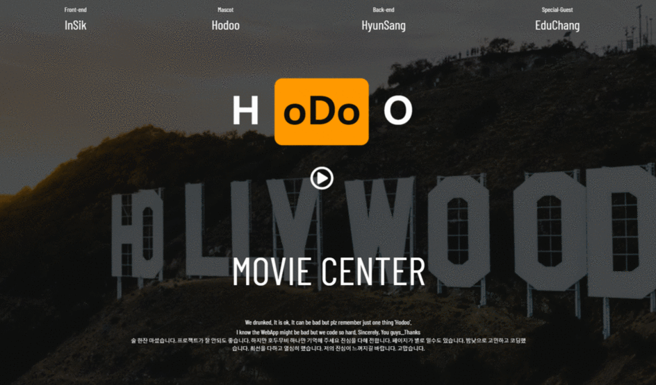

# 황인식 포트폴리오

## Jekyll을 이용한 Github 블로그 [Code](https://github.com/owner0220/owner0220.github.io)

```html
개인프로젝트
프로젝트 기간 : 19.06.01 ~ 19.06 
프로젝트 목표
 - Jekyll Theme을 이용하지 않고 만들어보자!
주요 기술
 - FrontEnd(HTML5,CSS,Bootstrap,scss), Jekyll, Markdown
```

#### LiveDemo : [바로가기](https://owner0220.github.io/)

> URL <https://owner0220.github.io/>


## 영화정보서비스(WATCHA) [Code](<https://github.com/owner0220/hodoo>)

```html
2인프로젝트
프로젝트 기간 : 19.05.06 ~ 19.05.17 (11일)
프로젝트 목표
 - Django Framework를 이용한 영화 정보 및 평가 관리, REST API 서버 제작
주요 기술
 - Restful API 서버 구축, 페이지별 권한설정, 상용서비스 연계(Kakao_플친)
 - 데이터 : Python, 웹크롤링, API 활용
 - DB : Django model 활용, SQL 조작
 - HTML5, CSS, BootStrap4, JavaScript
 - Git(SourceTree), GitHub
 - C9, Bash, AWS 배포
```

※ 페이지는 1920*1080 화면 비율에 최적화 되었습니다.(이외 해상도 지원 X)

#### Live Demo : [바로가기](http://movielists-dev4.ap-northeast-2.elasticbeanstalk.com/)

> URL http://movielists-dev4.ap-northeast-2.elasticbeanstalk.com/  

```html
테스트 계정   /    PW 
test        /   qqqq123!
```

#### **PPT :**  [바로가기](https://docs.google.com/presentation/d/1qQ0z4cxDtFp-fiubJw3VYT-mG6mh5_AgcudOraOvoBA/edit?usp=sharing)

> URL https://docs.google.com/presentation/d/1qQ0z4cxDtFp-fiubJw3VYT-mG6mh5_AgcudOra0OvoBA/edit?usp=sharing


### 샘플 이미지




