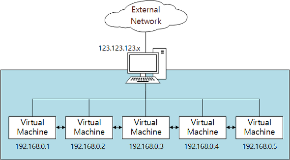
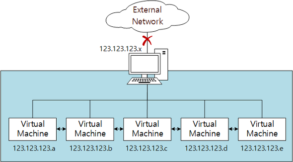

### NAT (Network Address Translation)

### NAT Network

### Internal Network

### Host Only Adapter

### Bridged Network

**일반 드라이버 (Generic Driver)**

------

- 거의 사용되지 않는 모드
- UDP Tunnel networking과 VDE(Virtual Distributed Ethernet) 지원

> 참조
>
>  https://technote.kr/213

---

# VirtualBox Network Settings: Complete Guide

In this modern business world, networking is a crucial component of interactive computer operations. It is difficult to imagine how to exchange data between computers without networks in a world where everything is changing at ever-growing speed. One of the central focal ideas behind hardware virtualization is the possibility to use virtual machines in nearly all cases where physical computers can also be used. Thus, virtual machines must be able to connect to physical and virtual networks with their virtual network adapters. Virtual machines running on VirtualBox can be connected to different networks. VirtualBox provides multiple network modes for virtual machines. Today’s blog post covers VirtualBox network settings to help you configure VirtualBox in the best way possible to suit your needs.

Below, the following VirtualBox network modes will be discussed and compared:

- Not Attached
- NAT
- NAT Network
- Bridged Adapter
- Internal Network
- Host-Only Adapter
- Generic Driver

## **Virtual Network Adapters**

Each VirtualBox VM can use up to eight virtual network adapters, each of which in turn is referred to as a network interface controller (NIC). Four virtual network adapters can be configured in the VirtualBox GUI (graphical user interface). All virtual network adapters (up to 8) can be configured with the **VBoxManage modifyvm** command. *VBoxManage* is a command line management tool of VirtualBox that can be used for configuring all VirtualBox settings including VirtualBox network settings. VirtualBox network adapter settings can be accessed in the virtual machine settings (select your VM, hit *Settings* and go to the *Network* section in the VM settings window).

There you should see four adapter tabs. One virtual network adapter is enabled by default after virtual machine creation. You can tick the “*Enable Network Adapter*” checkbox to enable the adapter and untick the checkbox to disable (this checkbox defines whether a virtual network adapter device is connected to a VM or not).

Hit **Advanced** to expand advanced VirtualBox network adapter settings.

## **Types of Virtual Network Adapters in VirtualBox**

A virtual network adapter is a software-emulated physical device. There are six virtual adapter types that can be virtualized by VirtualBox.

- **AMD PCnet-PCI II (Am79C970A)**. This network adapter is based on AMD chip and can be used in many situations. As for Windows guests, this network adapter can be used for older Windows versions (such as Windows 2000) because newer Windows versions such as Windows 7, 8 and 10 do not contain a built-in driver for this adapter. Originally, the**Am79C970A**PCI device contained a single chip 10-Mbit controller and the DMA engine was integrated. This network adapter also supports AMD’s Magic Packet technology for remote wake-up.
- **AMD PCnet-FAST III (Am79C973)**. This virtualized network adapter is supported by almost all guest operating systems that can run on VirtualBox. GRUB (the boot loader) can use this adapter for network boot. Similarly to the previous network adapter, this one is based AMD chip.
- **Intel PRO/1000 MT Desktop (82540EM)**. This adapter works perfectly with Windows Vista and newer Windows versions. The most of Linux distributions support this adapter as well.
- **Intel PRO/1000 T Server (82543GC)**. Windows XP recognizes this adapter without installing additional drivers.
- **Intel PRO/1000 MT Server (82545EM)**. This adapter model is useful to import OVF templates from other platforms and can facilitate import process.
- **Paravirtualized Network Adapter (virtio-net)** is a special case. Instead of virtualizing networking hardware that is supported by most operating systems, a guest operating system must provide a special software interface for virtualized environments. This approach allows you to avoid the complexity of networking hardware emulating and, as a result, can improve network performance.

The industry standard virtIO networking drivers are supported by VirtualBox. VirtIO networking drivers are a part of the KVM project and are open-source. These drivers are available for Linux with kernel 2.6.25 or later, and Windows including older versions such as Windows 2000, XP and Vista.

### Jumbo frames support

VirtualBox provides limited support for jumbo frames (Ethernet frames that can carry packets which size is more than 1,500 bytes). If you need to use jumbo frames, select an Intel virtualized network adapter, and configure that adapter to work in bridged mode. AMD-based virtual networks adapters don’t support jumbo frames. If you try to enable jumbo frames for AMD-based virtual network adapters, jumbo frames will be dropped silently for input and output traffic. Jumbo frames are disabled by default.

## **VirtualBox Network Modes**

VirtualBox provides a long list of network modes, which is one of the most interesting features of VirtualBox network settings. Each virtual network adapter can be separately configured to operate in a different network mode. For example, you can set the *NAT* mode for the adapter 1 and the *Host-only* mode for the adapter 2. You can select the network mode in the **Attached to** drop-down menu.

Let’s consider each VirtualBox network mode in detail.

### **Not attached**

A virtual network adapter is installed in a VM, but the network connection is missing, much like when you unplug the Ethernet network cable when using a physical network adapter. This mode can be useful for testing. For example, you can enable this network mode for a short time to emulate unplugging the cable. When you disable the *Not Attached* mode by switching to another network mode, the network connection becomes available again. You can also check whether a DHCP client obtains the IP address correctly, whether the appropriate application can resume downloading after link interruption or packet loss, and so on.

Instead of using the *Not Attached* network mode, you can use any other network mode without ticking the *Cable Connected* checkbox. You can tick/untick the checkbox when a VM is in the running state (see the screenshot above). Don’t forget to hit *OK* to apply changes in the VM network configuration.

### **NAT**

This network mode is enabled for a virtual network adapter by default. A guest operating system on a VM can access hosts in a physical local area network (LAN) by using a virtual NAT (Network Address Translation) device. External networks, including the internet, are accessible from a guest OS. A guest machine is not accessible from a host machine, or from other machines in the network when the *NAT* mode is used for VirtualBox networking. This default network mode is sufficient for users who wish to use a VM just for internet access, for example.

The IP address of the VM network adapter is obtained via DHCP and the IP addresses of the network used in this network mode cannot be changed in the GUI. VirtualBox has a built-in DHCP server and NAT engine. A virtual NAT device uses the physical network adapter of the VirtualBox host as an external network interface. The default address of the virtual DHCP server used in the NAT mode is 10.0.2.2 (this is also the IP address of the default gateway for a VM). The network mask is 255.255.255.0.

If you configure the network adapters of two or more VMs to use the *NAT* mode, each VM will obtain the 10.0.2.15 IP address in its own isolated network behind a private virtual NAT device. The default gateway for each VM is 10.0.2.2. In VirtualBox IP addresses are not changed when the *NAT* mode is used, as you can see below:

In order to enable the *NAT* mode for a VM with VBoxManage, execute the following command:

VBoxManage modifyvm VM_name --nic1 nat

Where:

- *VM_name* is the name of your virtual machine;
- *nic1* is the number of the virtual network adapter;
- *nat* is the name of the VirtualBox network mode that you need to set.

Port forwarding can be configured right from the VirtualBox VM network settings window by clicking the **Port forwarding** button (seen in the screenshot above). Detailed information about configuring port forwarding in VirtualBox network settings, which you can find below after the *Network Modes* section.

### **NAT Network**

This mode is similar to the *NAT* mode that you use for configuring a router. If you use the *NAT Network* mode for multiple virtual machines, they can communicate with each other via the network. The VMs can access other hosts in the physical network and can access external networks including the internet. Any machine from external networks as well as those from a physical network to which the host machine is connected cannot access the VMs configured to use the *NAT Network* mode (similarly to when you configure a router for internet access from your home network). You cannot access the guest machine from the host machine when using the *NAT Network* mode (unless you are configuring port forwarding in global VirtualBox network settings). A built-in VirtualBox NAT router uses a physical network interface controller of the VirtualBox host as an external network interface (as is the case for the *NAT* mode).

The network address and name can be changed in the global VirtualBox preferences (**File > Preferences**). In the left pane of the *Preferences* window, select *Network* to access global VirtualBox network settings, then double click your existing NAT network to edit the settings (you can also add a new network or delete an existing network by clicking the **+** or **x** icons).

In the small pop-up window that will appear, it is also possible to enable/disable DHCP, IPv6 and configure port forwarding.

The default address of the *NatNetwork* is 10.0.2.0/24.

The default gateway IP is 10.0.2.**1** (the x.x.x.1 template is used to assign the default gateway IP). For example, if you create a new virtual network for the *NAT Network* mode in VirtualBox and set the 192.168.22.0/24 network address, the IP address of the gateway in this network will be 192.168.22.**1**. You cannot change the IP address of the gateway for the network used in the *NAT Network* mode and change the range of IP addresses issued by the DHCP server. Similarly, the IP address of the DHCP server is 10.0.2.3 by default (the x.x.x.3 template is used).

The IP configuration of the Windows 7 VM running on VirtualBox with a virtual network adapter configured in the *NAT Network* mode is displayed on the screenshot.

If you don’t want to edit VirtualBox network settings in the GUI, you can add a new NAT network with VBoxManage by using the command:

VBoxManage natnetwork add --netname natnet1 --network "192.168.22.0/24" --enable

Where:

- *natnet1* is the name of the NAT network;
- *192.168.22.0/24* is the address of that NAT network.

If you want to configure a VM network adapter in order to use the *NAT Network* mode with VBoxManage, run the following command:

VBoxManage modifyvm VM_name --nic1 natnetwork

Where:

- *nic1* is the first virtual network adapter (network interface controller);
- *natnetwork* is the name of the VirtualBox network mode.

You may need to shut down the VM before applying these settings.

In order to avoid repeating the same command with VBoxManage when selecting a network mode for the virtual network adapter of a VM in each section of the article, consider the names of all possible VirtualBox network modes: **none, null, nat, natnetwork, bridged, intnet, hostonly, generic.**

**Port forwarding** is one more option that can be accessed and configured from this window. Port forwarding can be used to configure access from the host machine and other hosts of the same physical network to the services running on the guest OS inside the VM (see details below). As you can see, the location of the port forwarding settings for the *NAT* mode and *NAT* *Network* modes are different in the VirtualBox GUI. Port forwarding settings for the *NAT* mode are available in **VM > Settings > Network** while port forwarding settings for the *NAT Network* mode can be configured in **File > Preferences > Network**. This is because port forwarding rules for the *NAT* mode are individual for each VM while port forwarding rules for the *NAT Network* mode are common for multiple VMs whose adapters are connected to the appropriate NAT network. See details about configuring port forwarding below in the *Port Forwarding* section.

### **Bridged Adapter**

This mode is used for connecting the virtual network adapter of a VM to a physical network to which a physical network adapter of the VirtualBox host machine is connected. A VM virtual network adapter uses the host network interface for a network connection. Put simply, network packets are sent and received directly from/to the virtual network adapter without additional routing. A special net filter driver is used by VirtualBox for a *bridged* network mode in order to filter data from the physical network adapter of the host.

This network mode can be used to run servers on VMs that must be fully accessible from a physical local area network. When using the *bridged* network mode in VirtualBox, you can access a host machine, hosts of the physical network and external networks, including internet from a VM. The VM can be accessed from the host machine and from other hosts (and VMs) connected to the physical network.

If you have multiple physical network adapters on the host machine, you should select the correct adapter in VirtualBox network settings. On the screenshot below you can see two physical network adapters – Ethernet adapter and Wi-Fi adapter . If you use the bridged mode for a wireless network adapter, you cannot use low-level features of that Wi-Fi adapter in a guest operating system. For example, you cannot select Wi-Fi networks to connect to, enable the monitoring mode, etc. Instead, you need to connect to the Wi-Fi network on the host machine. If you have to use all features of the Wi-Fi adapter in the guest OS of the VM, use a USB Wi-Fi adapter and the USB Pass-through feature as explained in the blog post about [installing Kali Linux on VirtualBox](https://www.nakivo.com/blog/how-to-install-kali-linux-on-virtualbox/).

In VirtualBox, the IP address of a VM virtual network adapter can belong to the same network as the IP address of the physical network adapter of the host machine when the *bridged* mode is used. If there is a DHCP server in your physical network, the virtual network adapter of the VM will obtain the IP address automatically in the *bridged* mode (if obtaining an IP address automatically is set in the network interface settings in a guest OS). Thus, the default gateway for a virtual network adapter operating in the bridged mode is the same as for your host machine. Let’s look at a simple example with IP addresses.

The address of the physical network: 10.10.10.0/24

The IP address of the default gateway in the physical network: 10.10.10.1

The IP address of the DHCP server in the physical network: 10.10.10.1

IP configuration of the host machine: The IP address – 10.10.10.72; netmask – 255.255.255.0; default gateway – 10.10.10.1.

IP configuration of the guest machine: The IP address – 10.10.10.91; netmask – 255.255.255.0; default gateway – 10.10.10.1.

Sometimes, you may find that you have multiple gateways in your physical network. You can use a host machine for connecting to necessary networks via one gateway and use a guest machine for connecting to other networks via the second gateway. You can also edit a routing table on your VM and add routes for using both gateways to connect to the appropriate networks. As you can see, the bridged network mode is a powerful option in VirtualBox network settings with a lot of use cases.

**Promiscuous mode**. This mode allows a network adapter to pass all received traffic, no matter to which adapter the traffic is addressed. In normal mode, a network adapter receives only frames that include the MAC address of this particular network adapter as the destination address in the header. The frames that are addressed to a MAC address which differs from the MAC address of the selected adapter (when traffic is not broadcast) are dropped when in normal mode. The *promiscuous mode* makes it possible for a physical network adapter to have multiple MAC addresses, allowing all incoming traffic to pass the physical network adapter of the host machine and reach the virtual network adapter of the VM which has its own MAC address that is represented on the host adapter, even if that traffic is not addressed to the virtual network adapter of that particular VM.

Most wireless network adapters don’t support the promiscuous mode. Bridging to Wi-Fi adapters is done in following way – VirtualBox replaces the appropriate MAC addresses in the headers of Ethernet frames that must be delivered to the virtual network adapter of the VM (the MAC address of the host Wi-Fi adapter must be used for that traffic). The promiscuous mode is useful for network testing and security audits. You can enable the promiscuous mode in VirtualBox network settings and monitor network traffic with a sniffer.

There are three options of using the *promiscuous mode*.

- *Deny*. Any traffic that is not intended to the virtual network adapter of the VM is hidden from the VM. This option is set by default.
- *Allow VMs*. All traffic is hidden from the VM network adapter except the traffic transmitted to and from other VMs.
- *Allow All*. There are no restrictions in this mode. A VM network adapter can see all incoming and outgoing traffic.

The *Promiscuous* mode can be used not only for the *Bridged* network mode, but also for *NAT Network*, *Internal Network* and *Host-Only Adapter* modes.

### **Internal Network**

Virtual machines whose adapters are configured to work in the VirtualBox *Internal Network* mode are connected to an isolated virtual network. VMs connected to this network can communicate with each other, but they cannot communicate with a VirtualBox host machine, or with any other hosts in a physical network or in external networks. VMs connected to the internal network cannot be accessed from a host or any other devices. The VirtualBox *internal network* can be used for modelling real networks.

For example, you can create three VMs, each of which has a virtual network adapter (Adapter 1) connected to the internal network. The IP addresses of these network adapters are defined from the subnet used for the VirtualBox internal network (you should define the subnet manually). One of these VMs (*VM1*) also has a second virtual network adapter that is configured to operate in the *NAT* mode. The *VM1* is configured as a router (one of the best solutions for creating a router is to install Linux and configure IPTABLES, but for the first time you can use simpler routing solutions in a case of VirtualBox network testing).

A *VM2* and *VM3* whose network adapters are connected only to the VirtualBox internal network can have access to external networks if the IP address of the internal network adapter of the *VM1* are set as a gateway in the network settings of *VM2* and *VM3*.

Network configuration used in this example:

*VM1*. IP address – 192.168.23.1 (internal network mode); 10.0.2.15 (NAT mode), gateway 10.0.2.2 (the IP address of the built-in VirtualBox NAT device).

*VM2*. IP address – 192.168.23.2 (internal network), gateway – 192.168.23.1

*VM3*. IP address – 192.168.23.3 (internal network), gateway – 192.168.23.1

VirtualBox internal network subnet: 192.168.23.0/24

See the diagram below for more clarity.

*Note*: You can also deploy such virtual infrastructure for testing firewall rules in IPTABLES before implementing them in your real network infrastructure, but it is preferable to use the *bridged* mode and not the *NAT* mode for the second virtual network adapter of the *VM1* when connecting to/from external networks.

### **Host-only Adapter**

This network mode is used for communicating between a host and guests. A VM can communicate with other VMs connected to the *host-only* network, and with the host machine. The VirtualBox host machine can access all VMs connected to the host-only network.

The VirtualBox *Host-Only* virtual network adapter is created in a host operating system for use in the *host-only* network. You can edit settings of this VirtualBox network by going to **File > Host Network Manager**.

In our case, the default network address of the host-only network is 192.168.56.0/24 and the IP address of the virtual network adapter on the host machine is 192.168.56.1. You can edit these IP addresses manually in the *Adapter* tab. A DHCP server can be enabled or disabled by ticking the appropriate checkbox. In the *DHCP Server* tab, you can set the IP address of the DHCP server, netmask and the range of IP addresses to be issued for DHCP clients.

The virtual network adapters of the VMs don’t have a gateway in their IP configuration because the *Host-Only* mode doesn’t allow you to connect to any devices outside the host-only network. It is also possible to create more than one VirtualBox host-only network adapter in order to use different host-only networks—just press the *Create* button. If the host-only network is no longer needed, simply select the adapter and hit *Remove*.

### **Generic Driver**

This network mode allows you to share the generic network interface. A user can select the appropriate driver to be distributed in an extension pack or be included with VirtualBox.

Two sub-modes are available for VirtualBox *Generic Driver* mode – UDP Tunnel and VDE (Virtual Distributed Ethernet) Networking.

*UDP Tunnel*. Virtual machines that run on different hosts can communicate transparently by using an existing network infrastructure.

*VDE Networking*. Virtual machines can connect to a virtual distributed switch on Linux or FreeBSD hosts. You need to compile VirtualBox from sources to use VDE networking since standard VirtualBox packages don’t include this feature.

### **Comparison of VirtualBox Network Modes**

For more convenience, let’s summarize all information about network modes supported by VirtualBox in this table:

## **Port Forwarding**

Port forwarding is a process of intercepting traffic addressed to the appropriate IP address and port in addition to redirecting that traffic to a different IP address and/or port. Special applications can be used on computers and other router devices to configure port forwarding. One of the most popular use cases for port forwarding is by providing access to particular network services that are hidden behind the NAT from external networks. After configuring port forwarding rules, clients can access the appropriate services from outside by connecting to the router’s (host’s) external IP address and specified port.

The packets are first intercepted by an application on the router, then the application reads the destination IP address and port number of the appropriate headers (IP packet headers, headers of TCP or UDP segments). If a combination of the destination IP address and/or port number in headers matches a condition set in a port forwarding rule, the routing application rewrites the header information (IP address and/or port number) and sends a packet/segment to another network interface according to the port forwarding rule.

By default, connecting to VirtualBox VMs whose network adapters are set to operate in the *NAT* or *NAT Network* mode is impossible from a VirtualBox host and other hosts in LAN, but VirtualBox provides a built-in port forwarding feature to enable such access.

### **Example 1 – SSH access**

Let’s now consider configuring port forwarding for connecting to VirtualBox VMs using the example of connecting to an SSH server running on an Ubuntu Linux VM that is connected to the network by the *NAT* mode. You can read how to install Ubuntu on VirtualBox in [this blog post](https://www.nakivo.com/blog/install-ubuntu-on-virtualbox-virtual-machine/).

**The input data:**

Host IP: *10.10.10.72* (a physical NIC).

Ubuntu VM IP: *10.0.2.15* (NAT mode)

User name: *user1*

\1. Install the SSH server on the Ubuntu VM.

**apt-get install openssh-server**

\2. Edit the SSH server configuration file.

**vim /etc/ssh/sshd_config**

\3. Uncomment the string for enabling authentication with passwords.

**PasswordAuthentication yes**

\4. Restart the SSH daemon (service).

**/etc/init.d/ssh restart**

\5. Verify that the SSH server is working and try to connect to the SSH server from localhost (Ubuntu VM).

**ssh user1@127.0.0.1**

\6. If everything is OK, you can start configuring port forwarding in VirtualBox.

As you recall, you should open **VM settings** and select the **Network** section. Select your virtual network adapter that is configured to work in the *NAT* mode, expand **Advanced** **settings** and hit the **Port Forwarding** button. Click the **+** icon to add a new port forwarding rule in VirtualBox network settings of the VM.

An SSH server listens the 22-nd TCP port by default. Let’s create a rule that allows you to forward all connections to the VirtualBox host machine on port 8022 to the Ubuntu VM on port 22 that is listened by SSH server. First, you can create a rule that allows for connections only from the VirtualBox host.

| Name       | Protocol | Host IP   | Host Port | Guest IP  | Guest Port |
| ---------- | -------- | --------- | --------- | --------- | ---------- |
| Ubuntu-SSH | TCP      | 127.0.0.1 | 8022      | 10.0.2.15 | 22         |

The view of the port forwarding rules window in the VirtualBox GUI is shown on the screenshot below.

Open an SSH client (for example, PuTTY if you use Windows) on your VirtualBox host and connect to 127.0.0.1 on port 8022.

Other hosts in your physical network will be able to access the Ubuntu VM via SSH by connecting to the VirtualBox host machine on port 8022 if you create a similar port forwarding rule where the real IP address of your physical network adapter of the VirtualBox host will be defined instead of the localhost IP address (127.0.0.1). In this example, the IP address of the physical NIC on the VirtualBox host is 10.10.10.72.

| Name       | Protocol | Host IP     | Host Port | Guest IP  | Guest Port |
| ---------- | -------- | ----------- | --------- | --------- | ---------- |
| Ubuntu-SSH | TCP      | 10.10.10.72 | 8022      | 10.0.2.15 | 22         |

Open an SSH client on your VirtualBox host or on another host attached to your LAN and connect to your VirtualBox host IP on port 8022.

### **Example 2 – HTTP access**

If you want to deploy a web server on your VM and provide access to your web sites from outside, you can add another port forwarding rule. Let’s consider how to configure that port forwarding rule for accessing a web site deployed on an Ubuntu VM from a VirtualBox host machine and other machines connected to the physical local area network (LAN). Apache is used as a web server in this example.

First, install Apache on the Ubuntu VM running on VirtualBox.

**apt-get install apache2**

The *ufw* firewall is disabled in Ubuntu by default. If a firewall is enabled on your Ubuntu VM, make sure that access to the TCP 80 port is enabled.

After installing Apache, open a web browser on your Ubuntu VM and access the default Apache page by entering *http://127.0.0.1* in the address bar. If everything is OK, you will see the *Apache2 Ubuntu default page* in your web browser.

This means that now you can configure a port forwarding rule in VirtualBox network settings for accessing your web site hosted on the Ubuntu VM. Open the *Port Forwarding* settings window by going to **VM settings > Network > [select your adapter] > Port Forwarding** (similarly as explained above). You can add a new rule by doing the following:

| Name          | Protocol | Host IP     | Host Port | Guest IP  | Guest Port |
| ------------- | -------- | ----------- | --------- | --------- | ---------- |
| Ubuntu-HTTP80 | TCP      | 10.10.10.72 | 8080      | 10.0.2.15 | 80         |

Open a web browser on your host machine or on any other machine connected to your physical network and enter the IP address of your VirtualBox host machine and port defined in the port forwarding rule created above:

*http://10.10.10.72:8080*

In the current example, *10.10.10.72* is the IP address of the VirtualBox host machine and *8080* is a TCP port listened on the VirtualBox host machine. A positive result of configuring port forwarding is shown on the screenshot below.

You can also create similar rules for accessing a VM via RDP, FTP and other protocols.

Configuring port forwarding for VMs whose virtual network adapters work in the *NAT Network* mode functions similarly (see the section above where the NAT Network mode is explained for locating port forwarding settings for the NAT Network mode).

## **Conclusion**

VirtualBox is a powerful virtualization solution that is flexible and provides a wide range of network settings. Each VM can use up to eight virtual network adapters, and each network adapter can be emulated as the appropriate model of real Intel and AMD network interface controllers (NICs). VirtualBox network adapter settings allow you to change the MAC address of each virtual NIC, plug or unplug the virtual network cable, and select the network mode. Setting the network mode for a virtual network adapter is one of the most interesting and important parts of VirtualBox network settings. There are six network modes, each of which can be utilized for different use cases. Port forwarding can be configured for external access to VMs whose network adapters operate in NAT or NAT Network modes.

Today’s blog post has covered VirtualBox network settings, but if you want to learn more about VirtualBox, you are welcome to check out our blog posts about [VirtualBox usage](https://www.nakivo.com/blog/use-virtualbox-quick-overview/), [installing VirtualBox Extension Pack](https://www.nakivo.com/blog/how-to-install-virtualbox-extension-pack/), and [updating VirtualBox](https://www.nakivo.com/blog/how-to-update-virtualbox/). You can also read blog posts about comparing VirtualBox with [VMware](https://www.nakivo.com/blog/vmware-vs-virtual-box-comprehensive-comparison/) and [Hyper-V](https://www.nakivo.com/blog/hyper-v-virtualbox-one-choose-infrastructure/), where network settings of these virtualization platforms are discussed as well.

> https://www.nakivo.com/blog/virtualbox-network-setting-guide/