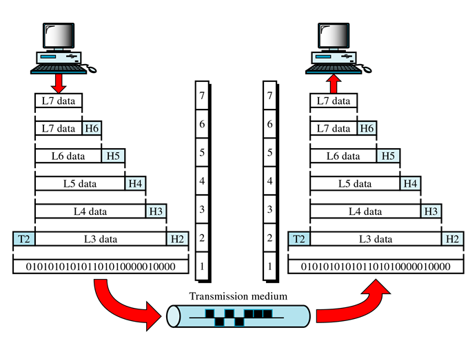

# OSI 7 네트워크 계층

- **Open System Interconnection (OSI)**

  (Basic Reference Model : **ISO-7498**)

#### 계층의 기본구조

1. 계층 1, 2, 3 (네트워크 지원 계층) : 물리, 데이터링크, 네트워크
   - 하나의 장치에서 다른 장치로 전송되는 데이터의 물리적인 면을 처리
2. 계층 5, 6, 7 (사용자 지원 계층) : 세션, 표현, 응용
   - 관련 없는 소프트웨어 시스템 간의 상호 운용성 제공
3. 계층 4 (트랜스포트 계층) : 전송
   - 두 개의 서브 그룹을 링크하고 하위층이 전송한 내용을 상위층이 사용할 수 있는 형태로 변환

전송되는 과정을 그림으로 표현 했을 때

마지막에 전송되는 파일은 1011 숫자 정보 뿐이다.

### 물리계층 (Physical Layer ; L1)

- 물리적 매체를 통한 비트 스트림 전송에 요구되는 기능을 담당 (기계적, 전기적 특성을 다룸 : 케이블 컨넥터)
- 데이터 링크층(L2)으로 부터 한 단위의 데이터를 받아 통신 링크를 따라 전송될 수 있는 형태로 변환
- 비트 스트림을 전자기 신호로 변환
- 매체를 통한 신호 전송 감독

#### 고려사항

- 회선 구성(Line configuration)
- 데이터 전송 모드(Data transmission mode)
- 접속 형태(Topology)
- 신호방식(Signals): 신호유형
- 부호화(Encoding)
- 인터페이스(Interface)
- 전송매체(Medium)

### 데이터링크 계층 (Data Link Layer ; L2)

- 하나의 지국에서 다른 지국으로 오류 없는 데이터 전달에 대한 책임을 가진다.
- 세번 째 층으로부터 데이터를 받아서 주소와 제어 정보를 포함하고 시작(header)와 끝(trailer)에 의미있는 비트를 추가한다. (프레임 Frame)
- 물리계층을 통해 얻은 이진 신호를 점검
- 오류 체크나 복구 기능을 한다.

##### L2의 기능

- node-to-node  전달(delivery) : station-to-station
- 주소지정(Addressing)
- 접근 제어(Access control)
- 흐름 제어(Flow control)
- 오류 처리(Error handling)
- 동기화(Synchronization)

##### L2 스위치 구성

- 패킷이 왔을 때 그것의 목적지가 어디인가를 보고, 그 목적지로 패킷을 보내주는 역할을 맡고 있다.
- IP  주소가 필요한 외부로는 보낼 수 없다. 즉, Route 는 지원하지 못한다.
- L2 스위치는 Ethernet 레벨에서 동작할 뿐 그 상위 레이어인 네트워크 계층에선 동작하지 못한다.

### 네트워크 계층 (Network Layer ; L3)

- 다중 네트워크 링크를 통해 패킷의 발신지-대-목적지 전달에 대한 책임을 가짐
- 비교 : 데이터 링크 층은 노드간(node-to-node) 전달 책임

##### 두가지 관련 서비스를 제공

- 스위칭(Switching) : 물리적 링크 간의 일시적인 연결 (예: 전화 시스템)
- 라우팅(Routing) : 한 지점에서 다른 지점으로 패킷을 전송 할 수 있는 경로가 많을 때 가장 최적의 경로를 선택하는 기능

##### L3의 기능

- 발신지-대-목적지 전달(packet)
- 논리적인 주소지정(Logical addressing)
- 라우팅(Routing)
- 주소 변환(Address transformation)
- 다중화(Multiplexing)

##### L3 스위치 구성

- 자신에게 온 패킷이 외부에 존재하는 IP일 경우 그 패킷을 외부에 연결된 Router로 보내 주는 기능을 가지고 있다.

스위치는 MAC을 보고 포워딩하지만, 라우터는 IP Layer를 보고 포워딩 합니다. 당연히 Routing table을 보고 소프트웨어적으로 구현되어 경로를 결정합니다.  이유는 MAC의 경우 보통 단순하지만 IP의 경우 복잡해서 하드웨어적으로 구성이 까다롭기 때문입니다.

### 전송 계층 (Transport Layer ; L4)

- 전체 메시지의 발신지-대-목적지(end-to-end) 전달에 대한 책임을 가진다.
- 비교 : 네트워크 층은 개별적인 패킷의 종단-대-종단 (end-to-end) 전송을 담당한다.

##### L4의 기능

- 종단-대-종단 전달(End-to-end message delivery)
- 서비스-점 주소 지정(Service-point(port) addressing)
- 분할과 재조립(Segmentation and reassembly)
- 연결 제어(Connection control)

##### L4 스위치 구성

- TCP/UDP Header를 확인 후 우선시 해서 로드벨런싱을 한다.
- vip 지정을 통한 Load Balance  및 Fail Over
- real ip  를 묶은  vip 로 향하는 트래픽은  RR 방식으로 로드밸런싱 된다.

##### 로드 밸런스란?

- 어느 한 회선이 다운되더라도 다른 회선으로 서비스를 계속하기 위한 것이기도 하고 (redundancy)
- 각각의 회선 용량을 합하여 사용함으로써 웹서버 회선 "총 용량"을 늘이기 위한 것이기도 하다.(link aggregation)

### 세션 계층 (Session Layer ; L5)

- 네트워크 대화 제어자
- 프로세스 간의 통신을 제어하고, 통신 과정이 진행 될 때 동기화를 유지(각종 이벤트)

##### 기능

- 세션 관리(Session management)
- 동기화(Synchronization)
- 대화 제어(Dialog control)
- 원활한 종료(Graceful Close)

### 표현 계층 (Presentation Layer ; L6)

- 통신 장치간의 상호 운용성(interoperability) 보장
- 필요에 따라 보안 목적을 위한 데이터 암호화와 복호화 기능
- 데이터 압축 및 확장 기능 (ASCII, EBCDIC, JPEG)

##### 기능

- 변환(Translation)
- 암호화(Encryption)
- 압축(Compression)
- 보안(Security)

### 응용 계층 (Application Layer ; L7)

- 네트워크 상의 소프트웨어 사용자에게 사용자 인터페이스 제공과 서비스 지원

##### 서비스

- 네트워크 가상 터미널(Network virtual terminal)
- 파일 액세스, 전송, 관리(File access, transfer, and management)
- 우편 서비스(Mail services)
- 디렉토리 서비스(Directory services)

##### L7 스위치 구성

- HTTP의  URL, FTP 쿠키 정보 및 바이러스 패턴을 분석해서 보안에 더 유리하고 정교한 로드밸런싱이 가능하다.
- L7 스위치는 애플리케이션 스위치, 콘텐CM스위치(Content Switch), 다계층스위치(Multi-Layer Switch) 등 다양한 이름으로 불리는데, 이는 L7 정보가 주로 애플리케이션과 직접 연관이 있고 패킷의 내용을 분석하여 이를 바탕으로 패킷에 대한 부하분산, 리디렉션, 필터링 등을 수행하기 때문에 자연스럽게 붙여진 이름입니다.
- L4 스위치는 VoIP나 P2P와 같은 중요 애플리케이션과 같이 다양한 형태의 패킷 내용을 살펴보기 어렵고 사용자의 IP가 수시로 바뀌는 경우 해당 사용자에 대한 연속적인 서비스를 제공하기 어렵다는 단점을 가지고 있습니다. 자체적으로 Layer4 정보(TCP/UDP port)를 바탕으로 패킷을 분류하고 원하는 서버나 장비로 전송을 합니다.
- L7 스위치에서는 패킷의 IP/Port 정보뿐만 아니라 패킷의  URL 정보, 쿠키, 플레이로드 정보 등을 종합적으로 검사하여 사용자별로 연속적이고 차별화된 서비스를 제공해 줄 수 있습니다.

L1 -> Flooding

L2 -> Switching

L3 -> Routing

L4 -> port number 이용 트래픽 분산처리(Load balancing)

L7 (cisco 6500이상 장비) -> S/W 를 장치에 올려서 Traffic filter , Security, VPN 를 할수 있다.

\- 상위 계층 장비는 하위 계층 장비의 기능을 모두 가지고 있다.

\- L5,L6 ? -> TCP/IP 기반이기때문에 L7이 L5~6 기능을 모두 포함하고 있다.

\- TCP/IP 기반

-> L1 : Network Interface 계층

-> L2,L3 : Network (Internet) 계층

-> L4 : Transport 계층

-> L7 : Application 계층

