# 네트워크의 기초 이해

## IP 이해

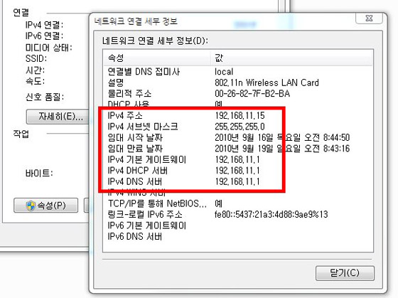

### IP 주소?

편지나 택배처럼 주소를 정확하게 알아야 배송이 되는 것처럼 인터넷에서도 주소가 필요하다. 컴퓨터 네트워크에서 IP(Internet Protocol) 주소는 전 세계 컴퓨터에 부여된 고유의 식별 주소다. 이론적으로 모든 컴퓨터(또는 네트워크 기기)는 중복되지 않는 IP 주소를 가지고 있어야 한다. 그래야 상호 충돌 없이 네트워크에 연결될 수 있기 때문이다. 따라서 IP 주소는 컴퓨터끼리 서로 통신하기 위한 '전화번호'로 생각하면 이해가 쉽다. 참고로 IP 주소는 각 나라의 공인기관에서 할당/관리하는데, 우리나라는 한국인터넷진흥원([www.krnic.or.kr](http://www.krnic.or.kr/))이 이에 해당된다.

### IP 주소의 기본 골격

2010년 9월, 인터넷에 연결된 컴퓨터(혹은 모바일 기기 등)에 할당된 IP 주소는 거의 대부분 IPv4(IP version4) 형태다. 이 IPv4의 주소 체계는 3자리 숫자가 4마디로 표기된다(각 마디를 옥텟(octet)이라 한다). 표기되는 숫자는 총 32개다. 예를 들어, '123.123.123.123'과 같은 식이다. 단 각 마디(옥텟)의 숫자는 255(0~255)를 넘을 수 없다. 따라서 IPv4 체계의 IP 주소로는 0.0.0.0부터 255.255.255.255까지 약 42억 개의 주소를 사용할 수 있다. 숫자로 보면 IP 주소가 엄청나게 많은 듯하지만, 지금까지 인터넷이 발전되면서 점차 IP 주소 고갈 현상이 나타나고 있다. 전 세계 컴퓨터를 비롯한 다양한 기기가 고유한 IP 주소를 가져야 하기 때문이다.

이와 같은 IP 주소 부족 문제를 해결하기 위해 제안된 새로운 IP 주소 체계가 IPv6다. 이는 기존 IPv4의 32개 숫자가 128개로 늘어나고, 마디도 4개에서 16개로 증가한 형태다. 예를 들어, 3.4x10의 38승(읽을 수도 없다)에 해당하는 IP 주소를 사용할 수 있게 된다. 한 마디로 거의 무한대로 사용할 수 있는 정도다. 이렇게 되면 비단 컴퓨터 관련 기기뿐 아니라, 냉장고, TV, 세탁기, 전자레인지 등 일반 가전에도 IP 주소를 부여할 수 있어 각 기기 간의 통신이 가능해 진다(이러한 통신 환경을 일컬어 '유비쿼터스'라고도 한다). 다만 IPv6는 현재 테스트 단계라 현재의 IPv4 체계를 완전히 대체하기까지는 상당한 시간이 필요할 것으로 예상된다.

### 형태 및 용도에 따른 구분

IP 주소는 사용 목적과 용도 등에 따라 여러 가지로 구분된다. 이들을 모두 자세하게 알 필요는 없지만, 인터넷과 관련 기기를 사용할 때 접할 수 있는 용어는 간단하게나마 숙지하는 것이 좋다.

#### 사용 범위에 따른 구분 1. 공인 IP 주소

단어 그대로, 공인기관에서 인증한 공개형(public) IP 주소다. 인터넷 유무선 공유기를 사용하지 않는 한 컴퓨터 등에서 사용하는 대부분의 IP 주소는 공인 IP 주소다. 우편물로 치면 우체국에서 배달하는 실제 주소인 셈이다. 이 주소는 외부로 공개되어 누구라도 그 주소로 우편물을 보낼 수 있는 것처럼, 공인 IP 주소도 외부에 공개되어 있어 다른 컴퓨터 등에서 검색, 접근이 가능하다. 예를 들어, 내 컴퓨터의 IP 주소가 100.100.100.100이라면 인터넷에 연결된 어떤 사용자(혹은 컴퓨터)라도 이 IP 주소를 토대도 내 컴퓨터에 (1차) 접근이 가능하다. 따라서 공인 IP 주소를 사용하려면 보안 장비(방화벽 등)가 반드시 필요하다. 다만 가정에서는 가입한 인터넷 서비스 회사(KT나 SK텔레콤 등)에서 보안 서비스를 제공하고 있기에 크게 걱정할 필요는 없다.

#### 사용 범위에 따른 구분 2. 가상 IP 주소

공인 IP 주소가 공개형이라면 가상(private) IP 주소는 폐쇄형이다. 종종 '사설 IP 주소'라고도 하는데, 공인되지 않은 가상의 IP 주소라는 의미 때문이다. 즉, 이 가상 IP 주소는 외부에 공개되지 않아 외부에서 검색, 접근이 근본적으로 불가능하다. 가상 IP 주소는 주소 대역이 3개로 고정되어 있다. 이를테면, '192.168.xxx.xxx'와 '172.10.xxx.xxx', 그리고 '10.xxx.xxx.xxx' 대역이다. 가상 IP 주소는 인터넷 유무선 공유기를 사용할 때 흔히 접하게 되는데, 하나의 공인 IP 주소를 공유하여 여러 대의 컴퓨터가 인터넷에 접속하게 하려면 가상 IP 주소가 필요하기 때문이다.

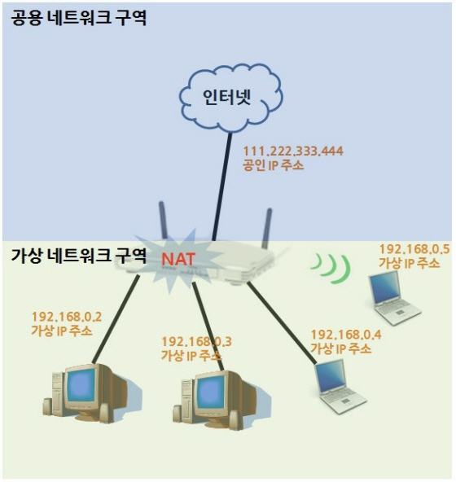

예를 드는 것이 이해하기 쉽겠다. 그동안 컴퓨터 한 대에 100.100.100.100라는 공인 IP 주소로 인터넷에 접속하다가 유무선 인터넷 공유기를 설치해 연결했다면, 공유기의 IP 주소가 100.100.100.100이 되고 공유기에 연결된 컴퓨터는 192.168.0.10 등과 같은 가상 IP 주소가 할당된다.

이러한 가상 IP 주소를 사용하는 이유는 두 가지 때문이다. 하나는 방금 언급한 IP 주소를 공유하기 위함이다. 이는 IPv4의 IP 주소 부족 문제를 해결할 수 있는 방안이기도 하다. 공유기가 없다면 사무실에 있는 10대의 컴퓨터 각각에 모두 공인 IP 주소를 부여해야 하지만, 공유기가 있으면 1개 공인 IP 주소만 공유기에 할당하고, 10대의 컴퓨터는 가상 IP 주소를 각각 할당받아 인터넷에 접속할 수 있게 된다.

또 하나의 이유는 보안 때문이다. 가상 IP 주소가 할당된 컴퓨터 등은 외부에서 검색, 접근이 기본적으로 불가능하다. 일반적으로 인터넷 공유기가 그러한 보안 장비의 역할도 수행하고 있다.

**IP 주소 확인하는 방법**
이쯤 되면 자신의 컴퓨터에 어떤 IP 주소가 설정되어 있는지 궁금할 것이다. 사용하는 운영체계가 MS 윈도우 XP, 비스타, 7이라면 '시작' - '실행' - 'cmd' 입력하고 엔터를 치면 '명령 프롬프트' 창이 나타난다. 여기서 'ipconfig /all' 명령을 실행하면 현재 IP 주소 등을 비롯한 각종 네트워크 정보를 확인할 수 있다. '명령 프롬프트' 외에도 IP 주소를 확인할 수 있는 방법은 다양하다.

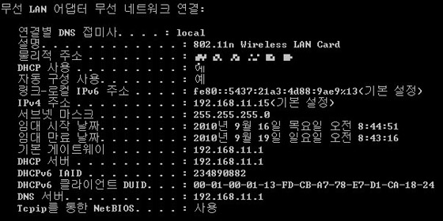

#### 할당 방식에 따른 구분 1. 고정 IP 주소

앞서 살펴본 공인 IP 주소든 가상 IP 주소든 컴퓨터 등에 IP 주소를 설정하려면, 누군가는 IP 주소를 배급, 할당해 줘야 한다. 공인 IP 주소라면 해당 인터넷 서비스 업체의 주소 할당 서비스가, 가상 IP 주소라면 인터넷 공유기가 이에 해당된다. 이때 IP 주소를 할당받는 컴퓨터 등은 이를 자동으로 설정할지, 아니면 수동으로 입력해서 설정할지를 선택할 수 있다. 고정 IP 주소는 사용자가 직접 IP 주소를 입력해 주소를 설정하는 방식을 말한다. IP 주소가 변경되면 안 되는 컴퓨터 등(파일 공유 서버 등)에 적합한 것으로 특별한 경우 외에는 사용할 기회가 거의 없다.

윈도우의 네트워크 연결 속성 페이지에서 '다음 IP 주소 사용' 옵션을 선택하고, 원하는 IP 주소를 4개 마디에 맞게 입력하면 된다(앞서 언급했듯 255를 넘을 수 없다).

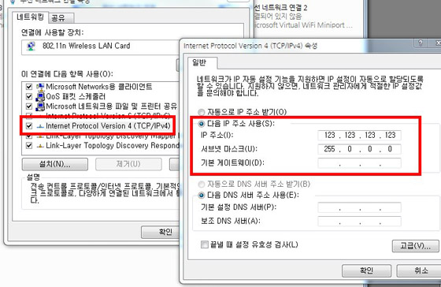

#### 할당 방식에 따른 구분 2. 유동 IP 주소

IP 주소를 할당하는 서버가 주는 그대로 컴퓨터 등에 자동 설정하는 방식이다. 이를 네트워크 용어로 'DHCP(Dynamic Host Configuration Protocol)' 서비스라 하는데, 컴퓨터가 부팅하면 DHCP 서버에 IP 주소 할당을 요청하고, 이를 수신한 DHCP 서버가 해당 컴퓨터에 IP 주소 등의 네트워크 정보를 전달하면, 컴퓨터에서는 이를 자동으로 등록, 설정하게 된다. 컴퓨터 수가 많은 환경에서 특히 간편하고 유용한 기능이다. 이론적으로는 매번 부팅할 때마다(즉 IP 할당 요청이 발생할 때마다) IP 주소는 변경되지만, 일반적으로는 이전에 할당받았던 IP 주소를 그대로 할당받는 경우가 더 많다. 인터넷 공유기는 앞서 가상 IP 주소를 생성(NAT 서비스)하여 각 컴퓨터 등에 자동 할당(DHCP 서비스)하는 역할을 하는 것이다.

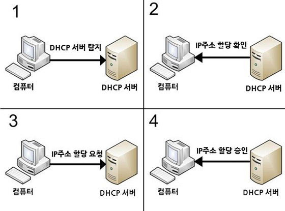

물론 DHCP 서비스를 적용했어도 특정 컴퓨터에 고정 IP 주소를 할당해야 한다면, (앞서 설명한 대로) 윈도우 네트워크 속성 페이지에서 '다음 IP 주소 사용' 설정을 이용하면 된다. 그럼 그 컴퓨터는 IP 주소 자동 할당 목록에서 제외된다.

### IP 주소의 동반자, 서브넷 마스크

IP 주소가 '바늘'이라면, 서브넷 마스크(subnet mask)는 '실'이다. 네트워크에 연결되려면 이 두 정보는 반드시 쌍으로 입력되어야 한다. 서브넷 마스크라는 용어를 풀어 보면 ‘하위(sub) 네트워크(net)를 구분하는 표기(mask)법’이라 할 수 있다. 우편물로 예를 들자. 한 집에 두 가구가 사는 경우 주소는 같지만 최종 목적지가 다르다. 이때는 주소 마지막에 '1층' 또는 '2층'이라 표기해야 하는 것처럼, 서브넷 마스크도 네트워크 구역을 정확하게 구분하는데 사용된다. 즉, 같은 IP 주소 대역이라도 네트워크를 A, B, C 등의 구역으로 나눌 수 있는데, 이를 구분하는 기준이라는 것이다.

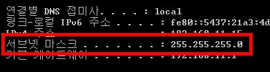

이러한 서브넷 마스크는 사용자가 임의로 설정하는 게 아니라, IP 주소를 할당하는 인터넷 서비스 업체에서 제공하는 값을 입력해야 한다. 따라서 IP 주소가 정확하더라도 서브넷 마스크가 틀리면 인터넷 접속이 불가능하다.

서브넷 마스크는 일반적으로 '255.0.0.0' 또는 '255.255.0.0', '255.255.255.0' 등의 형식으로 표기된다.

지금까지 설명한 내용을 네트워크(또는 TCP/IP) 관련 전문서적에서 찾아보면 상당한 분량을 차지하고 있음을 알 수 있다. 컴퓨터 네트워크를 이해하는 데 있어 그만큼 중요하고 복잡한 부분이기 때문이다. 물론 윗글로 이에 대해 완벽하게 이해하리라 기대할 수는 없지만, 각 요소가 어떠한 역할과 의미를 가지고 있는지 정도는 파악할 수 있을 것이라 생각한다. 다음 강의에서는 IP 주소와 서브넷 마스크와 함께 기본적인 네트워크 정보로 인식되는 게이트웨이와 DNS 주소에 대해 설명한다.

# 게이트웨이 / DNS

1부에서 살펴본 IP 주소와 서브넷 마스크는 내부 네트워크 ‘랜(LAN, Local Area Network, 지역 통신망)’ 환경에 유용한 정보였다. 2부에서는 인터넷 등의 외부 네트워크 ‘왠(WAN, Wide Area Network, 광역 통신망)’과 관련된 정보인 게이트웨이(gateway)와 DNS(Domain Name Service)에 대해 알아본다.

### 인터넷을 항해하기 위한 필수 관문 - 게이트웨이

'게이트웨이'는 우리말로 '관문'이나 '출입구'라는 뜻이다. 목적지로 가기 위한 시작점인 것이다. 컴퓨터(또는 다른 인터넷 기기)가 IP 주소와 서브넷 마스크 정보를 토대로 인터넷에 접속하기 위해서는 게이트웨이 IP 주소도 필요하다.

네트워크에서 게이트웨이는 라우터(router)를 의미하기도 한다. 라우터는 네트워크 연결 기기 중 하나로, 서로 다른 네트워크 구역을 연결하는(라우팅하는) 역할을 한다. 국도에서 고속도로로 진입하기 위한 톨게이트와 유사한 개념이다.

인터넷 공유기를 사용한다면 가장 가까운 게이트웨이가 공유기가 된다. 공유기를 통과하여 인터넷 서비스 업체의 게이트웨이(라우터)를 거쳐 인터넷에 연결된다. 참고로 인터넷(또는 목적지)에 도달할 때까지 거치는 게이트웨이 개수를 '홉(hop) 수'라고 하는데, 일반적으로 네트워크에서 홉 수가 많으면(즉 게이트웨이 수가 많으면) 네트워크 부하가 발생해 전송 속도가 저하될 수 있다.

게이트웨이 역할을 하는 라우터에도 고유한 IP 주소가 필요하다. 그래야 그 IP 주소를 토대로 다른 네트워크로 빠져나갈 수 있기 때문이다. 통상적으로 게이트웨이의 IP 주소는 컴퓨터에 할당된 IP 주소에서 끝자리만 다른 형태다. 대부분의 경우 끝자리에 1번 주소를 지정하는데, 예를 들어 내 컴퓨터 IP 주소가 192.168.0.10이라면 게이트웨이 IP 주소는 192.168.0.1인 경우가 많다. 물론 192.168.xxx.xxx 대역이라면 공유기를 사용했을 것이니, 이때 1차 게이트웨이는 공유기 자체가 된다.

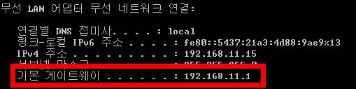

이 환경에서 공유기 설정의 IP 주소 부분을 보면, 인터넷 서비스 업체로부터 할당받은 공인 IP 주소가 입력되어 있을 것이다. 여기에서도 게이트웨이 설정 항목이 있는데, 이 IP 주소는 인터넷 서비스 업체의 라우터 주소다. 그리고 이 라우터는 2차 게이트웨이가 된다.

이러한 게이트웨이는 인터넷 접속을 위해 필요한 것이라 내부 네트워크, 예를 들어 내부의 컴퓨터끼리 통신하는 데는(파일/폴더 공유 등) 입력하지 않아도 된다. 게이트웨이 IP 주소 역시 윈도우의 명령 프롬프트에서 'ipconfig' 명령을 통해 확인할 수 있다.

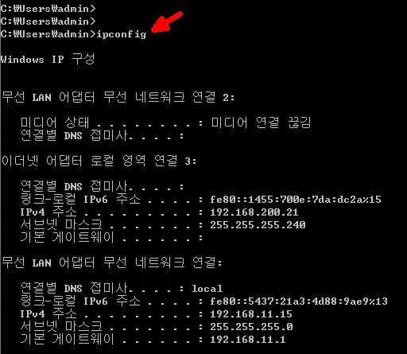

**기본 게이트웨이(Default gateway)는 또 뭐지?**

컴퓨터는 한 개 이상의 랜 카드를 장착해 서로 다른 네트워크에 연결할 수 있다. 이때 각 랜 카드는 각기 다른 게이트웨이 주소를 갖게 되는데, 그중 기본으로 사용할 게이트웨이를 지정한 경우를 의미한다. 즉 해당 컴퓨터에서 외부 네트워크로 빠져나갈 때 둘 중 어느 랜 카드를 통해 나갈지 지정하는 것이다. 물론 랜 카드가 하나라면 그에 설정된 게이트웨이가 당연히 기본 게이트웨이가 된다.

이외에도 랜 카드는 하나지만 두 개 이상의 네트워크에 연결된 경우, 예를 들어 업무용 내부 네트워크와 인터넷 접속 네트워크에 각각 연결되는 경우에도 기본 게이트웨이 설정이 필요하다. MS 윈도우 운영체계에서 기본 게이트웨이 설정은 각 랜 카드 연결 속성 페이지에서, 'Internet Protocol Version 4 (TCP/IPv4)' 항목 내 '고급' 버튼을 눌러 '고급 TCP/IP 설정' 페이지에서 수행할 수 있다(MS 윈도우 7 기준).

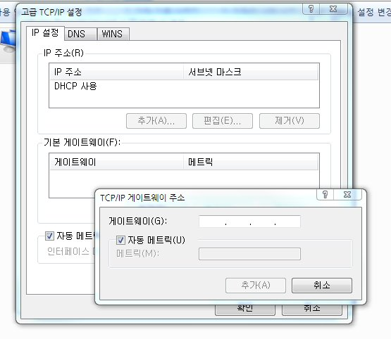

참고로 특정 사이트로 접근하는데 어떤 게이트웨이(라우터)를 거치는지 확인하고 싶다면, '명령 프롬프트'에서 'tracert' 명령어(trace route)와 해당 웹사이트 URL을 입력, 실행하면 된다(별표로 표시되는 구간은 보안 등의 이유로 정보 노출을 제한한 사이트다).

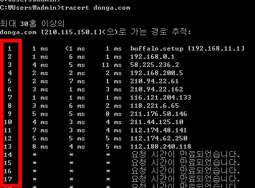

### 복잡한 IP 주소를 문자로 치환 - DNS

전 세계 모든 웹사이트는 대표 IP 주소를 가지고 있다. 앞서 IP 주소 강의에서 봤듯, 32자리나 되는 숫자를 일일이 기억하기 쉽지 않다. 그것도 여러 사이트라면 더욱 그러하다. 이처럼 전 세계 모든 웹사이트의 IP 주소를 사람이 인지하기 쉬운 문자로(또는 그 반대로) 치환해 주는 서비스가 DNS(Domain Name Service)다.

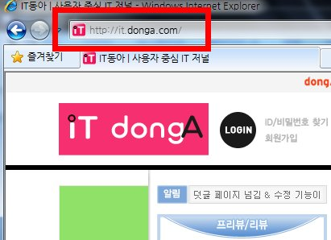

예를 들어, IT동아 웹사이트를 접속할 때 대표 IP 주소가 아닌 it.donga.com이라는 문자열(도메인 주소)을 웹브라우저 주소창에 입력하는 방식이 그러하다. 그럼 어떤 원리로 도메인 주소가 각 웹사이트의 IP 주소로 변환되는 것일까?

처리 단계는 간단하다. 사용자가 웹브라우저 주소창에 it.donga.com이라는 도메인 이름을 입력하고 엔터를 치면, 이때부터 도메인 이름 풀이 절차가 진행된다. 가장 먼저, 사용자 컴퓨터에서 it.donga.com의 IP 주소가 무엇인지, 해당 인터넷 서비스 업체의 DNS 서버에 질의하게 된다. DNS 서버에는 우리나라 및 전 세계 웹사이트의 도메인 이름과 IP 주소가 기록된 데이터베이스가 저장되어 있다(모든 웹사이트 정보가 다 있는 건 아니다).

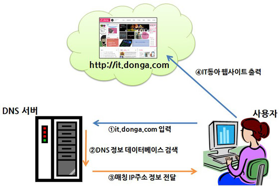

DNS 이름 풀이 요청을 받은 DNS 서버는 it.donga.com 주소의 뒷부분부터 DNS 데이터베이스 정보와 한 단계씩 비교하면서 정보를 찾는다. 즉 .com → donga → it 순으로 검색하여, '기업형 도메인(com)' → '동아일보 웹사이트(donga)' → '하위 도메인(it)'이라는 정보에 맞는 IP 주소를 검색하는 것이다. 최종적으로 it.donga.com에 해당되는 IP 주소를 발견되고 이를 사용자 컴퓨터에 전송함으로써 IT동아 웹사이트가 열리게 된다. 만약 it.donga.com에 해당되는 IP 주소가 없다면 당연히 웹사이트를 찾을 수 없다는 식의 메시지가 웹브라우저에 출력된다.

정상적으로 it.donga.com 웹사이트에 접속한 이후에는, DNS 서버가 제공했던 도메인-IP 주소 정보가 사용자 컴퓨터에 저장되어, 다음부터는 DNS 서버에 요청하지 않고 이를 참고하게 된다.

우리나라에는 현재 KT에서 운영하는 최상위 DNS 서버(서울 혜화동 소재)가 모든 도메인 이름 풀이를 담당하고 있으며, 이 최상위 DNS 서버는 전 세계 모든 DNS 서버와 웹사이트 정보를 동기화한다(그래야 외국 사이트도 접속할 수 있을 테니까). 몇 년 전에 발생한 '인터넷 대란'도 이 최상위 도메인 서버에 문제가 생겨, 도메인 이름을 IP 주소로 변경해 주지 못했기 때문이다(물론 이때 각 웹사이트의 IP 주소로 직접 접근하면 접속이 가능했을 것이다).

**특정 웹사이트의 IP 주소를 알고 싶으면?**

윈도우의 '명령 프롬프트'에서 'ping' 명령어와 해당 사이트의 주소를 입력하면 첫 줄에 IP 주소가 표시된다. 예를 들어, 'ping donga.com'이라 실행하면 첫 줄에 표시되는 '210.115.150.1'이 동아닷컴 웹사이트의 대표 IP 주소인 것이다. 물론 이 IP 주소를 웹브라우저에서 입력하면 donga.com으로 열었을 때와 똑같은 결과가 출력된다.

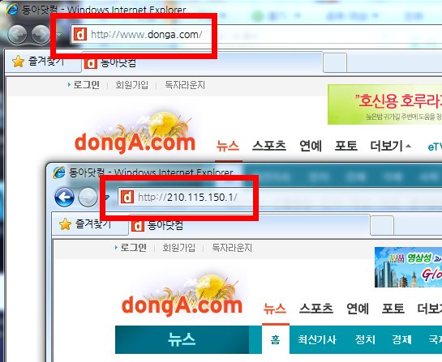

도메인 이름으로 인터넷에 접속하기 위해서는 사용자 컴퓨터에 도메인 서버 IP 주소를 설정해야 한다. 해당 인터넷 서비스 업체의 DNS 서버 IP 주소인데, 이는 업체마다 다르다. 하지만 반드시 해당 업체 도메인 서버 IP 주소를 입력해야 하는 것은 아니다. 도메인 이름 풀이 요청을 처리할 수 있는 DNS 서버면 되는데, 앞서 말한 KT 최상위 도메인 서버의 IP 주소는 168.126.63.1이다. 다만 사용자 컴퓨터와 가장 가까운 DNS 서버가 아무래도 해당 인터넷 서비스 업체이기에, 그쪽 DNS 서버 IP 주소를 설정하는 것이다.

각 인터넷 서비스 업체는 DNS 서버에 걸리는 이름 풀이 처리 부하를 줄이기 위해 여러 대의 서버를 운영하는데, 그에 따라 '1차 도메인 서버', '2차 도메인 서버' 등으로 정보를 제공하고 있다. 즉 1차 도메인 서버에 부하가 걸려 있으면, 2차 도메인 서버 쪽에서 이름 풀이 요청을 처리하는 것이다.

윈도우 컴퓨터의 '명령 프롬프트'에서 'ipconfig'를 실행하면, DNS 서버 설정은 확인할 수 없다. IP 주소와 서브넷 마스크, 게이트웨이 정보만 출력되기 때문이다. 이때는 'ipconfig /all'이라는 명령어를 사용해야 DNS 서버 정보를 확인할 수 있다.

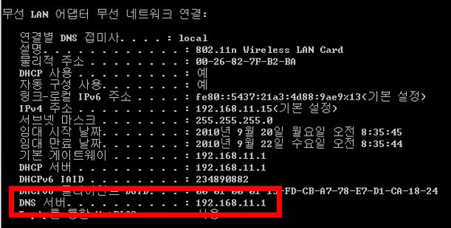

IP 주소를 자동으로 할당받는 DHCP 환경이라면, DNS 서버 IP 주소 정보도 자동으로 설정된다. 다만 경우에 따라 DNS 서버 설정을 변경해야 한다면, 네트워크 연결 속성 페이지의 'Internet Protocol Version 4 (TCP/IPv4)' 항목의 속성 페이지에서 '다음 DNS 서버 주소 사용'을 선택하고, 해당 인터넷 서비스 업체에서 제공하는 DNS 서버 IP 주소를 입력하면 된다.

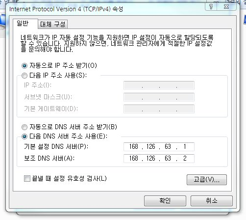

단 인터넷 공유기를 사용하는 환경이라면 DNS 서버 주소도 (게이트웨이와 마찬가지로) 공유기 자체의 IP 주소로 자동 설정된다(물론 변경할 수 있다).

**핵심 정리**

\1. 게이트웨이(gateway)

- 인터넷 접속 등 외부 네트워크로 연결되기 위한 네트워크 기기
- 두 개 이상 존재 가능(기본 게이트웨이 설정)
- 인터넷 서비스 제공 업체의 라우터 기기 IP 주소
- 일반적으로, 사용자 컴퓨터 IP 주소의 4번째 마디에 xxx.xxx.xxx.1로 설정

\2. DNS(Domain Name Service)

- 웹사이트 도메인 이름을 IP 주소(혹은 반대)로 변환해주는 서비스 또는 서버
- 경우에 따라 1차, 2차 DNS 서버 IP 주소를 설정
- 이름 풀이 요청(컴퓨터) → 도메인 이름/IP 주소 매핑 검색(서버) → IP 주소 정보 전송(서버→컴퓨터)

## 네트워크 프로토콜

프로토콜(protocol)은 컴퓨터뿐 아니라 다양한 방면에서 통용되는 용어다. 공상과학영화 등을 보면 자주 나오는데, 사전적으로는 ‘규약’, ‘약속’ 등을 의미한다. 컴퓨터 네트워크에서의 프로토콜은 두 기기(컴퓨터든 뭐든)가 서로 통신하기 위한 사전 약속으로 해석할 수 있다. 우리가 전화를 걸고 받을 때 서로 “여보세요”라는 말로 시작하는 것과 유사한 개념이다. 물론 “여보세요” 대신 ”네~” 혹은 “홍길동입니다”라고 말하는 이도 있지만, 이 역시도 전화 통화의 단계에서 보면 같은 맥락이다.

우리가 컴퓨터를 통해 인터넷을 접속하든 공유 폴더/파일에 접근하든 메일을 주고받든 네트워크 프로토콜을 알게 모르게 이용하게 된다. 이렇듯 컴퓨터 통신에 이용되는 프로토콜은 여러 가지가 있는데, 컴퓨터와 인터넷을 사용하면서 흔히 접하게 되는 프로토콜은 대여섯 개밖에 되지 않는다. 물론 이를 몰라도 아무 문제 없겠지만, 알아 두면 조만간 요긴하게 써먹을 일이 분명 생길 것이다.

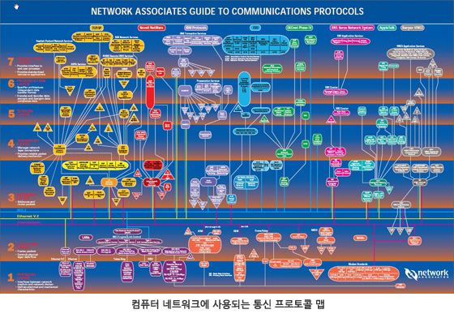

### 인터넷 접속을 위한 규약 - TCP/IP

TCP/IP라는 프로토콜을 교과서적으로 설명하려면, 먼저 ‘OSI 7계층’이라는 데이터 전송 기본 이론에 대해 구구절절 늘어놓아야 한다. 전산 자격증 시험을 볼 것도 아니니 여기서는 개괄적인 개요와 개념만 인식하도록 한다.

MS 윈도우 운영체계에서도 TCP/IP라는 프로토콜을 자주 접하는데, 이는 한마디로 ‘인터넷 접속’을 위한 통신 규약이라 정의할 수 있다. 이는 TCP라는 프로토콜과 IP라는 프로토콜을 합쳐서 사용하는 것으로, ‘123.123.123.123’과 같은 IP 주소 체계를 사용하면서(IP 프로토콜의 특징), 신뢰성 높은 데이터 송수신을 제공한다(TCP 프로토콜의 특징)는 의미다.

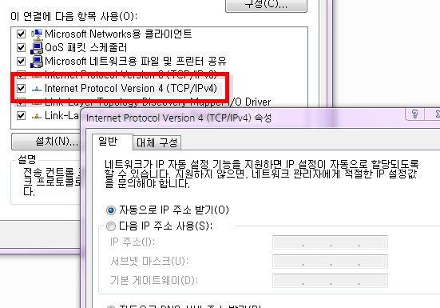

이에 따라 전 세계의 모든 컴퓨터, 기기가 인터넷을 통해 상호 연결되기 위해서는 TCP/IP라는 통신 규약을 사용해야 하고, 그 일환으로 IP 주소를 각각 부여하고 있다. 윈도우 운영체계의 네트워크 속성 등에서 보는 ‘Internet Protocol Version 4(TCP/IPv4)’가 바로 이것이다(MS 윈도우7 기준).

참고로 여기서 말하는 ‘인터넷’이란 엄밀히 말해, 흔히 웹 브라우저로 접속하는 ‘인터넷 웹 사이트’가 아닌, 각기 다른 지역의 컴퓨터가 서로 연결되는 방식을 통칭하는 의미다. 웹 브라우저로 접속하는 인터넷 웹 페이지는 ‘인터넷’의 방식 중 하나일 뿐이다. 이는 다음에서 바로 설명한다.

### 웹 페이지에 접속하기 위한 규약 - HTTP

앞서 언급한 대로, 인터넷 익스플로러 등의 웹 브라우저로 웹 페이지에 접속하는 것은 ‘인터넷’의 가장 보편적이고 대중적인 방식이다. 인터넷 웹 페이지는 ‘하이퍼 텍스트(hyper-text)’라는 글자로 구성되는데, 이 하이퍼 텍스트를 전송, 제어하는 규약이 HTTP이다. 그리고 웹 페이지를 작성하는 언어가 ‘HTML’이다. 특정 하이퍼 텍스트를 마우스로 클릭하여 다른 웹 페이지로 이동시키는 방식을 ‘하이퍼링크’라고 한다.

웹 브라우저 주소창에 ‘http://…’라 입력하는 건, 이제부터 접속할 인터넷은 하이퍼 텍스트로 작성된 웹 페이지에 접속한다는 뜻이다. 만약 이 ‘http’ 대신에 다른 프로토콜(예를 들면, 아래에서 설명할 ftp)을 입력하면 다른 방식의 인터넷으로 접속된다. 아울러 ‘http://’를 생략하고 www.itdonga.com와 같은 인터넷 주소를 입력해도, 컴퓨터는 기본적으로 ‘http://’가 포함된 것으로 간주하고 웹 페이지를 띄우게 된다.

전 세계의 모든 웹 페이지는 http 프로토콜을 통해 서비스되어야 하며, 사용자는 http 프로토콜을 지원하는 웹 브라우저를 통해 이 웹 페이지에 접속해야 한다. 이것이 네트워크에서 말하는 ‘규약’이다.

**HTTPS도 있던데?**

HTTPS는 http와 동일하지만 보안(secure) 기능을 추가한 것으로 http 프로토콜에 보안 기능을 제공하는 SSL 프로토콜을 접목한 형태다. 이 https는 컴퓨터 사이에 전송되는 데이터나 정보 등을 암호화하여 보안성을 강화하게 된다. 일반적으로 온라인 결재 웹 페이지나 회원 가입 웹 페이지 등에 적용되어 정보 유출을 방지한다. 웹 사이트에 로그인하거나 인터넷 쇼핑몰 등에서 온라인 결재할 때 인터넷 주소창을 유심히 보면, http에서 https로 변경됐다가 다시 http로 복귀되는 것을 볼 수 있다. 즉 회원 정보나 결재 정보가 전송되는 단계에서는 https 프로토콜로 전환되는 것이다(보통 눈 깜박할 사이에 전환되어 잘 안 보이긴 한다).

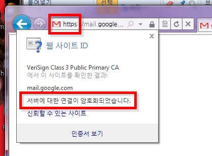

### 빠른 파일 전송을 위한 규약 - FTP

순전히 파일 전송을 위해 사용하는 인터넷 규약이다. 다른 어떤 프로토콜보다 속도가 빠른 것이 특징이다. 앞선 http를 사용하는 웹 페이지에서도 파일을 다운로드할 수 있지만, 대량의 파일을 다운로드하기에는 아무래도 불편하고 느리다. ftp 프로토콜은 원격의 컴퓨터에 접속하여 파일만 빠르게 업로드/다운로드할 수 있도록 한다. 위에서 ftp 역시 인터넷 규약이라 설명한 대로, 동일한 인터넷 주소라도 ‘http://’를 입력했을 때와 ‘ftp://’를 입력했을 때는 다른 화면이 나타난다(해당 사이트에서 http와 ftp 서비스를 제공한다는 가정). 즉 같은 ‘인터넷’이지만 접속 및 전송 방식이 다른 것이다. 규약이 다르기 때문이다.

기본적으로 ftp 프로토콜을 통해 파일을 전송하려면 FTP 클라이언트 프로그램이 필요하다. http를 사용하는 웹 페이지에 접속하기 위해서는 인터넷 익스플로러 등과 같은 웹 브라우저가 필요한 것과 동일하다. 이스트소프트의 ‘알FTP’가 그 대표적인 예다(무료이면서 여러 가지 기능을 제공하기 때문에 많은 사람이 사용한다).

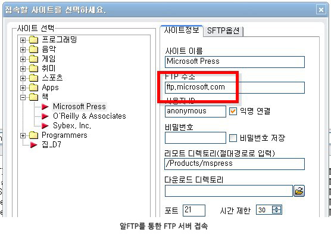

물론 웹 브라우저나 윈도우 탐색기에서도 ftp 서비스를 제공하는 서버(ftp 서버)에 접근할 순 있다. ‘http://..’와 유사하게 ‘ftp://..’ 형태로 주소를 입력하면 된다. 다만 대량의 파일을 송수신할 때는 알FTP와 같은 전용 클라이언트 프로그램보다는 속도도 느리고 번거롭다.

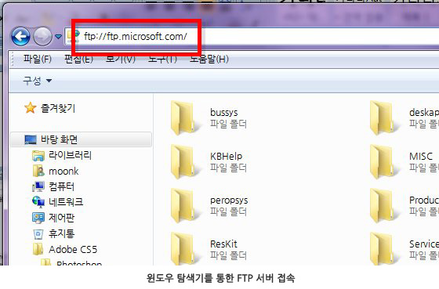

### E 메일을 받고 보내기 위한 규약 - POP / SMTP

편지를 정확하게 보내고 받기 위해 우리는 우편번호를 적고, 보내는 사람 주소 위치, 받는 사람 주소 위치를 구분하여 기재한다. 이것이 편지 송수신에 대한 사회적인 규약이다. E 메일(이하 메일)도 마찬가지다. 메일을 인터넷으로 보내기 위한 프로토콜(SMTP)과 받기 위한 프로토콜(POP)을 정확히 구분해서 사용해야 하는데, 전자가 POP, 후자가 SMTP 프로토콜이다.

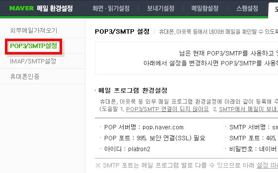

일반적으로 네이버 등의 포털 사이트의 메일 서비스를 통해 메일을 주고받을 때는 이들 메일 프로토콜에 대해 몰라도 된다. 포털 측에서 미리 설정해 뒀기 때문이다. 하지만 MS 아웃룩 등의 메일 클라이언트 프로그램을 설치해 이를 통해 메일을 발신, 수신하기 위해서는 POP, SMTP 프로토콜 설정을 직접 해야 한다. 예를 들어 네이버 메일을 MS 아웃룩에서 사용하려면, 네이버에서 제공하는 메일 수신용 POP 서버 주소(pop.naver.com)와 발신용 SMTP 서버 주소(smtp.naver.com)를 아웃룩에 입력하면서 계정과 암호를 설정해야 한다(물론 네이버 로그인 계정과 암호다). POP 설정만 하면 메일 수신만 가능하고, SMTP 설정만 하면 메일 발신만 가능하다.

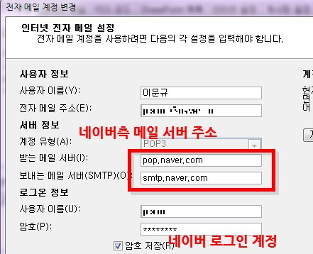

MS 아웃룩 같은 프로그램 외에도 스마트폰이나 태블릿 PC 등에 제공되는 메일 애플리케이션에서도 이와 같은 POP/SMTP 설정을 해야 외부 메일을 기기에서 직접 확인, 전송할 수 있다.

한편 메일을 수신하는 프로토콜은 POP 이외에 IMAP이라는 것도 많이 사용된다. 스마트폰 등에 주로 적용되는데, 메일 수신함을 폴더 형태로 편리하게 사용할 수 있거나 서버의 메일 수신함과 기기의 수신함을 동기화시킬 수 있고, 메일 미리 읽기 등이 가능하다는 특징이 있다. 설정하는 방법은 POP와 동일하다. 네이버의 경우 메일 수신 서버 설정에 imap.naver.com이라 입력하면 된다.

### IP 주소를 자동으로 설정하기 위한 규약 - DHCP

앞선 1부 강의에서 살펴본 IP 주소 등의 네트워크 정보를 컴퓨터에 자동 설정하도록 하는 프로토콜이다. DHCP 서버가 각 컴퓨터에 IP 주소 등의 정보를 뿌려줄 때 상호 간에 지정한 통신 규약이 DHCP다(이를 ‘유동 IP 주소’라 한다고 1부([http://it.donga.com/openstudy/3106/](http://it.donga.com/3106/))에서 배웠다). DHCP 환경에서는 IP 주소가 중복 사용될 염려가 없으며, 켜져 있는 컴퓨터에만 IP 주소 등을 할당하기 때문에 IP 주소가 쓸데없이 낭비되는 일도 없다. 물론 사용자가 일일이 직접 IP 주소 등을 입력할 필요가 없다는 점이 DHCP 서비스의 가장 큰 장점이다.

 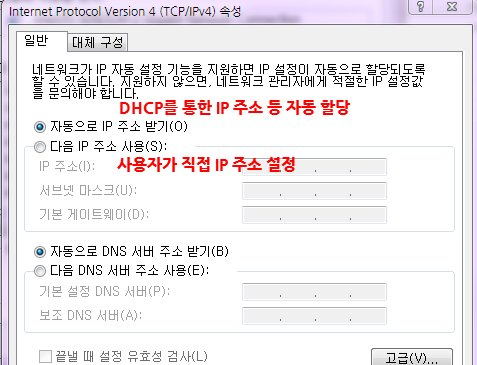

현재 판매되는 인터넷 유무선 공유기에는 이 DHCP 서비스가 기본적으로 제공되어 하나의 공인 IP 주소를 여러 대의 컴퓨터에서 공유할 수 있다. 공유기가 아니더라도 DHCP 서버를 직접 구현하여 사용할 수도 있다. MS 윈도우 서버 운영체계나 리눅스 등의 DHCP 서비스를 실행한 후 IP 주소를 자동 할당할 컴퓨터 대수에 맞게 IP 주소 범위(pool)를 설정하면 그 범위 내에서 서버가 알아서 컴퓨터에 IP 주소를 할당한다. 물론 이 정보를 수신한 컴퓨터도 알아서 자동으로 네트워크 설정을 완료하게 된다.

지금까지 이번 강의에서는 7개의 프로토콜에 대해서만 간략하게 알아봤지만, 실제로 컴퓨터나 네트워크 기기가 서로 통신하는 데는 수많은 프로토콜이 사용된다. 이에 대해 자세히 설명하려면 웬만한 두께의 참고서 한 권 정도가 된다. 물론 우리가 컴퓨터와 네트워크를 사용하는데 이들 프로토콜을 전부 알아야 할 필요도 없고 그러기도 어렵다. 하지만 분명한 건, 이렇게 복잡 다양한 통신 기술과 서비스가 톱니바퀴처럼 정확히 맞물려 돌아가고 있기 때문에, 책상에 앉아 지구 반대편 동네의 인터넷 웹 페이지에 접속할 수 있다는 점이다. 그런 만큼 일상의 일부가 된 인터넷을 지금보다 훨씬 유용하고 신속하게 사용하기 위해서는, 적어도 위의 프로토콜에 관한 기초 지식 정도는 알아두는 것이 바람직하다 하겠다.

**약어 풀이**

- OSI - Open System Interconnection
- TCP/IP - Transmission Control Protocol / Internet Protocol
- HTTP - HyperText Transfer Protocol
- HTTPS - HyperText Transfer Protocol Secure
- HTML - HyperText Markup Language
- FTP - File Transfer Protocol
- POP - Post Office Protocol
- SMTP - Simple Mail Transfer Protocol
- IMAP - Internet Message Access Protocol
- DHCP - Dynamic Host Configuration Protocol

## 네트워크 장비

컴퓨터 네트워크 이론 자체가 일반 사용자에게는 결코 쉽지 않은 것이다 보니, 이 이론에 기초하여 다양한 서비스를 제공하는 네트워크 장비(기기, 부품)에 관해서는 더욱 어렵게 여기게 된다. 물론 전문용 고급 네트워크 장비는 다분히 그러하지만, 사무실이나 가정에서 사용하는 소형 장비는 조금만 관심을 갖고 다뤄보면 ‘컴맹’이나 ‘넷맹’이라도 능히 활용할 수 있다. 이에 이번 4부 강의에서는 컴퓨터와 인터넷을 사용하다 보면 언젠가 한 번쯤은 접하게 될 일반용 네트워크 기기 및 부품 등에 대해 알아본다. 각 장비의 상세한 사용방법까지는 다룰 수 없지만, 적어도 뭐 하는 데 쓰는 물건인지, 그리고 나에게 필요한 것이 무엇인지는 알 수 있을 것이다.

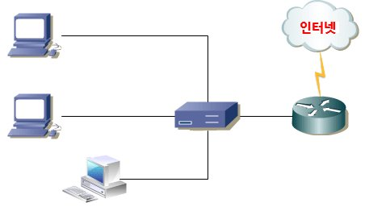

### 여러 컴퓨터를 연결하는 네트워크 분배기, 허브/스위치

컴퓨터나 모니터 등의 전원 케이블을 연결할 때 전기 콘센트가 부족한 경우 ‘멀티 탭’이라는 전기용품을 사용한다. 이는 하나의 전력원을 여러 기기로 분배해주는 역할을 담당한다. 네트워크 장비 중 허브(hub)와 스위치(switch, 혹은 스위치 허브)도 이 멀티 탭과 같이 분배의 역할을 한다. 다시 말해, 하나의 네트워크 라인에 여러 대의 컴퓨터에 랜 케이블을 꽂을 수 있도록 분배하는 장비다.

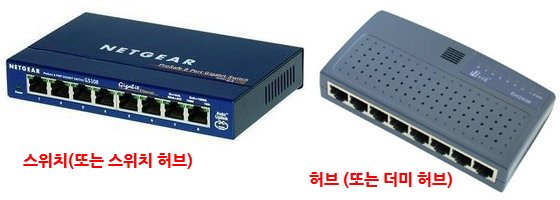

비슷하게 생긴 이 두 장비의 가장 큰 차이는 데이터 전송 대역이다. 허브는 단순한 분배 중계기에 불과하기 때문에, 연결되는 컴퓨터 수에 따라 데이터 전송 대역이 분리된다. 예를 들어, 원래 전송 대역이 10Mbps인 네트워크 라인에 허브를 물리고 여기에 5대의 컴퓨터를 연결했다면 각 컴퓨터의 대역폭은 2Mbps가 된다. 한번에 한쪽 컴퓨터로만 데이터를 전송할 수 있으므로, 전체 10Mbps 대역폭을 각 컴퓨터에 동시에 적용할 수 없기 때문이다. 한번에 한 대의 차량만 이동할 수 있는 왕복 1차선 도로를 연상하면 이해가 쉽다.

반면에 스위치는 10Mbps 대역폭을 5대의 컴퓨터에 모두 적용할 수 있어, 여러 대의 컴퓨터에 데이터를 전송하는 경우 허브보다는 상대적으로 속도가 빠르다. 이는 왕복 다차선 도로에 비유할 수 있겠다. 1차선에 차가 달리고 있어도 다른 차선의 차량 이동에 전혀 지장을 주지 않는 것처럼, A 컴퓨터에서 B 컴퓨터로 데이터를 전송하는 동안, C 컴퓨터에서 D 컴퓨터로도 데이터를 전송할 수 있다.

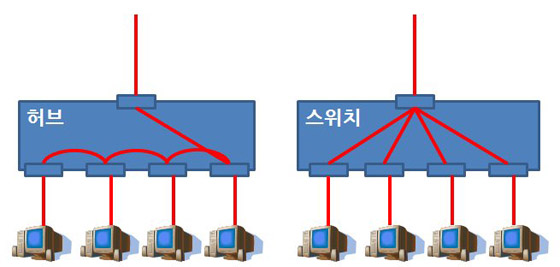

장비 구성을 봐도 스위치는 허브보다 고급 부품들로 생산된다. 일반적으로 스위치에는 CPU(컴퓨터용은 아니지만)와 메모리가 들어 있지만, 허브는 전기 멀티 탭과 같은 단순한 분배 장치에 불과하다. 아울러 스위치는 몇 가지의 네트워크 기능/서비스를 제공하기에 허브보다는 활용도가 높다. 가격은 물론 스위치가 허브보다 비싸다. 허브는 구형 장비로 인식되어 최근에는 스위치만 주로 생산, 판매되고 있다.

허브와 스위치는 컴퓨터를 연결할 수 있는 포트 수에 따라 4포트, 8포트, 16포트 등의 모델로 나뉘며, 포트 수가 많을수록 가격이 비싸다. 가정에서는 그다지 사용할 일이 없을 것이고(대부분 공유기를 사용할 테니), 컴퓨터 수가 많은 학교나 회사, PC방 등에 주로 사용된다.

### 서로 다른 지역의 컴퓨터를 연결하는 라우터

허브와 스위치가 한 공간에 배치된 컴퓨터를 연결하는 장비라면, 라우터(router)는 다른 장소의 컴퓨터를 연결하는 장비라 할 수 있다. 데이터가 출발지에서 목적지까지 정확하게 이동하는 것을 라우트(route)라 하고, 그렇게 될 수 있도록 최적의 경로를 찾아 주는 역할을 라우터가 담당한다. 배치되는 위치로 보면, 제일 하단에 컴퓨터가 그 바로 위에 허브나 스위치가, 또 그 위에 라우터가 존재한다. 라우터는 일반적으로 라우터끼리 연결되는 경우가 많다. 경부 고속도로의 서울 톨게이트와 부산 톨게이트를 각 지역의 라우터로 이해하면 된다. 이 때문에 라우터를 ‘게이트웨이(gateway)’라고도 한다.

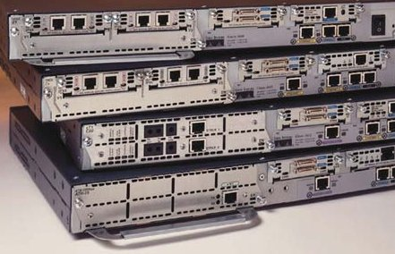

위에서 언급한 대로, 라우터는 최적의 경로를 찾아 데이터를 전송해야 하기 때문에 스위치보다 고급 부품으로 생산되며, 그에 따라 가격도 상당히 비싸다. 그리고 제대로 운영하기 위해서는 네트워크 고급 지식이 필요하다.

라우터는 기업용 전산 시스템 환경에 주로 적용되지만, 가정이나 사무실에서 사용하는 인터넷 유무선 공유기도 라우터의 일종이다. 집/사무실 컴퓨터를 인터넷에 연결시켜 주기 때문이다. 사실 인터넷 공유기는 스위치와 라우터, 그리고 아래에서 알아볼 방화벽 등의 기능이 농축된 네트워크 토털 패키지 장비인 셈이다.

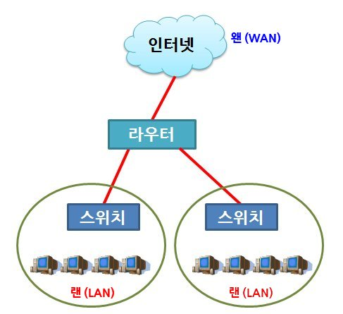

**LAN과 WAN**

'랜(LAN, Local Area Network)'이라는 용어는 그래도 귀에 익숙하지만, ‘왠(WAN, Wide Area Network)’은 낯설기만 하다. 랜은 작은 영역의 네트워크 연결을, 왠은 중대형 영역의 네트워크 연결을 의미한다. 즉 연결 영역의 크기에 따른 구분이다. 예를 들면, 집안이나 사무실 내의 네트워크 연결은 ‘랜’, 지역 간/국가 간 네트워크 연결은 ‘왠’이라 할 수 있다. 그에 따른 장비도 다른데, 랜 영역에는 허브나 스위치가, 왠 영역에는 라우터가 주로 사용된다.

### 하나의 IP 주소를 여러 컴퓨터가 공유하는 인터넷 공유기

노트북이나 스마트폰이 대중화되면서, 인터넷 유무선 공유기(이하 공유기)는 이제 일반 가정에서도 보편적인 네트워크 장비가 됐다. 집이나 사무실에 들어온 하나의 인터넷 라인을 공유하여, 두 대 이상의 컴퓨터나 스마트폰을 통해 유선 또는 무선으로 인터넷에 동시에 접속할 수 있도록 하는 장비다. 설치나 설정, 사용 방법이 간소화된 제품이 대거 출시되면서, 이제 전문가만이 아닌 일반 사용자도 얼마든지 활용할 수 있게 됐다.

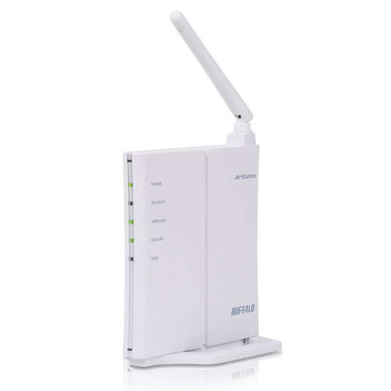

가정/사무실용 소형 공유기라 해도 주요 네트워크 서비스나 기능은 충실히 제공된다. 우선 앞서 언급한 대로, 공유기는 스위치와 라우터, 방화벽의 역할을 동시에 수행한다. 일반적으로 4개의 유선 랜 포트와 1개의 인터넷(WAN) 포트를 갖춘 구성인데, 인터넷 포트에는 인터넷 라인을(라우터 기능), 4개의 유선 랜 포트에는 노트북이나 데스크탑을 연결한다(스위치 기능). 여기에 누군가가 외부로부터 인터넷 등을 통해 내부로 침입할 수 없도록 하는 보안 기능(방화벽)을 기본 제공한다.

인터넷 공유기는 무선 랜(와이파이, Wi-Fi) 연결을 지원하기에 일반적으로 안테나를 장착한 형태다. 이러한 안테나가 많을수록 무선 신호가 강해져 무선 랜 사용 반경이 넓어진다. 그러니 공유기 구매 시 안테나 수도 확인해야 할 것이다(당연하겠지만, 안테나 수가 많은 제품이 비싸다).

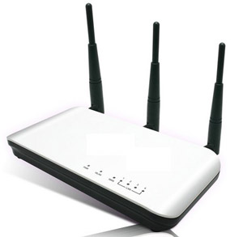

인터넷 공유기는 유선 랜 전용, 무선 랜 전용(AP, Access Point), 유무선 랜 겸용으로 구분되지만, 현재 출시, 판매되는 제품은 거의 대부분이 유무선 랜 겸용이다. 아직은 유선 랜이 무선 랜보다 빠르니, 무선 랜을 사용해야 하는 결정적인 이유(이동 중 인터넷 사용 등)가 없다면 유선 랜을 사용하는 것이 좋다. 속도가 빠른 것도 그렇고, 안정적인 인터넷 연결이 가능하기 때문이다.

인터넷 유무선 공유기에 대한 자세한 내용은 [IT강의실] 내 관련 기사를 참고한다.

### 네트워크 무단 침입을 예방하는 방화벽

원래 ‘방화벽(防火壁)’이라는 용어는 건축물 등에 화재가 발생했을 때 불길이 번지지 않도록 차단하는 벽면 외장재를 의미한다. 컴퓨터 네트워크에서는 해커나 크래커, 또는 바이러스 등이 네트워크 내부에 침입하지 못하도록 하는 보안 장비를 말한다. 하드웨어일 수도, 소프트웨어일 수도 있다(엄밀히 말하면 소프트웨어에 가깝다. 이것이 설치된 하드웨어가 방화벽 장비다).

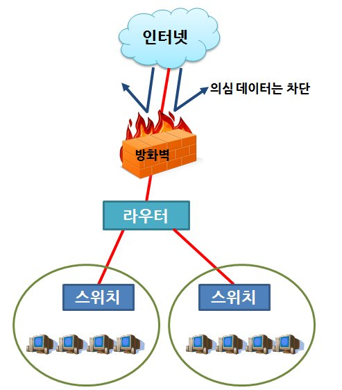

방화벽은 일반적으로 네트워크 구성에서 가장 윗단에 배치되어(컴퓨터-스위치-라우터-방화벽 순), 네트워크 내외에 걸쳐 데이터나 사용자의 이동 패턴을 분석한 후 사전에 지정한 보안 정책(rule)에 따라 처리한다. 예를 들어, 외부에서 인증되지 않은 사용자가 주기적으로 침입하려는 시도가 발생하면, 이를 ‘불법 침입’으로 간주하고 이를 차단하는 것이다. 한편 방화벽은 내부 네트워크에서 외부 인터넷 등으로 나가는 데이터도 통제할 수 있다. 이를테면, 관공서나 기업체 등에서 내부 직원이 특정 사이트에 접속하지 못하도록 차단하는 역할도 방화벽이 담당한다.

사실상 일반 사용자가 네트워크 방화벽을 직접 사용할 기회는 거의 없을 것이다. 왜냐하면 인터넷 서비스를 제공하는 업체의 네트워크 구성에 고급 방화벽 등의 보안 장비가 배치되어 있기 때문이다. 하지만 제아무리 고가의 고급 방화벽이라 해도 100% 안전할 순 없다. 따라서 윈도우 운영체계에서 무료로 제공되는 ‘윈도우 방화벽’ 프로그램이나 무료 백신 프로그램(알약, V3 라이트, 네이버 백신 등)을 설치해 주기적으로 컴퓨터 상태를 점검해야 하겠다.

**윈도우 방화벽**

MS 윈도우 XP와 비스타, 7 등에는 MS에서 개발한 방화벽 프로그램이 기본 내장되어 있다. 사용자가 일부러 종료하지 않으면 기본적으로 항상 실행되어 있는데, 완벽하지는 않아도 나름대로 제 역할을 충실히 하는 보안 프로그램이다. 윈도우 방화벽은 윈도우에 설치된 각종 프로그램 중에서 네트워크(혹은 인터넷)로 통신하는 프로그램의 통신 허용 여부를 설정한다. 이미 널리 알려진 통신 프로그램은 통신을 허용하고 있지만, 불확실 프로그램에 대해서는 통신 차단 확인 창을 띄우게 된다. 따라서 특정 프로그램(온라인 게임 포함)이 통신 불가 또는 접속 불가 문제가 발생한다면, 윈도우 방화벽 설정을 확인해야 한다. 아울러 윈도우 방화벽은 통신 포트(네트워크에서 데이터가 이동하는 통로)에 따라 통신을 차단하기도 한다(방화벽의 기본적인 기능). 이에 따라 업무용 프로그램 등이 다른 컴퓨터에 연결/접속되지 않는다면, 이 프로그램의 통신 포트를 확인하여 이를 윈도우 방화벽에서 차단 해제시켜야 한다. 뭐가 뭔지 잘 모르겠다면, 그냥 윈도우가 하라는 대로 하는 것이 컴퓨터를 안전하게 보호하는 길이다. 참고로 컴퓨터 시스템은 보안이 강화되면 그만큼 사용하는 데 번거로움이 있을 수밖에 없다.

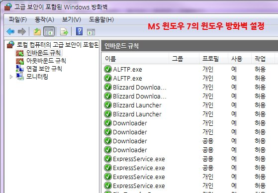

참고로 네트워크 보안 장비는 방화벽이 대표적이지만, 그 외에 IDS(Intrusion Detect System, 침입 감지 시스템)이나 IPS(Intrusion Protect System, 침입 예방 시스템) 등과 같이 방화벽보다 전문적인 고급 장비도 있다.

네트워크 장비는 위에서 열거한 제품 외에도 브릿지(bridge, 네트워크 간 연결)나 리피터(repeater, 네트워크 신호 증폭), 브라우터(브릿지+라우터) 등 그 용도와 목적에 따라 다양하지만, 가장 보편적으로 사용되는 장비는 위 제품들이다. 위 제품들은 또한 네트워크 전문가가 아닌 일반 사용자들이 언젠가 한 번쯤은 접할 수 있을 장비들이기도 하다. 물론 아직까지는 컴퓨터보다 설정, 사용법이 어렵다. 하지만 일단 한번 학습하면 두고두고 요긴하게 사용할 수 있는 장비다. 더군다나 오늘날처럼 인터넷과 네트워크가 우리 생활에 깊숙이 파고든 상황에서는 더욱 그러하다.

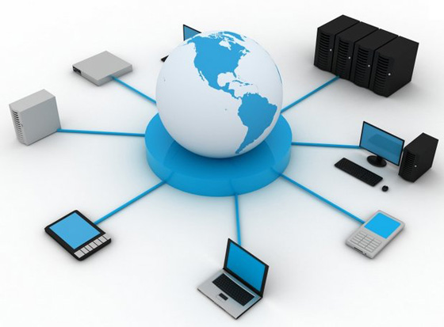

네트워크 장비와 친해지기 위한 확실한 방법은 인터넷 유무선 공유기를 사용하는 것이다. 앞서 언급한 대로, 인터넷 공유기는 네트워크 장비의 주요 기능과 역할, 서비스 등이 모두 내장된 제품이라 네트워크 관련 정보와 지식을 익히는 데 많은 도움이 된다. 또한 제조사와 제품은 달라도 설정, 사용하는 방법이 거의 동일해서, 제품 하나만 잘 다룰 줄 알면 다른 제품도 능히 제어할 수 있을 것이다. 최근에 출시되는 유무선 공유기는 네트워크 전문 지식이 없어도 설명만 보고 그대로 따라 하면 충분히 사용할 수 있도록 간소화되어 사용자의 편의를 제공하고 있다.

## 랜 카드와 랜 케이블

바느질을 하려면 바늘과 실이 필요하고, 운전을 하려면 차량과 연료가 필요하다. 둘 중 하나만 있어서는 아무것도 할 수가 없다. 이와 마찬가지로, 인터넷을 하기 위해서는 (컴퓨터는 당연하고) 랜 카드와 랜 케이블이 필요하며, 어느 하나라도 없으면 인터넷은 고사하고 주변 컴퓨터와도 연결될 수 없다.

컴퓨터 네트워크에 있어 랜 카드와 랜 케이블은 가장 원초적이며 기본적인 구성품이다. 그래서인지 일반 사용자들은 이 둘에 대해 별 관심이 없다. 그저 아무 문제 없이 잘 작동하면 그만일 뿐. 사실 그거면 된다. 그 이상의 관심과 정보는 관련 전공자에게나 필요한 내용이니까. 하지만 자동차를 운전만 한다 해도 차에 관한 기본 지식을 습득하면 좀 더 효율적이고 안정적으로 운전할 수 있는 것처럼, 랜 카드와 랜 케이블에 관해서도 간단하게나마 알아두면 쾌적한 인터넷 환경을 유지할 수 있을 것이다.

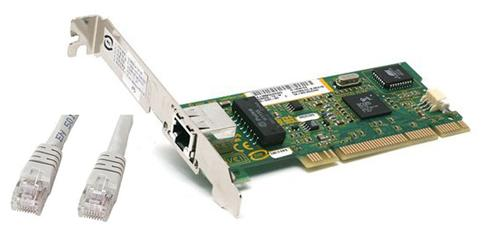

일반 사용자를 위한 IT동아의 네트워크 기초 강의, 그 다섯 번째 주제는 랜 카드와 랜 케이블이다.

### 컴퓨터 외부로 나가는 출발점, 랜 카드

랜 카드(LAN card)는 정확한 컴퓨터 용어로 ‘네트워크 어댑터(network adapter)’라고 한다. 어댑터의 사전적 의미가 두 접점을 연결하는 접합기이니, 네트워크 어댑터는 네트워크에 연결되도록 하는 매개로 해석할 수 있다. 랜 카드가 없는 컴퓨터는 인터넷과 같은 네트워크에 속할 수 없는 ‘왕따’에 불과한 셈이다. 인터넷이나 네트워크에 대한 활용도가 극히 낮았던 십수 년 전만 해도 랜 카드는 일부 전문가만 사용하는 고급 옵션으로 여겼다. 하지만 요즘에는 랜 카드(또는 랜 칩)가 없는 컴퓨터는 찾아볼 수 없을 정도로 일반화되어 있다. ‘컴퓨터=인터넷’으로 자리 잡았다.

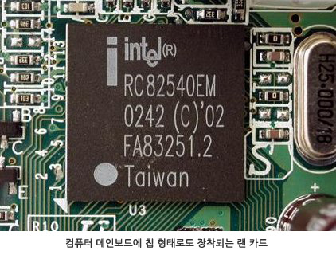

원래 랜 카드는 컴퓨터 부품의 하나로 컴퓨터 메인보드에 장착하는 카드형 제품이었다(그래픽 카드처럼). 물론 지금도 카드형 제품이 아예 없는 건 아니지만, 기본적으로 메인보드에 칩 형태로 내장되는 구성이 주를 이룬다. 이를 ‘메인보드 내장 랜 칩’이라 하는데, 이게 고장 나면 카드형 랜 카드를 구매해 추가 장착해야 한다. 참고로 랜 카드는 몇 개라도 꽂아 사용할 수 있다(메인보드에 꽂을 슬롯이 남아 있는 한). 다만 일반적인 환경에서는 거의 사용할 일 없고, 간혹 MS 윈도우 운영체제의 ‘인터넷 연결 공유’ 등의 부수 기능에 활용되긴 한다.

**내 컴퓨터를 인터넷 공유기로**

윈도우나 리눅스 등의 운영체제가 설치된 컴퓨터는 인터넷 공유기로도 활용할 수 있다. 이를 위해서는 윈도우에서 제공하는 ‘인터넷 연결 공유’ 기능을 사용하면 된다. 이때는 랜 카드를 2개 이상 장착해야 하는데, 랜 카드 하나는 인터넷 라인에, 다른 랜 카드는 각 컴퓨터에 연결하면 된다. 다만 일반적으로 개인용 컴퓨터는 랜 카드를 2개 이상 장착하기가 어려우며, 다른 컴퓨터에서 인터넷 라인을 공유하기 위해서는 공유기 역할의 컴퓨터가 늘 켜져 있어야 한다는 단점이 있다. 더군다나 최근에는 인터넷 공유기가 저렴해서 이 기능을 사용할 기회가 줄어들었다. 그래도 이런 기능이 있다는 것은 알아두면 좋다.

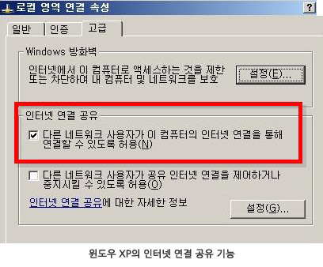

컴퓨터에 장착된 랜 카드(또는 랜 칩)는 각 운영체제에 맞는 드라이버 프로그램을 설치해야 정상적으로 작동하며 제 역할을 수행한다(이는 모든 컴퓨터 부품도 마찬가지다). 윈도우 운영체제의 ‘장치관리자’를 보면 현재 사용 중인 랜 카드와 드라이버 프로그램을 확인할 수 있다. 다른 부품은 몰라도 적어도 랜 카드 모델과 드라이버 프로그램은 파악해 두는 것이 유용하다. 이들을 통해 인터넷에 연결되면 그 외 부품에 대한 정보는 얼마든지 얻을 수 있기 때문이다.

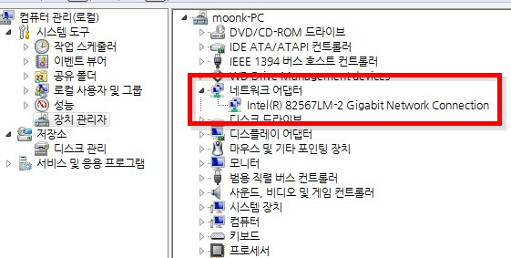

앞선 강의에서 배운 IP 주소는 엄밀히 말하면 이 랜 카드에 할당되는 것이다. 다시 말해, 랜 카드가 두 개 이상 꽂혀 있으면 IP 주소도 그 수에 맞게 할당할 수 있다. 사무실 직통 전화기마다 번호가 부여되는 이치와 동일하다. 운영체제에서는 이러한 랜 카드를 구분, 식별하는데 ‘MAC 주소(맥 주소)’라는 걸 사용한다(두 자리 숫자 여섯 묶음이다). 이 MAC 주소는 전 세계에 판매, 사용되고 있는 모든 랜 카드마다 고유하게 붙게 되는데, 여기에는 랜 카드 제조사, 모델 등의 제품 정보가 코드화되어 기재된다. 사람으로 치면 주민등록번호, 자동차로 치면 차대번호 정도에 해당한다.

MAC 주소 역시 일반적인 사용 환경에서는 그리 활용할 기회가 없을 테지만, MS 윈도우 운영체제의 명령 프롬프트에서 ‘ipconfig /all’ 명령어를 실행하면 ‘물리적 주소’라는 항목에서 각 랜 카드 고유의 MAC 주소를 확인할 수 있다.

**MAC 주소가 사용되는 실례**

랜 카드로 인터넷을 사용하면서 MAC 주소가 필요한 경우가 딱 한 번 있을 수 있다. 집에서 인터넷 사용하다가 컴퓨터를 교체한 경우다. KT나 SKT 등의 인터넷 서비스 업체는 각 가정 컴퓨터의 랜 카드 MAC 주소를 토대로 IP 주소를 할당하고 있는데, 컴퓨터를 바꿨으니 그 안에 있는 랜 카드로 바뀌고, 그에 따라 MAC 주소도 바뀌게 되어 결국 인터넷 서비스를 차단하게 된다(물론 컴퓨터를 바꿔도 인터넷이 잘 되는 경우도 많다). 이런 경우에 해당 업체로 전화하여 컴퓨터가 바뀌었음을(즉 MAC 주소가 바뀌었음을) 알리면, 해당 컴퓨터의 MAC 주소를 다시 검색하여 등록하게 된다.

랜 카드는 형태에 따라 일반 유선 랜 카드와 무선 랜 카드로 나눌 수 있다. 케이블만 있고 없을 뿐 나머지는 동일하다. 무선 랜 카드의 경우 데스크탑 메인보드에 장착하는 카드형과 노트북 등의 USB 포트에 연결하는 USB형 랜 카드가 존재한다. 앞선 강의에서도 지적한 바 있지만, 무선 랜을 사용할 결정적인 이유가 없는 이상 가급적 유선 랜을 사용하는 것이 여러 가지로 바람직하다. 특히 컴퓨터 수가 많은 환경이라면 더더욱 그러하다. 무선 랜은 랜 케이블이 없어 이동하며 사용할 수 있다는 점 외의 장점이 없다.

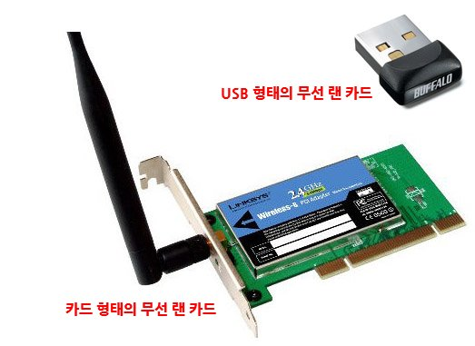

끝으로, 갑자기 인터넷이나 네트워크 통신이 안 된다면 여러 가지 방법으로 원인을 분석할 수 있는데, 가장 초동적인 것이 현재 자신의 컴퓨터 랜 카드의 작동 상태를 확인하는 것이다. 우선 윈도우 운영체제의 ‘장치관리자’에서 네트워크 어댑터 항목에 별다른 표시/표식이 있는지 확인한다. 그런 다음 명령 프롬프트를 열고 ‘ping’이라는 명령어로 ‘ping localhost’ 또는 ‘ping 127.0.0.1’이라 실행한다. ‘ping’은 해당 기기(컴퓨터 또는 네트워크 장비)에 일정 크기의 데이터(패킷)를 보냄으로써 ‘온라인’ 상태인지를 점검하는 명령어인데, ‘localhost’와 ‘127.0.0.1’이 자신의 컴퓨터를 나타내는 이름과 IP 주소다. 결국 컴퓨터가 자기 자신에게 ping 명령을 수행함으로써, 적어도 컴퓨터가 네트워크 통신을 할 준비가 되어 있는지 자체 점검하는 셈이다. 위와 같은 ping 실행 결과가 아래와 같다면, 적어도 컴퓨터와 랜 카드에는 문제가 없는 것으로 판단할 수 있다.

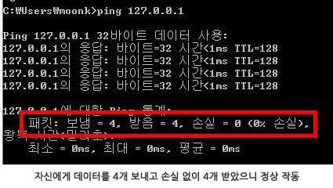

**이더넷은 또 뭐지?**

이더넷(Ethernet) 역시 컴퓨터, 인터넷과 관련해서 흔히 접할 수 있는 용어다. 이는 컴퓨터 네트워크 통신의 형태를 의미한다. 일반적으로 서로 가까운 거리에 위치해 있는 컴퓨터끼리 연결하는 통신망을 나타내며, 랜(LAN)과 함께 통용되고 있다. 현재 우리가 사용하는 컴퓨터 통신은 대부분 이 이더넷 통신 기술을 표준으로 운영된다. 다시 말해, 앞선 강의를 통해 알아본 네트워크 장비, 프로토콜, 서비스 등이 이더넷 통신 기술을 기반으로 작동하는 것이다. 랜 카드의 공식적인 이름은 ‘이더넷 네트워크 어댑터’ 또는 ‘이더넷 네트워크 컨트롤러’다.

### 데이터의 이동 통로, 랜 케이블

랜 케이블은 물이 통과하는 수로나 호스와 같은 역할을 하는 것으로 실제로 데이터가 이동하는 통로다. 이러한 랜 케이블은 유형과 형태, 목적 등에 따라 다양한데, 앞서 언급한 이더넷 네트워크 기술 아래 컴퓨터 통신에 주로 사용되는 케이블은 (우리가 일반적으로 말하는 랜 케이블인) UTP 케이블이다. 피복 안에 총 8개 가닥이 2개씩 꼬여 있는 형태로, 이 중 4개 가닥만이 데이터 통신에 사용된다.

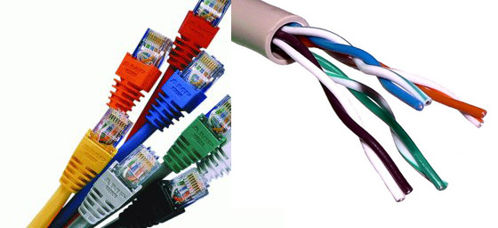

케이블 양쪽 끄트머리에는 컴퓨터나 허브, 스위치, 공유기 등의 랜 포트에 꽂을 수 있는 작은 플라스틱(혹은 철재) 플러그가 부착되는데, 이를 RJ45 커넥터(혹은 잭)이라 부른다(RJ45는 이더넷 네트워크 케이블의 규격 중 하나이다). 한쪽 면에 고정용 걸쇠가 있어 반대 방향으로 끼우지 못하도록 되어 있다. 랜 포트 구멍에 맞게 집어넣으면 ‘딸각’ 소리가 나면서 완전히 고정되고, 고정용 걸쇠를 눌러 잡아 빼면 쉽게 빠진다. 뺄 때는 RJ45 커넥터 부분을 쥐고 빼야 케이블 손상을 방지할 수 있다.

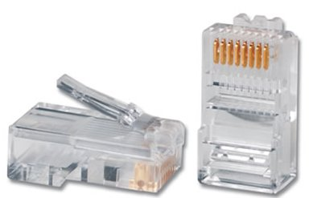

UTP 랜 케이블은 8개의 가닥의 배열에 따라 다이렉트, 크로스 케이블로 구분되는데, 다이렉트 배열은 일반적으로 네트워크 장비와 컴퓨터와 연결할 때, 크로스 배열은 (허브/스위치 없이) 컴퓨터와 컴퓨터를 1:1로 연결할 때 또는 네트워크 장비끼리 연결할 때 주로 사용한다. 단, 네트워크 장비끼리는 다이렉트 배열 케이블로 연결 가능한 경우도 있다. 두 배열을 구분하는 방법은 RJ 커넥터의 바닥면(걸쇠가 없는 면)의 왼쪽부터 가닥 배열이 주황-주황 띠-초록 띠-파랑-파랑 띠-초록-갈색 띠-갈색(양 끄트머리 동일)이면 다이렉트, 초록 띠-초록-주황 띠-파랑-파랑 띠-주황-갈색 띠-갈색(한쪽 끄트머리만 해당)이면 크로스 배열이다(아래 그림 참고).

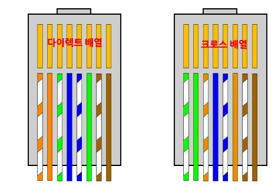

한편 UTP 랜 케이블의 피복 중간 중간에는 규격 등을 표시하는 글자가 있는데, 여기서 눈여겨볼 것이 ‘카테고리(CAT, Category)’ 구분이다. 일반 용도로 사용되는 UTP 랜 케이블은 데이터 전송 대역폭에 따라 CAT 5, CAT 5e, CAT 6, CAT 6e 등으로 구분되며, 최근에는 CAT 7 규격도 등장했다. 간단히 말해, CAT 5는 10/100Mbps용, CAT 5e와 CAT 6, CAT 6e는 1Gbps(1,000Mbps)용, CAT 7은 10Gbps용이라 할 수 있다. 가정이나 사무실, PC방 등에서는 CAT 5나 CAT 5e가 주로 사용되고, CAT 6 이후 케이블은 기업 서버용 등 특수 목적으로 사용된다.

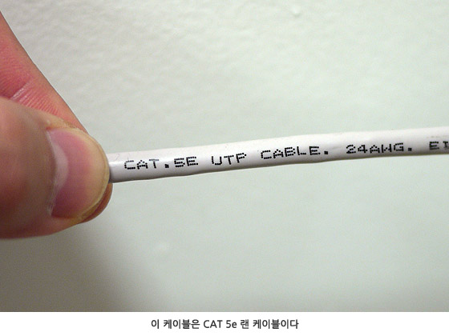

일반적으로 현재 우리가 사용하는 인터넷은 100Mbps가 최대 속도지만, 그래서 CAT5 케이블이면 충분할 것 같지만, 가정이나 사무실 내 컴퓨터끼리 파일을 공유할 일이 많다면, 기가비트(Gigabit, 1,000Mbps)를 지원하는 랜 카드와 랜 케이블, 즉 CAT5e나 CAT6 케이블, 여기에 기가비트용 스위치나 인터넷 공유기를 사용할 것을 적극 권장한다. 다시 말해, 랜 카드와 랜 케이블, 네트워크 장비가 모두 기가비트를 지원해야 1,000Mbps 속도를 만끽할 수 있다.

참고로, 랜 케이블은 인터넷을 접속하게 하고, 이를 통해 엄청난 정보를 얻을 수 있게 하는 중요한 부품이지만, 이를 제작하는 방법은 생각보다 어렵지 않다. 물론 케이블 제작에 필요한 전문 도구(케이블링 툴)가 필요하긴 하지만, 이 도구와 RJ 커넥터만 있으면, 다이렉트든 크로스든 누구라도 랜 케이블을 제작할 수 있다. 랜 케이블을 직접 제작, 연결하여 정상 작동함을 확인하면 ‘네트워크’가 한결 친근하게 다가올 것이다. 참고로 아래 예시는 CAT5, CAT5e, CAT6 등의 랜 케이블의 표준 제작법이다.

1) 케이블 피복을 약 3~4cm가량 벗겨 낸다. 내부 8개 가닥이 손상되지 않도록 조심하면서, 가위나 칼 등을 통해 알아서 재량껏 절단해 낸다.

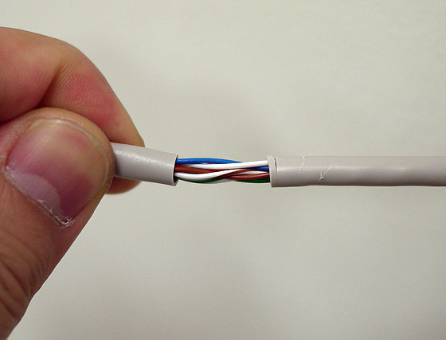

2) 꼬여 있는 각 가닥을 하나하나 성실하게 편 다음, 위에서 언급한 가닥 배열에 따라 왼쪽부터 일렬로 나란히 배열한다.

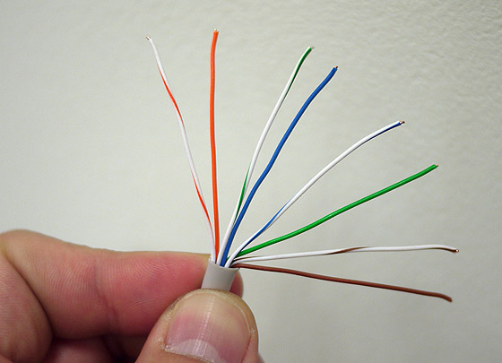

3) 엄지와 검지로 케이블을 쥔 후 엄지손가락 손톱에서 약 1cm 정도만 남기고 가위 등으로 평평하게 자른다.

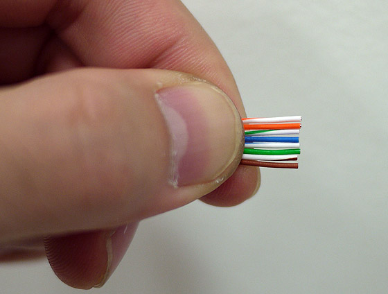

4) RJ45 커넥터를 뒤집은 상태(걸쇠가 아래쪽으로 향하게)로 8개의 케이블 가닥을 살며시 밀어 넣는다. 이때 8개의 가닥이 RJ45 커넥터의 한 홈에 하나씩 정확하게 들어갔는지 반드시 확인한다.

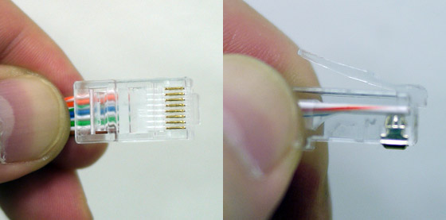

5) 그 상태에서 조심스레 케이블링 툴의 RJ45 구멍에 끼운 후 툴 양쪽 손잡이를 힘껏 쥐어 RJ45 커넥터의 금속 부분이 8개 가닥을 관통하도록 한다. 손잡이를 한두 번 더 쥔 후 RJ45 커넥터를 빼내고 케이블 가닥과 금속 부분이 정확히 맞닿았는지 확인한다. 만약 한 가닥이라도 짧거나 가닥 홈으로 제대로 들어가지 않았다면, RJ45 커넥터 부분을 잘라내고, 1)~5) 과정을 반복해야 한다(일단 케이블링 툴로 작업한 RJ45 커넥터는 재활용할 수 없다. RJ45 커넥터는 개당 약 200~300원이다).

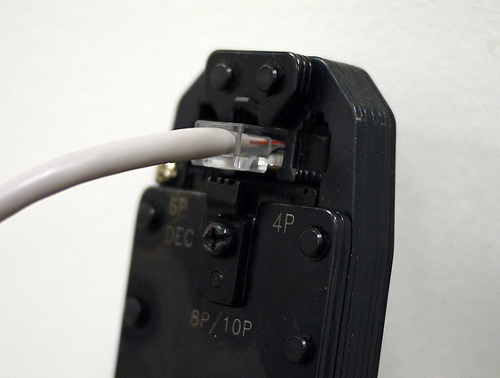

6) 반대쪽 끄트머리도 동일하게 제작한 후 테스트한다. 랜 케이블 테스트 툴로 테스트하는 것이 정석이지만, 테스트 툴이 없을 땐 곧바로 컴퓨터와 네트워크 기기(공유기 등)에 연결하여 인터넷 또는 네트워크 연결 상태를 확인하면 된다. 만약 인터넷이 연결되지 않는다면 1)~6) 과정을 반복한다.

컴퓨터를 비롯해 기타 전산 시스템에 문제가 발생했을 때, 전문가들은 가장 먼저 ‘물리적 원인’을 고려한다. 하드웨어나 소프트웨어의 문제이거나 바이러스 때문일 수도 있지만, 그보다 전원 케이블, 네트워크 케이블 등의 상태를 1순위로 확인하는 것이다. 가장 기본적이기에 가장 쉽게 간과되는 부분이기 때문이다. 설마 하겠지만, 이러한 물리적 단계에서 원인을 찾는 경우도 의외로 많다. 때문에 네트워크 계층의 물리적 단계에 해당하는 랜 카드와 랜 케이블은 늘 관심의 대상이 되어야 하는 게 마땅하다. 이제는 네트워크 또는 인터넷에 연결된 컴퓨터만이 사용자에게 유용한 시대이므로, 이제라도 컴퓨터 네트워킹의 초석이 되는 이들 부품에 관심을 갖도록 하자.

## 파일 / 폴더 공유

지난 5부에 걸친 컴퓨터 네트워크 기초 강의에서 네트워크를 구성하고 실현하는 물리적인 장비와 도구 등에 살펴봤다. 물론 이는 ‘컴퓨터 네트워크’라는 방대한 이론의 극히 일부에 지나지 않는다. 하지만 일반 사용자가 컴퓨터를 사용하면서 접하게 되는 네트워크 기초 정보로서는 (완벽하진 않아도) 크게 부족하지 않으리라 사려된다.

컴퓨터 네트워크를 통해 넓게는 ‘인터넷’으로 전 세계 사이트에 접속할 수 있으며, 좁게는 바로 옆에 있는 컴퓨터와 데이터를 서로 ‘공유’할 수도 있다. 사람 사이에 있어 ‘소통’이 중요함이 강조되고 있듯, 컴퓨터에서도 상호 간의 ‘데이터 공유’는 빼놓을 수 없는 중요한 요소이다.

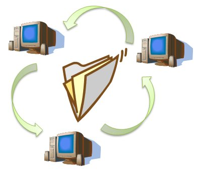

가장 일반적이면서 기본적인 데이터 공유 방식인 컴퓨터 파일/폴더 공유. IT동아의 네트워크 기초 강의 연재, 그 여섯 번째 주제다.

**편집자 주**

개인용 컴퓨터에 설치, 사용되는 운영체제는 마이크로소프트 윈도우 계열과 리눅스 계열이 대표적이다. 이중 일반적으로 널리 사용되는 것이 윈도우 계열이니, 본 강의에서도 윈도우를 기반으로 한 파일/폴더 공유에 대한 내용만을 다루겠다. 아울러 윈도우 계열 중에서도 가장 많이 사용하고 있을 윈도우 XP와 윈도우 7(비스타 포함)을 기준으로 한다.

또한 기본적으로 두 대 이상의 컴퓨터가 파일/폴더를 공유하려면 모두 같은 네트워크 영역 안에 있어야 한다. 이를테면 하나의 공유기에 모든 컴퓨터가 물려 있는 경우가 그러하다. 집에 있는 컴퓨터와 회사에 있는 컴퓨터는 윈도우를 통한 파일/폴더 공유가 원칙적으로 불가능하다는 점을 기억해두자(그래서 FTP 등과 같은 방법으로 공유하곤 한다).

### 폴더/파일 공유를 위한 준비

집이나 사무실에서 데스크탑과 노트북을 함께 사용하는 경우가 많다. 한쪽에 있는 수십 GB짜리 대용량 파일을 다른 쪽 컴퓨터로 복사/이동하고 싶은데, 한 번도 파일/폴더 공유를 사용해 보지 못한 당신 주변에는 때마침 없고 컴퓨터를 잘 아는 동료가 없다. 이런 경우 유일한 해결책은 파일/폴더 공유다. 윈도우에 있어 파일/폴더 공유는 누구라도 어렵지 않게 사용할 수 있으나 그전에 준비해야 할, 그리고 알아야 할 정보가 몇 가지 있다.

#### 1) 사용 중인 윈도우의 버전 확인

공유하려는 컴퓨터의 윈도우 버전이 같으면 파일/폴더 공유가 훨씬 수월하다. 아울러 윈도우 버전에 따라 공유하는 방법 또는 단계가 약간씩 다르므로, 자신의 컴퓨터와 다른 컴퓨터의 윈도우 버전을 확인할 필요가 있다. 윈도우 버전은 바탕화면의 ‘내 컴퓨터’ 아이콘을 마우스 오른쪽 클릭하여 ‘속성(윈도우 XP는 ‘등록정보’)’을 클릭해 나타나는 창에서 확인할 수 있다.

#### 2) 사용자 계정과 권한에 대한 기초 이해

대부분의 컴퓨터 운영체제는 사용자 계정이라는 개념을 두고 있다. 우리는 일반적으로 한 대의 컴퓨터를 하나의 사용자 계정(대부분이 관리자(administrator) 계정)으로 사용하고 있지만, 여러 사용자 계정을 등록하여 각 사용자에게 맞는 사용 환경(바탕화면, 각종 설정 등)을 불러와 적용할 수도 있다. 사용자 계정에는 또한 그에 맞는 권한이 부여된다. 예를 들어, 관리자 계정에는 파일/폴더를 삭제, 변경, 저장 등 모든 권한이 부여되지만, 손님(guest) 계정은 관리자의 설정에 따라 파일/폴더에 대한 권한이 제한될 수 있다. 폴더/파일 공유에 있어 사용자의 권한은 대표적으로 ‘읽기’, ‘쓰기’, ‘수정’, ‘실행’ 등이 있다.

#### 3) 윈도우 파일/폴더 공유를 위한 사전 확인

일반적으로 운영체제의 파일 공유는 해당 파일 자체가 아닌 그 파일이 들어 있는 폴더에 대해 공유 설정을 적용한 다음, 이 폴더 안에 들어 있는 파일을 복사/이동하는 방식으로 이루어진다. 이들 파일에 대해 특정 권한을 적용함으로써 각 공유 사용자를 제한할 수 있다(폴더까지만 제한하고 파일은 그냥 두는 게 일반적이다).

처음으로 파일/폴더 공유를 수행하기에 앞서 몇 가지 확인할 것이 있다. 가장 먼저 윈도우 운영체제에서 ‘파일/폴더 공유 기능’이 활성화되어 있는지 확인해야 한다. 설정을 따로 변경하지 않았다면 기본적으로 활성화되어 있을 텐데, 그래도 다시 한번 확인하도록 한다. 윈도우 XP라면 현재 사용 중인 네트워크 어댑터의 연결 속성을 열고(아래 그림 참고) ‘이 연결에 다음 항목을 사용’ 부분에 ‘Microsoft 네트워크용 파일 및 프린터 공유’ 항목이 선택되어 있는지 확인하면 된다(간혹 무선 랜을 사용하는 경우에는 보안 문제 때문에 비활성화되기도 한다).

윈도우 7(또는 비스타)에서도 이와 비슷하게, 사용 중인 네트워크 어댑터(로컬 영역 연결) 속성 창에서 동일한 이름의 항목을 선택하면 된다. 아울러 윈도우 7에서는 파일/폴더 공유에 보안성을 가미하기 위해 ‘네트워크 위치’라는 개념이 추가됐는데, 현재 사용 중인 컴퓨터의 환경에 따라 ‘홈 네트워크’, ‘회사 네트워크’, ‘공용 네트워크’로 설정할 수 있다.

**윈도우 7의 네트워크 위치 선택**

홈 네트워크, 회사 네트워크, 공용 네트워크의 3가지로 나뉘는데, 단어 의미 그대로 이해하면 된다. 각 위치 설정에 따라 윈도우 방화벽 등의 보안 설정이 적용된다.

홈 네트워크는 가정에서 사용하는 컴퓨터끼리 연결되는 형태로 모든 공유 기능이 활성화된다(단, 그만큼 보안성은 저하된다). 파일/폴더, 프린터 등을 자유롭게 공유해 사용할 수 있다. 공유 그룹인 ‘홈 그룹’과 연계된다. 회사 네트워크는 홈 네트워크와 유사한 공유 기능을 제공하지만, 방화벽 설정 등에서 그보다는 약간 제한적이다. 공용 네트워크는 노트북 등으로 공공장소에서 인터넷 등에 접속할 때 설정한다. 이 경우 모든 공유 기능이 비활성화되어 시스템 보안을 강화한다.

물론 이 네트워크 위치 설정을 유지한다 해서 모든 위해 요소를 원천적으로 차단할 순 없지만, 자신의 사용 환경에 맞게 적용하는 것이 컴퓨터 보안의 첫 단계이니 이를 적극 활용하기를 권장한다. 참고로 네트워크 위치 설정이 다르거나 하지 않아도 인터넷은 사용할 수 있다.

다음으로 확인할 게 윈도우 방화벽이다. 이 역시 기본 설정은 ‘파일 및 프린터 공유’를 사용하게끔 되어 있지만, 다시 한번 확인하는 것이 좋다. 윈도우 XP, 윈도우 7 모두 제어판의 ‘Windows 방화벽’ 항목에서 확인, 설정할 수 있다.

마지막으로 윈도우의 사용자 계정을 점검해야 한다. 앞서 언급한 대로, 윈도우에는 사용자 계정이 존재하는데, 파일/폴더를 공유하기 위해서는 ‘Guest(이하 게스트)’ 계정을 눈여겨봐 둬야 한다. 게스트 계정은 자신의 컴퓨터에 접근할 수 있는 가장 원초적이고 제한적인 계정으로, ‘계정 사용 안 함(기본 설정)’으로 되어 있으면 파일/폴더 공유가 불가능하다. 따라서 파일/폴더 공유를 위해서는 일단 이 계정을 사용하도록 설정해야 한다(그런 다음 공유 폴더 등에 권한을 부여해야 한다).

### 만인을 위한 파일/폴더 공유

약 10GB의 동영상 홍보 파일 여러 개를 사무실 내 몇 명의 직원에게 복사해 주려 한다고 가정해 보자. 우선 해당 파일을 임시 폴더에 모두 저장한다. 위에서 말한 대로, 윈도우 XP(프로페셔널 에디션)에서는 해당 폴더를 마우스 오른쪽 버튼으로 누른 후 ‘공유 및 보안’ 항목을 선택한 다음, [공유] 탭에서 ‘네트워크에서 이 폴더 공유’를 선택하면 된다. 그리고 다른 직원이 그 폴더의 파일을 수정, 변경할 수 있도록 하려면, 바로 아래에 있는 ‘네트워크 사용자가 내 파일을 변경할 수 있음’ 옵션까지 설정하면 된다(게스트 계정이 사용하도록 설정되어 있는지 다시 한번 확인한다).

폴더 공유 설정이 완료되면 폴더 아이콘 아래쪽에 손바닥으로 받치고 있는 모습이 나타난다. 공유 폴더임을 표시하는 것이다. 공유 설정 단계를 반대로 수행하면 폴더 공유가 해제되며, 손바닥 표시는 사라진다(윈도우 7에서는 표시되지 않는다).

윈도우 7에서는 해당 폴더를 마우스 오른쪽 버튼 클릭 후, ‘속성’ 창의 [공유] 탭에서 ‘네트워크 파일 및 폴더 공유’ 항목의 ‘공유’ 버튼을 누른 다음, ‘Everyone’ 그룹이나 ‘Guest’ 계정에 대해 사용 권한 수준을 설정하면 된다. ‘읽기’만 설정하면 당연히 파일을 읽거나 복사하기만 가능하고, ‘읽기/쓰기’를 설정하면 삭제나 수정, 새 파일 생성 등도 가능해진다.

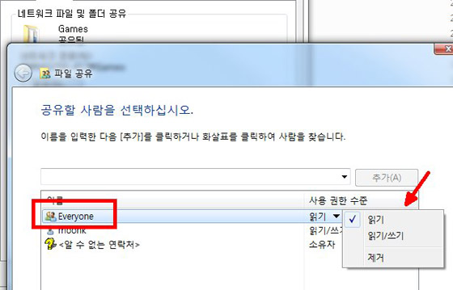

이제 다른 컴퓨터에서 자신의 공유 폴더로 접근할 차례. 같은 네트워크에서 컴퓨터에 접근하는 방법은 두 가지다. 하나는 IP 주소를 이용하는 방법, 또 하나는 컴퓨터 이름을 이용하는 방법이다. 편한 방법을 사용하면 그만이다. 다만 네트워크 내 컴퓨터 이름이 일괄적으로 설정된 환경이라면 컴퓨터 이름을 이용하는 방법이 좀 더 편리할 것이다. 참고로 컴퓨터 이름은 ‘내 컴퓨터’ 아이콘의 ‘속성’ 페이지에서 확인할 수 있다(윈도우 XP의 경우 [컴퓨터 이름] 탭에 있다).

공유 폴더가 있는 컴퓨터의 이름이 ‘munch’라면, 다른 컴퓨터 윈도우 탐색기의 주소창에 ‘\\munch’라 입력한 후 엔터를 치면 해당 컴퓨터에서 공유한 폴더가 모두 표시될 것이다. 만약 ‘munch’ 컴퓨터의 IP 주소가 192.168.0.10이라면, ‘\\192.168.0.10’이라 입력해도 마찬가지 결과가 표시된다.

이제 해당 공유 폴더를 더블 클릭하여 그 안의 파일을 바로 실행하든, 복사하든 원하는 작업을 수행할 수 있다. 이때 공유 폴더가 있는 컴퓨터에 접근하는 모든 사용자는 ‘게스트 계정’ 권한을 부여받는다. 만약 이들 사용자가 공유 파일을 수정하거나 삭제하지 못하도록 하려면, 앞서 말한 ‘네트워크 사용자가 내 파일을 변경할 수 있음’ 옵션을 해제하면 된다(윈도우 XP 기준).

다만, 윈도우 버전과 에디션에 따라 동시에 접근해서 파일을 공유할 수 있는 수(이를 세션-session이라 한다)가 제한되어 있으니 무턱대고 공유할 순 없다.

보안을 위해서라도 폴더 공유가 완료되면 공유 설정을 해제하는 것이 바람직하다. 공유된 폴더를 타고 전파되는 바이러스 등도 적지 않기 때문이다(이런 경우 백신 프로그램을 설치, 실시간 감시가 필수다).

추가적으로 바탕화면의 ‘내 네트워크 환경(윈도우 7은 ‘네트워크’)’을 실행하면 같은 네트워크 안에 있는 모든 컴퓨터 이름을 확인할 수 있다. 윈도우 XP의 경우 ‘전체 네트워크’ → ‘Microsoft Windows 네트워크’ → 작업그룹으로 차례로 들어가 보면 네트워크상의 컴퓨터 이름이 보일 것이고, 이를 더블 클릭하면 해당 컴퓨터가 공유한 폴더를 볼 수 있다. 폴더에 접근 권한을 지정하지 않았다면, 이처럼 누구라도 손쉽게 공유 폴더에 접근하여 파일을 건드릴 수 있다.

### 공유 폴더 및 접근 사용자 확인

그렇다면 현재 자신의 컴퓨터에 공유 설정된 폴더가 어떤 폴더이며, 또 누가 접근해 있는지를 주기적으로 파악할 필요가 생긴다. 이는 ‘컴퓨터 관리’ 창에서 확인할 수 있다. ‘내 컴퓨터’를 마우스 오른쪽 버튼 클릭 후 ‘관리’를 선택하면 ‘컴퓨터 관리’ 창이 실행되는데(윈도우 XP, 윈도우 7 동일), 여기서 ‘공유 폴더’ 메뉴의 ‘공유’ 항목과 ‘세션’ 항목을 주의 깊게 봐야 한다.

‘공유’ 항목은 현재 공유 설정된 폴더의 이름과 경로, 현재 접근해 있는 사용자 수 등을 표시해준다. 불필요한 공유 폴더는 지체 없이 공유 설정을 해제해야 한다. 아울러 ‘세션’ 항목에는 현재 자신의 컴퓨터에 접근해 있는 사용자 계정과 접근 수를 보여준다. 별도의 사용자 계정을 생성, 할당하지 않은 이상 대부분 게스트 계정이 출력된다. 또한 여기서는 각 사용자의 IP 주소도 확인할 수 있으니 누구의 컴퓨터인지 정확하게 파악할 수 있다. 의심되는 사용자라면 마우스 오른쪽 버튼은 눌러 ‘세션 닫기’를 선택하여 연결을 즉시 종료할 수도 있다.

이외에 ‘열린 파일’ 항목에서는 사용자에 의해 실행된, 또는 열려 있는 폴더나 파일 목록을 확인할 수 있다.

**윈도우 운영체제의 공유 그룹 - 작업그룹(Workgroup)**

윈도우의 작업그룹은 동일한 네트워크상에서 하나로 묶이는 영역을 의미한다. 이를테면 팀이나 부서 등의 그룹으로 나누는 역할이다. 윈도우 XP나 윈도우 7을 설치하면 기본적으로 ‘Workgroup’이라는 작업그룹이 설정된다. 다만 그저 이처럼 그룹을 나눠줄 뿐 특별한 기능이나 효과가 있는 건 아니다(즉, 작업그룹이 다르다고 파일/폴더 공유가 불가능한 게 아니다).

### 또 하나의 파일/폴더 공유 - 네트워크 드라이브

한편 매번 ‘\\컴퓨터이름’ 형식의 주소를 입력하지 않고 늘 공유 폴더에 연결되도록 하는 것이 바로 윈도우의 ‘네트워크 드라이브’다. 특정 컴퓨터의 공유 폴더를 내 컴퓨터에서는 하나의 드라이브로 설정해 언제든 간편하게 접근하겠다는 의도다. 업무상 늘 공유해야 하는 폴더는 이렇게 D: 또는 E:와 같은 드라이브로 연결하는 것이 효율적이다.

네트워크 드라이브를 설정하는 방법은 몇 가지가 있는데, ‘내 컴퓨터’ 아이콘을 선택한 뒤 마우스 오른쪽 버튼을 눌러 나오는 메뉴 중 ‘네트워크 드라이브 연결’을 선택하여 설정하는 게 대표적이다(윈도우 XP, 윈도우 7 동일). 설정 창이 나오면, 네트워크 드라이브에 할당할 문자를 지정하고 해당 공유 폴더의 경로(\\컴퓨터이름\공유 폴더)를 입력하면 된다. 자신의 컴퓨터를 다시 시작할 때마다 네트워크 드라이브에 연결하려면 ‘로그온할 때 다시 연결’ 옵션을, 별도의 사용자 계정을 통해 접근하려면 ‘다른 자격 증명을 사용하여 연결’ 옵션을 선택하고 사용자 계정과 암호를 지정하면 된다.

연결된 네트워크 드라이브를 끊으려면 해당 네트워크 드라이브를 마우스 오른쪽 버튼으로 클릭한 다음 ‘연결 끊기’를 선택하면 된다.

**공유 폴더 연결을 완전히 제거하는 방법**

어떤 컴퓨터의 공유 폴더에 일단 접근하면, 공유 폴더 창을 닫더라도 두 컴퓨터는 일정 시간 동안 연결 상태(세션)가 유지된다. 간혹 이 세션 유지 시간 때문에 다른 공유 폴더에 접근하지 못하는 경우도 발생하곤 한다. 이런 경우 자신의 컴퓨터에 걸려 있는 세션을 모두 완전히 제거해야 하는데, 윈도우 명령 프롬프트 명령어를 이용하면 간단하게 해결된다.

우선 윈도우 명령 프롬프트를 실행(‘시작’→‘실행’→‘cmd’입력)하고, ‘net session’라고 입력 후 엔터를 치면, 현재 자신의 컴퓨터가 열어 놓은 공유 세션 목록이 출력된다. 즉 네트워크(net) 공유 세션(session) 내역을 보여주는 명령어다. 모든 목록을 제거하려면 ‘net session /delete’라고 입력하면 되는데, 이를 해석하면 네트워크(net) 공유 세션(session) 내용을 삭제(/delete)한다는 의미다. 이제 다시 ‘net session’ 명령을 실행해 보면 공유 목록이 제거됐음을 알 수 있다. 공유 세션을 완전히 끊었다는 뜻이다.

### 자신의 컴퓨터에 자신만 속속들이 접근 - 관리자 공유

파일/폴더를 공유하다 보면 이런 경우도 분명 있다. 다른 컴퓨터에서 자신의 컴퓨터에 있는 파일이나 폴더에 접근해야 할 때 말이다. 물론 공유 폴더가 아닌 다른 폴더에 있는 파일이라면 별다른 방법이 없다. 윈도우 운영체제에는 ‘관리자 공유’라는 게 있는데, 표기하기는 ‘Default share’, 즉 기본 공유로 표기하고 있다. 이는 운영체제 기본적으로 생성되는 공유 설정으로, 관리자가 자신의 컴퓨터를 관리할 목적으로 사용할 수 있는 드라이브 전체 공유다. 간단한 기능을 글로써 표현하려니 복잡하게 보인다.

예를 들어보자. 앞서 ‘컴퓨터 관리’ 창의 ‘공유’ 메뉴를 보면 현재 공유 중인 폴더 목록이 나타난다 했다. 하나씩 살펴보면 C:(드라이브)나 D: 바로 뒤에 ‘$’ 기호가 붙어 있는 게 있는데, 이것이 바로 관리자 공유다. 단 관리자 공유를 사용하기 위해서는 관리자 계정(administrator 등)에 반드시 암호를 지정해야 한다.

사용하는 방법은 일반 공유 폴더와 동일하다. 다른 컴퓨터에서 자신의 컴퓨터 이름이나 IP 주소를 이용해 ‘\\컴퓨터이름(또는 IP 주소)’ 형식으로 입력하면서 끝에 ‘\c$’를 추가하면 된다. 즉 ‘\\컴퓨터이름\c$’ 형식이다. 그럼 사용자 계정과 암호를 입력하라는 창이 나오고, 정확하게 입력하면 특정 공유 폴더가 아닌 C 드라이브 전체가 출력된다. D 드라이브가 있다면 마찬가지로 ‘\\컴퓨터이름\d$’로 접근할 수 있다. 사용자가 아닌 관리자의 권한으로 접근했기 때문이다. 파일/폴더 공유를 사용하다 보면 대단히 유용한 기능인데, 정작 이를 모르는 사용자가 많은 듯하다.

### 공유의 시작은 곧 보안의 시작

이쯤 되면 반드시 강조해야 할 사항이 있다. 바로 ‘보안’이다. 위에서 본 관리자 공유는 어느 누구라도 손쉽게 다른 사용자의 컴퓨터를 헤집고 다닐 수 있음을 보여준다. 관리자 계정에 암호를 부여했지만, ‘1111’과 같이 쉽게 예측할 수 있는 수준이라면 자신의 컴퓨터를 그냥 활짝 열어둔 것과 마찬가지다. 보안상의 치명적인 허점인 것이다. 일반 파일/폴더 공유의 경우에도 일단 공유를 시작한다는 건 자신의 컴퓨터로 들어오는 통로를 열어 두는 것과 같기에, 그에 따른 보안 대책을 반드시 강구해야 한다.

일반 사용자가 대비할 수 있는 보안 요소라면 (유무료) 백신 프로그램(네이버 백신, V3라이트, 알약 등)과 윈도우 방화벽, 윈도우 디펜더(Windows Defender) 등이 있다. 100% 완벽하진 않지만 이 정도만 갖추고 주기적으로 점검만 해준다면 치명적인 보안 사고는 충분히 예방/방지할 수 있다. 그리고 그러한 보안 사고는 대부분 사용자의 무관심과 태만 속에서 발생함을 늘 새겨두기 바란다.

 

## 프린터 공유

가정에서는 프린터 사용이 예전보다 다소 줄었지만, 회사나 사무실에서는 여전히 중요한 인쇄 도구다. 아무리 디지털 오피스네 전자문서네 해도 A4 종이에 반듯하게 인쇄된 문서가 아직도 계약서로, 증명서로, 제안서로 애용되고 있다. 그런데 컴퓨터는 각 구성원이 한 대씩 사용하는 반면, 프린터는 팀 단위 또는 파트 단위의 사람들이 공유하고 있다. 프린터 공유는 한번 설정해 두면 웬만해서는 손댈 일 없지만, 사무실이 이전하거나 프린터를 새로 교체한 경우라면 어쩔 수 없이 누군가는 한번 시도해야 한다. 본 기자가 연재하고 있는 (여러 가지로 부족한) 네트워크 기초 강의를 빠짐 없이 참고한 독자라면 서슴없이 나서보길 권한다. 네트워크 기본 지식을 습득한 상태라면 사무실 내 프린터 공유 설정, 그거 생각보다 어렵지 않다. 또 한번 알아두면 두고두고 요긴하게 활용할 수 있다. 단 여기서는 MS의 윈도우 7을 기준으로 설명하겠지만, 윈도우 XP도 부분적으로 다룰 것이다.

### 프린터에 대한 기초 이해

잘 알고 있는 대로, 컴퓨터용 프린터는 컴퓨터에서 작성한 문서나 사진 등의 콘텐츠를 다양한 크기의 인쇄용지에 출력하는 장치다. 통상적으로 잉크로 인쇄하면 ‘잉크젯 프린터’, 복사기처럼 토너로 인쇄하면 ‘레이저 프린터’로 구분된다. 인쇄 속도나 품질 등 여러 가지 면에서 레이저 프린터가 잉크젯 프린터보다는 낫지만 그만큼 비싸다(물론 잉크젯이 더 비싼 경우도 더러 있다).

프린터는 컴퓨터에 연결할 수도 있고(요즘에는 대부분 USB 포트), (컴퓨터 없이) 네트워크 허브나 스위치에 독립적으로 연결할 수도 있다. 두 경우 모두 공유 설정이 가능하다. 그러니 현재 사용 중인 프린터가 어떤 방식으로 연결, 공유되어 있는지 확인해야겠다.

어떤 방식으로 연결되어 있든 컴퓨터에서 해당 프린터로 인쇄하기 위해서는 프린터 모델에 맞는 장치 드라이버 프로그램을 설치해야 한다. 일반적으로 프린터 앞면 또는 뒷면 어딘가에는 제조사와 제품 모델이 표기되어 있으니, 이를 토대로 제조사 홈페이지에서 최신 드라이버 설치 파일을 다운로드하여 컴퓨터에 설치하면 된다. 물론 프린터 구입 시 패키지에 들어 있던 설치CD를 보유하고 있다면 그것을 사용하면 된다.

마지막으로 프린터 뒷면 또는 좌우측면에 있을 커넥터 형태를 확인한다. USB 포트만 있으면 컴퓨터에만 연결할 수 있으며, USB 포트와 유선 랜 포트 모두 있다면 둘 중 하나로 연결하면 된다. 물론 공유를 위해서는 유선 랜 포트에 연결하는 것이 한결 간편하다. 간혹 구형 프린터의 경우 USB 포트가 아닌 25핀 프린터 포트(페러랠 포트라고도 함)를 사용하는데, 컴퓨터에 이와 동일한 포트만 있으면 연결, 사용하는 데 아무런 문제 없다(USB 연결보다 인쇄 데이터 전송 속도가 다소 느리긴 하지만).

### 네트워크 프린터 공유의 시작

이 강의에서는 현재 컴퓨터와 프린터 설정이 완료된 상태, 즉 인쇄 명령을 내리면 곧바로 인쇄가 가능한 상태임을 가정한다. 앞서 언급한 대로, 프린터 모델을 확인하고 그에 따른 프로그램(드라이버 및 인쇄 관리자 등)을 컴퓨터에 설치하면 된다.

#### 1) USB 포트로 연결된 프린터

연결 포트가 USB 밖에 없는 프린터는 반드시 컴퓨터(또는 프린터 서버, 이에 대해서는 아래 다시 설명한다)가 존재해야 공유가 가능하다. USB 프린터가 컴퓨터에 정상적으로 인식되면, [시작]→[장치 및 프린터] 항목(윈도우 7)에 해당 모델의 프린터 아이콘이 생긴다. 참고로 ‘프린터 및 팩스’ 부분에는 다양한 출력 장치 아이콘이 있는데, 특정 문서 프로그램을 설치하면 가상의 출력 장치가 생성되기 때문에 인쇄 시 프린터를 선택하는 단계에서 착오가 발생하곤 한다. 예를 들어, 아래아한글을 설치하면 생기는 ‘Haansoft PDF’나 MS오피스를 설치하면 생기는 Microsoft XPS Document Writer’ 등이 이에 해당된다(실제로 이들로 인쇄해도 A4 용지로 출력되지 않는다). 참고로 USB 포트 등으로 컴퓨터에 직접 연결된 프린터를 일컬어 ‘로컬 프린터’라 한다.

이제 프린터 공유 설정을 해야 할 차례. 그 보다 먼저, 윈도우 7에서 파일 및 프린터 공유 기능을 활성화해야 한다. 이미 설정된 네트워크 프로필(홈, 회사, 공용)에 따라, 아래 그림처럼 ‘파일 및 프린터 공유 켜기’를 선택해야 한다(끄기가 기본값이다). 윈도우 XP에서도 네트워크 등록정보의 로컬 영역 연결 속성에서 ‘Microsoft 네트워크용 파일 및 프린터 공유’가 선택되어 있는지 확인한다.

이제 앞서 본 [장치 및 프린터] 항목에 있는 실제 프린터를 마우스 오른쪽 버튼 클릭한 후 ‘프린터 속성’을 선택한다. [공유] 탭의 ‘이 프린터 공유’를 선택한 다음, 원하는 공유 프린터 이름을 지정하거나 그냥 놔둬도 된다(아무래도 팀별 프린터라면 팀명을 붙여주는 게 좋다). 그대로 ‘확인’ 버튼을 누르면 공유 설정 완료다.

이제는 다른 컴퓨터에서 이 공유 프린터를 설정할 차례. 윈도우 XP가 설치된 컴퓨터에서 진행해 보자. '시작'→'프린터 및 팩스' 메뉴를 실행하고 좌측 상단의 ‘프린터 추가’ 버튼을 누른다. 이처럼 사용자가 수동으로 프린터를 추가하는 경우는 지금처럼 네트워크 공유 프린터를 설정할 때다. ‘프린터 추가 마법사’가 실행되면 프린터 선택 단계에서 ‘네트워크 프린터 또는 다른 컴퓨터에 연결되어 있는 프린터’를 선택하고 ‘다음’ 버튼을 누른다. 네트워크로 공유된 프린터니 당연하다.

다음 단계에서 ‘프린터 찾아보기’에 두고 ‘다음’을 누르면, 십중팔구 앞서 설정했던 공유 프린터 목록이 출력될 것이다(안되면 컴퓨터 작업 그룹을 프린터 공유 컴퓨터와 맞춰 설정해 본다. 기본값은 ‘WORKGROUP’이다). 이 화면에서는 프린터를 공유하고 있는 컴퓨터 이름 아래로 공유 프린터 목록이 표시된다. 이를 선택하고 ‘다음’을 누른다.

이전부터 해당 프린터를 사용하고 있던 컴퓨터라면 상관 없지만, 윈도우 운영체제를 다시 설치했거나 새 컴퓨터라면 프린터 드라이버 파일을 설치해야 한다. 물론 프린터 드라이버 설치 CD가 있다면 CD-ROM에 넣어 설치하면 되며, CD-ROM이 없는 노트북 등이라면 앞선 파일/폴더 공유 강의에서 배운 폴더 공유를 활용할 수 있다. 즉 프린터 공유 컴퓨터에 프린터 드라이버 설치 CD를 넣고 CD-ROM 드라이브를 폴더 공유 설정한 뒤 이 폴더의 파일을 해당 컴퓨터에 복사하는 것이다. 드라이버 파일은 해당 프린터 제조사 홈페이지에서도 다운로드할 수 있지만, 그 보다는 CD-ROM/폴더 공유가 간편하리라 예상한다.

어떤 방법이든 드라이버 파일이 정상적으로 설치됐다면, 이제 해당 컴퓨터의 ‘프린터 및 팩스’ 항목에 공유 프린터 아이콘이 생성됐음을 확인할 수 있다. 그럼 이때부터 자유롭게 공유 프린터를 사용할 수 있게 된다.

쉽다. 아니 적어도 어렵진 않다. 누구라도 해 볼만 하다. 모든 프린터의 공유 설정은 이와 크게 다르지 않아 두고두고 활용할 만 하다.

**윈도우의 ‘기본 프린터’ 설정**

윈도우 운영체제는 여러 프린터를 설치, 사용할 수 있다. A팀 프린터, B팀 프린터 모두 설정해 필요할 때마다 선택, 인쇄할 수 있는 것이다. 다만 윈도우에서는 이들 프린터 중 ‘기본 프린터’ 설정을 하도록 되어 있다. 즉 어느 프린터가 ‘메인’이 될 것인지를 지정하는 것이다. 프린터 아이콘을 마우스 오른쪽 버튼으로 누른 후 ‘기본 프린터로 설정’을 선택한다. 이제부터 문서 등을 인쇄할 때 (따로 지정하지 않는 한) 해당 프린터로 우선 출력된다. 앞서 언급한 대로, 문서 작성 프로그램 등을 설치하면 가상의 프린터가 각각 생성되는데, 이런 경우 실제 프린터를 기본 프린터로 지정해야 인쇄 시 프린터를 선택해야 하는 번거로움이 없다.

참고로 네트워크 공유 프린터로 문서 등을 인쇄하면 윈도우 작업표시줄 오른쪽 하단(시계표시 부분)에 프린터 아이콘이 나타난다. 이를 더블클릭하면 현재 인쇄 중인(또는 대기 중인) 작업 목록이 나타나며, 이 중 원치 않는 인쇄 작업을 취소할 수 있다.

**공유 프린터 검색이 안될 경우**

앞서 공유 프린터를 검색하는 단계에서 프린터 목록이 나타나지 않는다면, 작업 그룹을 프린터 공유 컴퓨터와 동일하게(예, WORKGROUP) 설정한 후 재부팅하여 다시 시도해 본다. 그래도 안된다면 다른 컴퓨터에서 프린터 공유 컴퓨터의 IP 주소를 집적 입력(예, \\192.168.11.10 등)하여 접근해 보면, 공유된 프린터가 나타날 것이고, 이를 더블클릭하여 공유 프린터 설치 단계를 진행할 수 있다. 어찌 보면 이 방법이 훨씬 간편하고 신속할 수 있다. 물론 드라이버 파일은 (필요한 경우) 동일한 방법으로 설치해야 한다.

#### 2) 유선 랜 포트로 연결된 프린터

USB 포트와 유선 랜 포트가 함께 있는 프린터라면 아무래도 유선 랜을 연결하는 게 여러 사용자가 공유하기에 편리하다. 이들 프린터는 랜 케이블을 연결하면 자동으로 IP 주소를 설정하거나, 사용자가 직접 설정할 수 있는 메뉴를 제공한다. 따라서 이는 프린터 설명서를 참고하면 되겠으며, IP 주소가 설정되면 각 컴퓨터에서 ‘네트워크 프린터’로 지정해 설정, 설치하면 된다. 최신 프린터의 경우 유무선 랜을 모두 지원하여 업무의 효율성을 높인 제품도 있다(본 강의에 사용된 HP 오피스젯 프로 8500A가 그러하다).

유무선 랜으로 연결되는 프린터는 일단 연결 컴퓨터가 필요 없고, 프린터에 부여된 IP 주소만으로 설치 및 공유가 가능하다. 모든 컴퓨터가 (로컬 프린터가 아닌) 네트워크 공유 프린터로 설정하면 되며, 프린터를 관리하는 누군가의 컴퓨터에만 관리 프로그램(설치 CD에 포함)을 설치하면 된다.

우선 프린터에 유선 랜 케이블을 꽂는다. 다른 쪽은 사무실 내 컴퓨터가 연결되어 있는 동일한 인터넷 유무선 공유기(이하 공유기)에 물리면 된다. 자동으로 IP 주소를 설정할 테지만, 필요한 경우 수동으로 IP 주소를 입력할 수도 있다(유선 랜 포트가 있는 프린터는 IP 주소를 설정할 수 있는 기능을 제공한다).

프린터에 IP 주소가 설정됐다면, 이를 토대로 프린터를 설치, 설정할 차례다(IP 주소만 있으면 된다. 서브넷 마스크나 게이트웨이, DNS 주소 등은 필요 없다). USB 연결 때와 동일하게 프린터 추가 단계를 실행한다.

윈도우 7의 경우는 윈도우 XP보다 네트워크 프린터 설정 작업이 훨씬 간편하다. 같은 네트워크(공유기 환경)에 있는 프린터를 검색해서 보여주고 이 중 원하는 프린터를 선택한 후 화면의 지시에 따라 진행하면 되기 때문이다. 물론 이때도 필요한 경우 프린터 드라이버 파일을 설치할 수 있다. 다만 공유 설정은 필요 없다. 왜냐면 유무선 네트워크로 연결된 프린터는 그 자체가 공유 프린터이기에 특정 컴퓨터에서 공유할 필요가 없기 때문이다. 따라서 다른 컴퓨터에서도 동일한 방법으로 프린터 설정을 수행하면 된다.

윈도우 XP의 경우에는 윈도우 7에 비해 다소 까다롭다. 윈도우 XP에서는 프린터 선택 화면에서 ‘네트워크 프린터…’로 선택하면 안되고, 인터넷 기반의 TCP/IP 프린터 포트를 따로 생성한 다음 ‘로컬 프린터’로 설정해야 한다. 그래서 아래 그림처럼, 인쇄 서버(즉 프린터가 연결된 컴퓨터)에 연결되어 있지 않는 유무선 랜 프린터는 ‘로컬 프린터’ 옵션을 선택하라고 공지하고 있다.

뭔가 복잡해 보이지만 해보면 별거 아니다. 일단 프린터 추가 버튼을 누르고 ‘이 컴퓨터에 연결된 로컬 프린터’를 선택한다. 단 그 아래 있는 ‘플러그 앤 플레이 프린터를 자동으로 검색 및 설치’ 옵션은 선택 해제한다. 자동으로 검색해 봐야 검색되지도 않고 검색 시간만 소요된다.

앞서 말한 인터넷 기반 TCP/IP 프린터 포트를 생성하는 단계가 나온다. 여기서 하단의 ‘새 포트 만들기’를 선택하고 포트 종류를 ‘Standard TCP/IP Port’를 지정한다. IP 주소를 사용하는 TCP/IP 포트를 만들어 여기에 프린터를 연결하겠다는 의도다.

그러면 TCP/IP 포트 추가 마법사 창이 뜨고, ‘프린터 이름 또는 IP 주소’란에 해당 프린터의 IP 주소를 정확히 입력한다. 그러면 아래 있는 ‘포트 이름’은 동일한 IP 주소 앞에 ‘IP_’가 붙은 포트 이름이 자동 생성된다. 마침을 누르면 결과 창이 나오는데, 여기서 ‘어댑터 종류’ 항목에 해당 프린터의 제조사가 나타난다면 정상적으로 포트가 생성된 것이다.

이제 다시 프린터 추가 창으로 복귀하면 제조사와 해당 모델을 지정해 설치를 진행하면 된다(이후 단계는 윈도우 7과 비슷하다). 설치를 완료하면서 테스트 페이지를 인쇄해 보고 정상 출력된다면 네트워크 프린터 공유 설정이 끝난다.

글로 읽으려니 복잡하게 느껴지지만, 실제로 작업해 보면 그다지 고급 기술이 필요한 것이 아님을 알 수 있을 것이다. 다른 컴퓨터도 이와 동일한 방법으로 설치하면 된다. 다른 프린터도 마찬가지다. 제조사나 모델이 달라도 설정하는 방법은 동일하다.

최신 프린터의 경우 할당된 IP 주소를 통해 웹 브라우저로 프린터 상태를 점검, 확인할 수 있는 기능을 제공하는 제품도 있다. 즉 인터넷 익스플로러 등의 웹 브라우저를 실행하고, 주소 창에 프린터 IP 주소를 입력하면 프린터의 운영 현황(작동 상태, 잉크 잔량, 네트워크 설정 등)을 한 눈에 확인할 수 있어 편리하다. 또한 이런 네트워크 프린터는 스마트폰에서도 특정 앱(애플리케이션)을 통해 직접 인쇄할 수 있어 업무적 활용도가 대단히 높다.

**USB 프린터는 네트워크 프린터로 사용할 수 없나?**

유무선 랜 포트는 없고 USB 포트만 있는 프린터도 위와 같은 IP 주소 기반의 네트워크 프린터로 사용할 수 있다. 다만 특수한 기기가 필요한데, 이것이 바로 ‘프린트 서버’다. 인터넷 유무선 공유기와 비슷한 크기의 소형 기기로, USB 프린터를 이 기기에 연결하고 랜 케이블을 꽂으면 USB 프린터도 네트워크 프린터로 사용할 수 있다. 이때 프린터 IP 주소는 프린트 서버의 IP 주소가 되는 것이다. 최근 출시되는 유무선 공유기나 NAS 기기 등에 USB 프린터 지원 기능이 포함되기도 한다.

## 네트워크 관련 윈도우 명령어

일반적으로 마이크로소프트 윈도우 운영체제에서는 문자 입력 이외에 대부분의 기본 조작이 마우스를 통해 이뤄진다. 과거 도스(DOS) 시절에는 파일을 복사하거나 이름을 바꾸는 간단한 작업에도 일일이 명령어를 입력해 처리해야 했지만, 윈도우가 등장, 대중화되면서 마우스 왼쪽, 오른쪽 버튼을 통해 대부분의 기본 작업을 수행할 수 있게 됐다. 도스처럼 명령어 기반의 작업 환경을 유식한 말로 CUI(Character/Command User Interface, 텍스트/명령어 작업 환경)라 하고, 윈도우처럼 대화 창+마우스 기반의 작업 환경을 GUI(Graphic User Interface, 그래피컬한 작업 환경)라고 한다.

아무래도 복잡한 명령어 체계를 외울 필요가 없고 마우스만으로 간단히 조작할 수 있다는 점에서 GUI가 더 사용자 지향적이라 할 수 있다. 그렇다고 텍스트 명령어가 모두 사라진 건 아니다. 모든 윈도우에 내장되어 있지만 일반적으로 사용할 기회가 적어 노출이 안될 뿐이다. 엄밀히 말하면 사용자에게는 보이지 않지만, 내부적으로는 이러한 텍스트 명령어가 지속적으로 실행, 종료되고 있다.

다만 평소에는 알 필요 없지만, 컴퓨터 네트워크와 관련해서는 몇 가지 알아두면 유용할 윈도우 명령어가 몇 개 있다. 더구나 앞선 네트워크 강의 시리즈에서 봤듯 네트워크 활용에 있어서는 반드시 필요한 것도 더러 있다. 컴퓨터 지식이라는 게 대부분 그렇듯이, 몰라도 큰 문제 없지만 알아두면 어떻게든 도움이 된다. 지금부터 소개할 명령어를 외울 필요는 없다. 다만 ‘이러 저러한 용도에 맞는 저러 이러한 명령어가 있다’는 정도만 기억하면 된다.

**윈도우의 명령 프롬프트(Command Prompt)**

윈도우에서 각종 명령어를 입력, 실행하기 위해서는 과거 DOS처럼 ‘까만 바탕에 흰 글씨’ 화면이 필요하다. 윈도우에서는 이를 ‘명령 프롬프트’라 하고 있는데, 사용 빈도가 낮아지다 보니 현재는 꼭꼭 숨겨져 있다. [시작], [프로그램], [보조프로그램], ‘명령 프롬프트’로 실행하거나, [시작], [실행]을 선택하여 입력란에 ‘cmd'를 입력 후 실행해도 된다. 명령 프롬프트 종료는 창의 ‘닫기’ 버튼을 클릭하거나, ‘exit’를 입력, 실행하면 된다.

아울러 대부분의 명령어는 명령어 뒤에 ‘/?’을 붙여 실행하면 간단한 도움말을 보여준다.

### 상황에 따른 네트워크 명령어 활용 예

#### - 내 컴퓨터의 IP 주소 등 네트워크 정보를 확인하고 싶을 때 : ipconfig

컴퓨터 네트워크는 자신의 네트워크 정보를 파악하는 데서 시작된다. 명령 프롬프트에서 ‘ipconfig’를 입력하면 현재 자신의 컴퓨터에 설정된 IP 주소와 서브넷 마스크, 기본 게이트웨이 정보를 보여준다. 출력 내용 중 ‘이더넷 어댑터 Local Area Connection’ 항목이 랜 카드에 해당되는 정보다. 노트북처럼 유선 랜, 무선 랜이 모두 존재하는 경우, 무선 네트워크 정보는 ‘무선 LAN 어댑터 무선 네트워크 연결’ 항목에 표시된다(윈도우 7 기준).

또한 ‘ipconfig’ 명령어는 옵션에 따라 다양하게 활용할 수 있다. 대표적으로 ‘/all’ 옵션과 함께 사용하면(‘ipconfig /all’), ipconifg 결과보다 상세한 정보를 보여주는데, DNS 서버 주소나 MAC(물리) 주소 등이 포함된다.

또한 DHCP 서비스 환경이라면, ‘/renew’와 ‘/release’ 옵션을 통해 IP 주소를 새로 할당하거나, 이미 할당된 주소를 해제할 수도 있다. 네트워크 정보에 기초를 보여주는 명령어니 이것만큼은 확실히 기억해 두도록 한다.

#### - 통신 상태를 점검하고 싶을 때 : ping

인터넷이나 네트워크 공유가 안된다 싶을 때 수행할 초동 조치가 네트워크 통신 상태를 점검하는 일이다(랜 카드나 케이블 등 물리적 요소를 가장 먼저 확인해야 한다). 자신의 컴퓨터 네트워크 상태, 그리고 인터넷(또는 대상 컴퓨터)와는 통신 상태 등이 이에 해당되는데, 이는 ping 명령어를 통해 점검할 수 있다. ping은 ‘packet internet groper’의 약자로, 일정 패킷(네트워크 데이터 전송 단위)을 대상 시스템에 보내어 이에 응답하는지 확인함으로써 통신 상태를 점검한다. 군사용 레이더와 동일한 원리라 보면 된다.

사용법은 간단하다. ‘ping 대상_시스템_이름(또는 IP주소)’로 실행하면 된다. 예를 들어, 특정 컴퓨터의 IP 주소가 123.123.123.123이라면, ‘ping 123.123.123.123’이라 실행하면, 다음과 같은 결과를 보여준다(IP 주소 대신 웹 주소(URL)를 지정해도 된다).

위에서 4줄까지는 대상 시스템에서 응답한 결과를 나타내는 것으로, 32바이트 크기의 패킷을 보내 1ms(mili-second, 1/1,000초) 만에 응답을 받았음을 의미한다. 총 4번을 보냈고 그 응답 속도가 어땠는지를 확인할 수 있는 것이다. 위 결과처럼 응답속도가 1~2ms 정도라면 네트워크 연결 상태가 매우 양호한 것이라 평가할 수 있다.

아울러 그 아래 줄에는 4번의 패킷을 보내 정상적으로 응답을 받은 횟수와 손실된 횟수가 표시된다. 손실 횟수가 1개라도 나오면 네트워크 상태가 어딘가 불안하다고 볼 수 있다. 참고로 ‘TTL’은 ‘Time To Live’의 약자로, 대상 시스템으로 보낸 패킷이 네트워크에 살아(live) 활동할 제한시간을 의미하는 것이라 네트워크 상태 점검과는 별 상관 없다.

위와 같이 ping 명령어는 기본적으로 4번만 패킷을 보내고 종료되므로, 지속적으로 ping을 수행하기 위해서는 ‘-t’ 옵션과 함께 실행해야 한다. 그러면 사용자가 강제로 중단하기 전(컨트롤 키+c 조합)까지 지속적으로 패킷을 보내며 응답 상태를 점검한다.

한편 ping 명령어 수행 후 아래와 같은 결과를 받았다면 대상 시스템과 연결되지 않는다는 의미다. 이때는 대상 시스템이나 네트워크 상태에 문제가 생겼거나 IP 주소가 틀렸을 수 있으니 원인을 하나씩 짚어 봐야 한다. 자신의 컴퓨터 IP 주소로 ping을 실행하여 네트워크 설정 상태를 점검할 수 있다.

ping 명령어는 이처럼 네트워크 연결이 안되거나 불안한 경우, 가장 신속하고 간단하게 네트워크 상태를 확인할 수 있는 필수 명령어다.

참고로, ping 명령어는 옵션(-l)에 따라 패킷의 크기(기본 32바이트)를 지정할 수 있다. 이 옵션을 악용해 의도적으로 특정 사이트 등에 대량의 패킷을 지속적으로 보내 정상적인 서비스가 불가능하게 하는 악의적 작업(DDoS의 한 방법)을 수행할 수 있는데, 이 때문에 대부분의 웹 사이트는 보안 장비를 도입하여 이와 같은 반복적인 대량 패킷을 거부하도록 하고 있다. 따라서 ping 명령에 대한 응답이 없다고 해서 특정 사이트 또는 네트워크 문제라 단언할 수 없다.

#### - IP 주소로 컴퓨터 이름을 알고 싶을 때 : nbtstat

네트워크로 파일, 폴더를 공유하다 보면, 특정 IP 주소가 어느 컴퓨터의 것인지를 확인하고 싶을 때가 있다. 아무래도 컴퓨터 이름을 보면 누구의 컴퓨터인지 금방 알 수 있기 때문이다. 참고로 컴퓨터 이름은 ‘내 컴퓨터’ 아이콘을 마우스 오른쪽 버튼으로 눌러 ‘속성’ 창을 실행하여 확인할 수 있으며, 이 이름을 토대로 폴더를 공유할 수도 있다.

예를 들어, IP 주소가 ‘192.168.0.11’인 컴퓨터의 이름을 알기 위해서는 ‘nbtstat’ 명령어를 사용하면 되는데, ‘-A’ 옵션을 붙여 실행하면 컴퓨터 이름과 그룹 이름 등이 출력된다. 이제 컴퓨터 이름을 토대로 해당 사용자가 누군지를 파악하면 된다.

#### - 네트워크 공유 연결을 종료하고 싶을 때 : net use

파일, 폴더를 공유하다 보면 공유 원본 컴퓨터와 자신의 컴퓨터는 공유 연결이 생성된다. 이를 ‘세션(session)’이라 하는데, 기본적으로 컴퓨터를 재부팅하기 전까지는 일정 시간 동안 세션이 유지된다. 공유 폴더를 닫는다 해도 연결 세션이 종료되는 게 아니라서, 다른 공유 계정으로 폴더에 접근할 때 문제가 발생할 수 있다. 이런 경우 이미 생성된 연결 세션을 확실히 종료해야 하는데, 이때 ‘net use’라는 명령어를 사용할 수 있다.

옵션 없이 ‘net use’를 실행하면 현재 공유 폴더에 연결된 세션 목록을 보여준다. 여기에 ‘net use * /delete’라는 옵션으로 실행하면 공유 폴더 연결을 최종적으로 종료하게 된다(원격 연결 종료 확인을 한번 거친다). 참고로 명령어 기반에서 ‘*(별표, 애스터리스크)’은 ‘모든 것, 전부’를 의미한다. 모두 종료할 게 아니라면 별표 대신 해당 경로를 모두 입력 후 실행해야 한다.

실행할 기회는 많지 않지만 폴더를 공유하다 보면 언젠가는 꼭 필요할 때가 있으니 잘 기억해 두도록 하자.

#### - 특정 사이트의 IP 주소를 알고 싶을 때 : nslookup

가끔 알아야 할 때가 있다. 그리고 ping 명령어로도 특정 사이트의 IP 주소는 알 수 있다(ping 실행 후 결과 화면 첫 번째 줄에 표시된다). ‘nslookup’은 해당 웹 사이트의 IP 주소와 정확한 도메인 이름을 확인할 수 있다.

예를 들어, nslookup 명령어와 IT동아 홈페이지 주소인 it.donga.com을 연동, 실행하면 다음과 같은 결과를 출력한다.

IT동아 홈페이지의 IP 주소는 210.115.148.121이며, 이 IP 주소를 조회한 DNS 서버가 하나넷(드림엑스)에서 제공하는 서버임을 알 수 있다(IP 주소: 210.94.0.73).

이외에도 nslookup 명령어와 옵션을 통해서 특정 사이트의 다양하고 자세한 도메인 서버 정보를 확인할 수 있지만, 일반적인 용도로는 위의 옵션 정도만 알고 있으면 된다.

#### - 네트워크 경로를 추적하고 싶을 때 : tracert

자신의 컴퓨터에서 특정 웹 사이트(또는 컴퓨터)에 접속할 때 어떤 경로를 거치는지 확인할 수 있는 명령어다. 네트워크 상태에 문제가 있을 때 어떤 구간에서 병목 또는 지체 현상이 발생하는지 파악하는데 주로 사용된다. ‘tracert’는 ‘trace route’의 준말로, 라우팅(패킷 이동) 경로를 추적한다는 의미다.

예를 들어, 자신의 컴퓨터에서 IT동아 홈페이지인 it.donga.com까지의 연결 경로를 추적하기 위해, ‘tracert it.donga.com’을 실행해 보면, 아래와 같은 결과가 출력된다.

여기서 가장 왼쪽의 일련 번호는 목적지에 도달하기까지 거치는 네트워크 장비(라우터, 게이트웨이)의 개수(홉-hop이라 함)를 의미한다. 각 네트워크 장비가 각각의 네트워크 구간이라 보면 된다. 쉽게 말해, 특정 목적지로 가기 위해 버스와 지하철, 택시 등을 갈아타는 경우와 동일한 것이다. 버스로 지하철 역까지 가는 데는 원활했으나 열차 연착으로 인해 늦을 수도 있고, 목적지 지하철 역에 제 때 내렸으나 택시 잡는데 시간이 걸려 지체될 수도 있다.

마찬가지로, tracert의 결과에서도 각 구간의 통신 속도를 ms로 표시하고 있는데(낮을수록 빠르다), 숫자가 높을수록 해당 구간에 지체 현상이 발생하고 있다고 판단할 수 있다. 일반적으로 한 자리 수를 유지한다면 큰 문제가 없지만, 20ms 이상을 기록한다면 해당 구간에 병목이 발생하고 있는 것이다.

또한 별표와 ‘요청 시간이 만료되었습니다’라는 메시지가 표시되는 구간은 보안 상의 이슈로 경로 추적을 금지하고 있는 상태다. 사람으로 치면 주민등록번호에 해당하는 IP 주소를 그대로 보여주는 것이니 충분히 그럴 만하다.

‘ping’ 명령어와 함께 네트워크 문제 해결에 있어 가장 일반적으로 사용되는 명령어니 이 역시 잘 기억해 두기를 권한다.

#### - 같은 네트워크에 있는 모든 컴퓨터의 IP 주소를 알고 싶을 때 : arp

IP 주소를 통해 MAC 주소를 알아내는 명령어다. MAC 주소는 랜 카드마다 부여된 고유의 식별 문자로, 전세계 모든 컴퓨터의 랜 카드는 유일한 MAC 주소를 갖는다. MAC 주소를 반드시 알아야 할 것도 아닌데 arp 명령어가 필요한 이유는, 앞서 nbtstat 명령어의 반대 경우인 컴퓨터 이름으로 IP 주소를 알고 싶을 때 응용할 수 있기 때문이다.

우선 ‘arp –a’ 명령을 실행하면 현재 자신의 컴퓨터와 같은 네트워크에 존재하는 모든 컴퓨터의 IP 주소(인터넷 주소)와 MAC 주소(물리적 주소)를 검색, 출력한다. 사실 이 정보만으로는 큰 의미가 없다.

‘nbtstat’ 명령어와 조합하여 특정 컴퓨터의 IP 주소를 확인해 본다. 우선 컴퓨터 이름이 ‘test-pc’라고 하면, 앞선 ‘nbtstat’ 명령어와 ‘-a(소문자)’ 옵션을 조합하여 ‘nbtstat –a test-pc’라고 실행한다. 이로 인해 ‘test-pc’의 MAC 주소를 알 수 있고, 이제 이 MAC 주소에 할당된 IP 주소를 ‘arp –a’ 명령 결과 목록에서 찾으면 된다.

다만 목록 수가 많아 찾기가 어려운 경우에는 ‘arp –a’ 명령과 ‘find(특정 문자 검색)’ 명령어를 조합하여, ‘arp –a | find “MAC주소”’의 형태로 실행하면 원하는 결과만 뽑아 출력한다(큰 따옴표가 반드시 있어야 한다). 참고로 파이프(|) 옵션은 앞 명령의 실행 결과를 다음 명령의 입력 값으로 사용하는 역할을 한다. 즉 위 명령 조합은 ‘arp –a’의 출력 결과 중에 “MAC주소” 문자열이 있는 라인만 검색, 출력(find)하라는 의미다.

‘arp’ 명령어 역시 사용할 기회가 그다지 많지 않지만, ‘nbtstat’와 함께 조합하여 원하는 네트워크 정보를 확인할 수 있다.

#### - 네트워크 연결 현황을 알고 싶을 때 : netstat

인터넷에 연결된 컴퓨터는 무수히 많은 통신 연결이 이뤄진다. 웹 브라우저로 인터넷만 서핑하고 있다 해도, 마치 인체의 신경처럼 내부적으로는 여기저기에 연결을 맺고 있는 것이다. 이러한 네트워크 연결은 네트워크 통신 포트(port)를 통해 성립된다. 일반적으로 컴퓨터 (TCP/IP) 네트워크의 통신 포트는 약 65,500여 개가 제공된다(이 중 1,024~65,535까지 사용 가능). 네트워크(인터넷 포함)를 통해 연결되는 모든 프로그램, 서비스, 시스템 등은 이 중 하나의 포트를 사용한다. 예를 들어, 인터넷 웹 브라우저는 80 포트(http)를, FTP 서비스는 20, 21 포트를, DNS 서비스는 53 포트를, 파일 공유는 139 포트 등을 사용하고 있다. 이외에도 흔히 사용하는 메신저 프로그램, 백신 프로그램 등도 모두 통신 포트를 통해 외부 시스템과 연결된다. 때문에 만약 방화벽 등과 같은 보안 장비에서 메신저용 통신 포트를 차단하도록 설정하면 해당 네트워크 내에서는 메신저 통신이 불가능하다.

하여튼 통신 포트 등과 같은 네트워크 연결 현황을 종합적으로 확인할 수 있는 명령어가 바로 ‘netstat’다. 이 명령어 역시 옵션에 따라 매우 상세한 네트워크 연결 정보를 보여주는데, 가장 일반적인 조합이 ‘netstat –an’이다. 모든 연결 현황(-a)을 주소와 포트 번호 형식으로 구분하여(-n) 출력한다는 의미다.

결과에서 주목할 항목이 ‘로컬 주소’, ‘외부 주소’, 그리고 ‘상태’다. 로컬 주소에는 자신의 컴퓨터 IP 주소와 통신 포트가, 외부 주소에는 해당 외부 시스템의 IP 주소와 통신 포트가 표시된다. ‘상태’는 연결 상태를 표시하는데, ‘LISTENING’은 응답 대기, ‘ESTABLISHED’는 연결 생성을 나타낸다.

자 그럼 명령 결과에서 연결 생성된 항목을 통해 어떤 네트워크 연결이 생성되어 있는지 파악해 본다.

외부 주소가 ‘211.45.143.71:80’로 되어 있다. 통신 포트가 80이니 인터넷 연결이다. 웹 브라우저로 인터넷을 연결한 상태라는 것이다. 그럼 IP 주소, 211.45.143.71를 웹 브라우저 주소창에 넣어 접속해 보면 어느 사이트인지 알 수 있다. 확인해 보니 KT 올레 사이트였다. 그 아래 ’74.125.71.113:443’을 보자. 443은 보안 기능이 강화된 웹 사이트의 SSL 통신 포트다. 74.125.71.113은 구글 이메일(G메일) 사이트다. 결국 구글 이메일 사이트에 로그인한 상태기 때문에 이러한 통신 연결이 생성된 것이다.

이와 같은 방식으로 ESTABLISHED 항목의 외부 주소와 통신 포트를 점검하여, 의심스러운 사이트나 악성 프로그램이 네트워크로 연결되어 있는지 확인할 수 있다. 외부 주소 항목의 IP 주소로 접속했는데, 이상한 웹 페이지가 뜨거나 아예 뜨지 않는다면 의심할 만하다. 아울러 통신 포트는 인터넷에서 검색하면 그 용도를 알 수 있다.

이처럼 netstat는 자신의 컴퓨터의 네트워크 보안 상태를 점검할 때 주로 사용된다. 바이러스 백신이나 안티 스파이웨어 하나 설치했다고 맹신하지 말고, 틈틈이 netstat 명령을 실행해 현재 네트워크 연결 상태를 확인하는 것이 바람직하다.

### 알면 알수록 매력 있는 네트워크

앞서서도 언급했지만, 위의 네트워크 명령어가 컴퓨터를 사용하는데 있어 절대적으로 필요한 건 아니다. 더군다나 각 명령어의 용도와 사용법 등이 일반 사용자에게 결코 쉽지도 않다. 하지만 적어도 네트워크에 관심이 있거나, 관심을 갖기 시작했다면 반드시 알아둬야 할 기본 명령어다. GUI 기반으로 인해 윈도우의 사용이 편리해졌다 하더라도, 기본 이상의 상세한 정보를 알고 싶으면 마우스 클릭보다 키보드 타이핑이 아무래도 유리하다. 그 동안 있는지 없는지, 뭐에 사용하는지 몰랐던 명령 프롬프트가 알고 보니 윈도우 시스템을 자유자재로 운용할 수 있는 중요한 도구였음을 이제 알아두기 바란다.

### NAT (Network Address Translation)

### NAT Network

### Internal Network

### Host Only Adapter

### Bridged Network

**일반 드라이버 (Generic Driver)**

------

- 거의 사용되지 않는 모드
- UDP Tunnel networking과 VDE(Virtual Distributed Ethernet) 지원

> 참조
>
>  https://technote.kr/213

---

# VirtualBox Network Settings: Complete Guide

In this modern business world, networking is a crucial component of interactive computer operations. It is difficult to imagine how to exchange data between computers without networks in a world where everything is changing at ever-growing speed. One of the central focal ideas behind hardware virtualization is the possibility to use virtual machines in nearly all cases where physical computers can also be used. Thus, virtual machines must be able to connect to physical and virtual networks with their virtual network adapters. Virtual machines running on VirtualBox can be connected to different networks. VirtualBox provides multiple network modes for virtual machines. Today’s blog post covers VirtualBox network settings to help you configure VirtualBox in the best way possible to suit your needs.

Below, the following VirtualBox network modes will be discussed and compared:

- Not Attached
- NAT
- NAT Network
- Bridged Adapter
- Internal Network
- Host-Only Adapter
- Generic Driver

## **Virtual Network Adapters**

Each VirtualBox VM can use up to eight virtual network adapters, each of which in turn is referred to as a network interface controller (NIC). Four virtual network adapters can be configured in the VirtualBox GUI (graphical user interface). All virtual network adapters (up to 8) can be configured with the **VBoxManage modifyvm** command. *VBoxManage* is a command line management tool of VirtualBox that can be used for configuring all VirtualBox settings including VirtualBox network settings. VirtualBox network adapter settings can be accessed in the virtual machine settings (select your VM, hit *Settings* and go to the *Network* section in the VM settings window).

There you should see four adapter tabs. One virtual network adapter is enabled by default after virtual machine creation. You can tick the “*Enable Network Adapter*” checkbox to enable the adapter and untick the checkbox to disable (this checkbox defines whether a virtual network adapter device is connected to a VM or not).

Hit **Advanced** to expand advanced VirtualBox network adapter settings.

## **Types of Virtual Network Adapters in VirtualBox**

A virtual network adapter is a software-emulated physical device. There are six virtual adapter types that can be virtualized by VirtualBox.

- **AMD PCnet-PCI II (Am79C970A)**. This network adapter is based on AMD chip and can be used in many situations. As for Windows guests, this network adapter can be used for older Windows versions (such as Windows 2000) because newer Windows versions such as Windows 7, 8 and 10 do not contain a built-in driver for this adapter. Originally, the**Am79C970A**PCI device contained a single chip 10-Mbit controller and the DMA engine was integrated. This network adapter also supports AMD’s Magic Packet technology for remote wake-up.
- **AMD PCnet-FAST III (Am79C973)**. This virtualized network adapter is supported by almost all guest operating systems that can run on VirtualBox. GRUB (the boot loader) can use this adapter for network boot. Similarly to the previous network adapter, this one is based AMD chip.
- **Intel PRO/1000 MT Desktop (82540EM)**. This adapter works perfectly with Windows Vista and newer Windows versions. The most of Linux distributions support this adapter as well.
- **Intel PRO/1000 T Server (82543GC)**. Windows XP recognizes this adapter without installing additional drivers.
- **Intel PRO/1000 MT Server (82545EM)**. This adapter model is useful to import OVF templates from other platforms and can facilitate import process.
- **Paravirtualized Network Adapter (virtio-net)** is a special case. Instead of virtualizing networking hardware that is supported by most operating systems, a guest operating system must provide a special software interface for virtualized environments. This approach allows you to avoid the complexity of networking hardware emulating and, as a result, can improve network performance.

The industry standard virtIO networking drivers are supported by VirtualBox. VirtIO networking drivers are a part of the KVM project and are open-source. These drivers are available for Linux with kernel 2.6.25 or later, and Windows including older versions such as Windows 2000, XP and Vista.

### Jumbo frames support

VirtualBox provides limited support for jumbo frames (Ethernet frames that can carry packets which size is more than 1,500 bytes). If you need to use jumbo frames, select an Intel virtualized network adapter, and configure that adapter to work in bridged mode. AMD-based virtual networks adapters don’t support jumbo frames. If you try to enable jumbo frames for AMD-based virtual network adapters, jumbo frames will be dropped silently for input and output traffic. Jumbo frames are disabled by default.

## **VirtualBox Network Modes**

VirtualBox provides a long list of network modes, which is one of the most interesting features of VirtualBox network settings. Each virtual network adapter can be separately configured to operate in a different network mode. For example, you can set the *NAT* mode for the adapter 1 and the *Host-only* mode for the adapter 2. You can select the network mode in the **Attached to** drop-down menu.

Let’s consider each VirtualBox network mode in detail.

### **Not attached**

A virtual network adapter is installed in a VM, but the network connection is missing, much like when you unplug the Ethernet network cable when using a physical network adapter. This mode can be useful for testing. For example, you can enable this network mode for a short time to emulate unplugging the cable. When you disable the *Not Attached* mode by switching to another network mode, the network connection becomes available again. You can also check whether a DHCP client obtains the IP address correctly, whether the appropriate application can resume downloading after link interruption or packet loss, and so on.

Instead of using the *Not Attached* network mode, you can use any other network mode without ticking the *Cable Connected* checkbox. You can tick/untick the checkbox when a VM is in the running state (see the screenshot above). Don’t forget to hit *OK* to apply changes in the VM network configuration.

### **NAT**

This network mode is enabled for a virtual network adapter by default. A guest operating system on a VM can access hosts in a physical local area network (LAN) by using a virtual NAT (Network Address Translation) device. External networks, including the internet, are accessible from a guest OS. A guest machine is not accessible from a host machine, or from other machines in the network when the *NAT* mode is used for VirtualBox networking. This default network mode is sufficient for users who wish to use a VM just for internet access, for example.

The IP address of the VM network adapter is obtained via DHCP and the IP addresses of the network used in this network mode cannot be changed in the GUI. VirtualBox has a built-in DHCP server and NAT engine. A virtual NAT device uses the physical network adapter of the VirtualBox host as an external network interface. The default address of the virtual DHCP server used in the NAT mode is 10.0.2.2 (this is also the IP address of the default gateway for a VM). The network mask is 255.255.255.0.

If you configure the network adapters of two or more VMs to use the *NAT* mode, each VM will obtain the 10.0.2.15 IP address in its own isolated network behind a private virtual NAT device. The default gateway for each VM is 10.0.2.2. In VirtualBox IP addresses are not changed when the *NAT* mode is used, as you can see below:

In order to enable the *NAT* mode for a VM with VBoxManage, execute the following command:

VBoxManage modifyvm VM_name --nic1 nat

Where:

- *VM_name* is the name of your virtual machine;
- *nic1* is the number of the virtual network adapter;
- *nat* is the name of the VirtualBox network mode that you need to set.

Port forwarding can be configured right from the VirtualBox VM network settings window by clicking the **Port forwarding** button (seen in the screenshot above). Detailed information about configuring port forwarding in VirtualBox network settings, which you can find below after the *Network Modes* section.

### **NAT Network**

This mode is similar to the *NAT* mode that you use for configuring a router. If you use the *NAT Network* mode for multiple virtual machines, they can communicate with each other via the network. The VMs can access other hosts in the physical network and can access external networks including the internet. Any machine from external networks as well as those from a physical network to which the host machine is connected cannot access the VMs configured to use the *NAT Network* mode (similarly to when you configure a router for internet access from your home network). You cannot access the guest machine from the host machine when using the *NAT Network* mode (unless you are configuring port forwarding in global VirtualBox network settings). A built-in VirtualBox NAT router uses a physical network interface controller of the VirtualBox host as an external network interface (as is the case for the *NAT* mode).

The network address and name can be changed in the global VirtualBox preferences (**File > Preferences**). In the left pane of the *Preferences* window, select *Network* to access global VirtualBox network settings, then double click your existing NAT network to edit the settings (you can also add a new network or delete an existing network by clicking the **+** or **x** icons).

In the small pop-up window that will appear, it is also possible to enable/disable DHCP, IPv6 and configure port forwarding.

The default address of the *NatNetwork* is 10.0.2.0/24.

The default gateway IP is 10.0.2.**1** (the x.x.x.1 template is used to assign the default gateway IP). For example, if you create a new virtual network for the *NAT Network* mode in VirtualBox and set the 192.168.22.0/24 network address, the IP address of the gateway in this network will be 192.168.22.**1**. You cannot change the IP address of the gateway for the network used in the *NAT Network* mode and change the range of IP addresses issued by the DHCP server. Similarly, the IP address of the DHCP server is 10.0.2.3 by default (the x.x.x.3 template is used).

The IP configuration of the Windows 7 VM running on VirtualBox with a virtual network adapter configured in the *NAT Network* mode is displayed on the screenshot.

If you don’t want to edit VirtualBox network settings in the GUI, you can add a new NAT network with VBoxManage by using the command:

VBoxManage natnetwork add --netname natnet1 --network "192.168.22.0/24" --enable

Where:

- *natnet1* is the name of the NAT network;
- *192.168.22.0/24* is the address of that NAT network.

If you want to configure a VM network adapter in order to use the *NAT Network* mode with VBoxManage, run the following command:

VBoxManage modifyvm VM_name --nic1 natnetwork

Where:

- *nic1* is the first virtual network adapter (network interface controller);
- *natnetwork* is the name of the VirtualBox network mode.

You may need to shut down the VM before applying these settings.

In order to avoid repeating the same command with VBoxManage when selecting a network mode for the virtual network adapter of a VM in each section of the article, consider the names of all possible VirtualBox network modes: **none, null, nat, natnetwork, bridged, intnet, hostonly, generic.**

**Port forwarding** is one more option that can be accessed and configured from this window. Port forwarding can be used to configure access from the host machine and other hosts of the same physical network to the services running on the guest OS inside the VM (see details below). As you can see, the location of the port forwarding settings for the *NAT* mode and *NAT* *Network* modes are different in the VirtualBox GUI. Port forwarding settings for the *NAT* mode are available in **VM > Settings > Network** while port forwarding settings for the *NAT Network* mode can be configured in **File > Preferences > Network**. This is because port forwarding rules for the *NAT* mode are individual for each VM while port forwarding rules for the *NAT Network* mode are common for multiple VMs whose adapters are connected to the appropriate NAT network. See details about configuring port forwarding below in the *Port Forwarding* section.

### **Bridged Adapter**

This mode is used for connecting the virtual network adapter of a VM to a physical network to which a physical network adapter of the VirtualBox host machine is connected. A VM virtual network adapter uses the host network interface for a network connection. Put simply, network packets are sent and received directly from/to the virtual network adapter without additional routing. A special net filter driver is used by VirtualBox for a *bridged* network mode in order to filter data from the physical network adapter of the host.

This network mode can be used to run servers on VMs that must be fully accessible from a physical local area network. When using the *bridged* network mode in VirtualBox, you can access a host machine, hosts of the physical network and external networks, including internet from a VM. The VM can be accessed from the host machine and from other hosts (and VMs) connected to the physical network.

If you have multiple physical network adapters on the host machine, you should select the correct adapter in VirtualBox network settings. On the screenshot below you can see two physical network adapters – Ethernet adapter and Wi-Fi adapter . If you use the bridged mode for a wireless network adapter, you cannot use low-level features of that Wi-Fi adapter in a guest operating system. For example, you cannot select Wi-Fi networks to connect to, enable the monitoring mode, etc. Instead, you need to connect to the Wi-Fi network on the host machine. If you have to use all features of the Wi-Fi adapter in the guest OS of the VM, use a USB Wi-Fi adapter and the USB Pass-through feature as explained in the blog post about [installing Kali Linux on VirtualBox](https://www.nakivo.com/blog/how-to-install-kali-linux-on-virtualbox/).

In VirtualBox, the IP address of a VM virtual network adapter can belong to the same network as the IP address of the physical network adapter of the host machine when the *bridged* mode is used. If there is a DHCP server in your physical network, the virtual network adapter of the VM will obtain the IP address automatically in the *bridged* mode (if obtaining an IP address automatically is set in the network interface settings in a guest OS). Thus, the default gateway for a virtual network adapter operating in the bridged mode is the same as for your host machine. Let’s look at a simple example with IP addresses.

The address of the physical network: 10.10.10.0/24

The IP address of the default gateway in the physical network: 10.10.10.1

The IP address of the DHCP server in the physical network: 10.10.10.1

IP configuration of the host machine: The IP address – 10.10.10.72; netmask – 255.255.255.0; default gateway – 10.10.10.1.

IP configuration of the guest machine: The IP address – 10.10.10.91; netmask – 255.255.255.0; default gateway – 10.10.10.1.

Sometimes, you may find that you have multiple gateways in your physical network. You can use a host machine for connecting to necessary networks via one gateway and use a guest machine for connecting to other networks via the second gateway. You can also edit a routing table on your VM and add routes for using both gateways to connect to the appropriate networks. As you can see, the bridged network mode is a powerful option in VirtualBox network settings with a lot of use cases.

**Promiscuous mode**. This mode allows a network adapter to pass all received traffic, no matter to which adapter the traffic is addressed. In normal mode, a network adapter receives only frames that include the MAC address of this particular network adapter as the destination address in the header. The frames that are addressed to a MAC address which differs from the MAC address of the selected adapter (when traffic is not broadcast) are dropped when in normal mode. The *promiscuous mode* makes it possible for a physical network adapter to have multiple MAC addresses, allowing all incoming traffic to pass the physical network adapter of the host machine and reach the virtual network adapter of the VM which has its own MAC address that is represented on the host adapter, even if that traffic is not addressed to the virtual network adapter of that particular VM.

Most wireless network adapters don’t support the promiscuous mode. Bridging to Wi-Fi adapters is done in following way – VirtualBox replaces the appropriate MAC addresses in the headers of Ethernet frames that must be delivered to the virtual network adapter of the VM (the MAC address of the host Wi-Fi adapter must be used for that traffic). The promiscuous mode is useful for network testing and security audits. You can enable the promiscuous mode in VirtualBox network settings and monitor network traffic with a sniffer.

There are three options of using the *promiscuous mode*.

- *Deny*. Any traffic that is not intended to the virtual network adapter of the VM is hidden from the VM. This option is set by default.
- *Allow VMs*. All traffic is hidden from the VM network adapter except the traffic transmitted to and from other VMs.
- *Allow All*. There are no restrictions in this mode. A VM network adapter can see all incoming and outgoing traffic.

The *Promiscuous* mode can be used not only for the *Bridged* network mode, but also for *NAT Network*, *Internal Network* and *Host-Only Adapter* modes.

### **Internal Network**

Virtual machines whose adapters are configured to work in the VirtualBox *Internal Network* mode are connected to an isolated virtual network. VMs connected to this network can communicate with each other, but they cannot communicate with a VirtualBox host machine, or with any other hosts in a physical network or in external networks. VMs connected to the internal network cannot be accessed from a host or any other devices. The VirtualBox *internal network* can be used for modelling real networks.

For example, you can create three VMs, each of which has a virtual network adapter (Adapter 1) connected to the internal network. The IP addresses of these network adapters are defined from the subnet used for the VirtualBox internal network (you should define the subnet manually). One of these VMs (*VM1*) also has a second virtual network adapter that is configured to operate in the *NAT* mode. The *VM1* is configured as a router (one of the best solutions for creating a router is to install Linux and configure IPTABLES, but for the first time you can use simpler routing solutions in a case of VirtualBox network testing).

A *VM2* and *VM3* whose network adapters are connected only to the VirtualBox internal network can have access to external networks if the IP address of the internal network adapter of the *VM1* are set as a gateway in the network settings of *VM2* and *VM3*.

Network configuration used in this example:

*VM1*. IP address – 192.168.23.1 (internal network mode); 10.0.2.15 (NAT mode), gateway 10.0.2.2 (the IP address of the built-in VirtualBox NAT device).

*VM2*. IP address – 192.168.23.2 (internal network), gateway – 192.168.23.1

*VM3*. IP address – 192.168.23.3 (internal network), gateway – 192.168.23.1

VirtualBox internal network subnet: 192.168.23.0/24

See the diagram below for more clarity.

*Note*: You can also deploy such virtual infrastructure for testing firewall rules in IPTABLES before implementing them in your real network infrastructure, but it is preferable to use the *bridged* mode and not the *NAT* mode for the second virtual network adapter of the *VM1* when connecting to/from external networks.

### **Host-only Adapter**

This network mode is used for communicating between a host and guests. A VM can communicate with other VMs connected to the *host-only* network, and with the host machine. The VirtualBox host machine can access all VMs connected to the host-only network.

The VirtualBox *Host-Only* virtual network adapter is created in a host operating system for use in the *host-only* network. You can edit settings of this VirtualBox network by going to **File > Host Network Manager**.

In our case, the default network address of the host-only network is 192.168.56.0/24 and the IP address of the virtual network adapter on the host machine is 192.168.56.1. You can edit these IP addresses manually in the *Adapter* tab. A DHCP server can be enabled or disabled by ticking the appropriate checkbox. In the *DHCP Server* tab, you can set the IP address of the DHCP server, netmask and the range of IP addresses to be issued for DHCP clients.

The virtual network adapters of the VMs don’t have a gateway in their IP configuration because the *Host-Only* mode doesn’t allow you to connect to any devices outside the host-only network. It is also possible to create more than one VirtualBox host-only network adapter in order to use different host-only networks—just press the *Create* button. If the host-only network is no longer needed, simply select the adapter and hit *Remove*.

### **Generic Driver**

This network mode allows you to share the generic network interface. A user can select the appropriate driver to be distributed in an extension pack or be included with VirtualBox.

Two sub-modes are available for VirtualBox *Generic Driver* mode – UDP Tunnel and VDE (Virtual Distributed Ethernet) Networking.

*UDP Tunnel*. Virtual machines that run on different hosts can communicate transparently by using an existing network infrastructure.

*VDE Networking*. Virtual machines can connect to a virtual distributed switch on Linux or FreeBSD hosts. You need to compile VirtualBox from sources to use VDE networking since standard VirtualBox packages don’t include this feature.

### **Comparison of VirtualBox Network Modes**

For more convenience, let’s summarize all information about network modes supported by VirtualBox in this table:

## **Port Forwarding**

Port forwarding is a process of intercepting traffic addressed to the appropriate IP address and port in addition to redirecting that traffic to a different IP address and/or port. Special applications can be used on computers and other router devices to configure port forwarding. One of the most popular use cases for port forwarding is by providing access to particular network services that are hidden behind the NAT from external networks. After configuring port forwarding rules, clients can access the appropriate services from outside by connecting to the router’s (host’s) external IP address and specified port.

The packets are first intercepted by an application on the router, then the application reads the destination IP address and port number of the appropriate headers (IP packet headers, headers of TCP or UDP segments). If a combination of the destination IP address and/or port number in headers matches a condition set in a port forwarding rule, the routing application rewrites the header information (IP address and/or port number) and sends a packet/segment to another network interface according to the port forwarding rule.

By default, connecting to VirtualBox VMs whose network adapters are set to operate in the *NAT* or *NAT Network* mode is impossible from a VirtualBox host and other hosts in LAN, but VirtualBox provides a built-in port forwarding feature to enable such access.

### **Example 1 – SSH access**

Let’s now consider configuring port forwarding for connecting to VirtualBox VMs using the example of connecting to an SSH server running on an Ubuntu Linux VM that is connected to the network by the *NAT* mode. You can read how to install Ubuntu on VirtualBox in [this blog post](https://www.nakivo.com/blog/install-ubuntu-on-virtualbox-virtual-machine/).

**The input data:**

Host IP: *10.10.10.72* (a physical NIC).

Ubuntu VM IP: *10.0.2.15* (NAT mode)

User name: *user1*

\1. Install the SSH server on the Ubuntu VM.

**apt-get install openssh-server**

\2. Edit the SSH server configuration file.

**vim /etc/ssh/sshd_config**

\3. Uncomment the string for enabling authentication with passwords.

**PasswordAuthentication yes**

\4. Restart the SSH daemon (service).

**/etc/init.d/ssh restart**

\5. Verify that the SSH server is working and try to connect to the SSH server from localhost (Ubuntu VM).

**ssh user1@127.0.0.1**

\6. If everything is OK, you can start configuring port forwarding in VirtualBox.

As you recall, you should open **VM settings** and select the **Network** section. Select your virtual network adapter that is configured to work in the *NAT* mode, expand **Advanced** **settings** and hit the **Port Forwarding** button. Click the **+** icon to add a new port forwarding rule in VirtualBox network settings of the VM.

An SSH server listens the 22-nd TCP port by default. Let’s create a rule that allows you to forward all connections to the VirtualBox host machine on port 8022 to the Ubuntu VM on port 22 that is listened by SSH server. First, you can create a rule that allows for connections only from the VirtualBox host.

| Name       | Protocol | Host IP   | Host Port | Guest IP  | Guest Port |
| ---------- | -------- | --------- | --------- | --------- | ---------- |
| Ubuntu-SSH | TCP      | 127.0.0.1 | 8022      | 10.0.2.15 | 22         |

The view of the port forwarding rules window in the VirtualBox GUI is shown on the screenshot below.

Open an SSH client (for example, PuTTY if you use Windows) on your VirtualBox host and connect to 127.0.0.1 on port 8022.

Other hosts in your physical network will be able to access the Ubuntu VM via SSH by connecting to the VirtualBox host machine on port 8022 if you create a similar port forwarding rule where the real IP address of your physical network adapter of the VirtualBox host will be defined instead of the localhost IP address (127.0.0.1). In this example, the IP address of the physical NIC on the VirtualBox host is 10.10.10.72.

| Name       | Protocol | Host IP     | Host Port | Guest IP  | Guest Port |
| ---------- | -------- | ----------- | --------- | --------- | ---------- |
| Ubuntu-SSH | TCP      | 10.10.10.72 | 8022      | 10.0.2.15 | 22         |

Open an SSH client on your VirtualBox host or on another host attached to your LAN and connect to your VirtualBox host IP on port 8022.

### **Example 2 – HTTP access**

If you want to deploy a web server on your VM and provide access to your web sites from outside, you can add another port forwarding rule. Let’s consider how to configure that port forwarding rule for accessing a web site deployed on an Ubuntu VM from a VirtualBox host machine and other machines connected to the physical local area network (LAN). Apache is used as a web server in this example.

First, install Apache on the Ubuntu VM running on VirtualBox.

**apt-get install apache2**

The *ufw* firewall is disabled in Ubuntu by default. If a firewall is enabled on your Ubuntu VM, make sure that access to the TCP 80 port is enabled.

After installing Apache, open a web browser on your Ubuntu VM and access the default Apache page by entering *http://127.0.0.1* in the address bar. If everything is OK, you will see the *Apache2 Ubuntu default page* in your web browser.

This means that now you can configure a port forwarding rule in VirtualBox network settings for accessing your web site hosted on the Ubuntu VM. Open the *Port Forwarding* settings window by going to **VM settings > Network > [select your adapter] > Port Forwarding** (similarly as explained above). You can add a new rule by doing the following:

| Name          | Protocol | Host IP     | Host Port | Guest IP  | Guest Port |
| ------------- | -------- | ----------- | --------- | --------- | ---------- |
| Ubuntu-HTTP80 | TCP      | 10.10.10.72 | 8080      | 10.0.2.15 | 80         |

Open a web browser on your host machine or on any other machine connected to your physical network and enter the IP address of your VirtualBox host machine and port defined in the port forwarding rule created above:

*http://10.10.10.72:8080*

In the current example, *10.10.10.72* is the IP address of the VirtualBox host machine and *8080* is a TCP port listened on the VirtualBox host machine. A positive result of configuring port forwarding is shown on the screenshot below.

You can also create similar rules for accessing a VM via RDP, FTP and other protocols.

Configuring port forwarding for VMs whose virtual network adapters work in the *NAT Network* mode functions similarly (see the section above where the NAT Network mode is explained for locating port forwarding settings for the NAT Network mode).

## **Conclusion**

VirtualBox is a powerful virtualization solution that is flexible and provides a wide range of network settings. Each VM can use up to eight virtual network adapters, and each network adapter can be emulated as the appropriate model of real Intel and AMD network interface controllers (NICs). VirtualBox network adapter settings allow you to change the MAC address of each virtual NIC, plug or unplug the virtual network cable, and select the network mode. Setting the network mode for a virtual network adapter is one of the most interesting and important parts of VirtualBox network settings. There are six network modes, each of which can be utilized for different use cases. Port forwarding can be configured for external access to VMs whose network adapters operate in NAT or NAT Network modes.

Today’s blog post has covered VirtualBox network settings, but if you want to learn more about VirtualBox, you are welcome to check out our blog posts about [VirtualBox usage](https://www.nakivo.com/blog/use-virtualbox-quick-overview/), [installing VirtualBox Extension Pack](https://www.nakivo.com/blog/how-to-install-virtualbox-extension-pack/), and [updating VirtualBox](https://www.nakivo.com/blog/how-to-update-virtualbox/). You can also read blog posts about comparing VirtualBox with [VMware](https://www.nakivo.com/blog/vmware-vs-virtual-box-comprehensive-comparison/) and [Hyper-V](https://www.nakivo.com/blog/hyper-v-virtualbox-one-choose-infrastructure/), where network settings of these virtualization platforms are discussed as well.

> https://www.nakivo.com/blog/virtualbox-network-setting-guide/
>
> **참고 자료**
>
> https://it.donga.com/3106/

